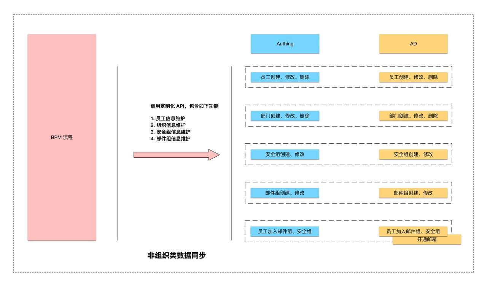
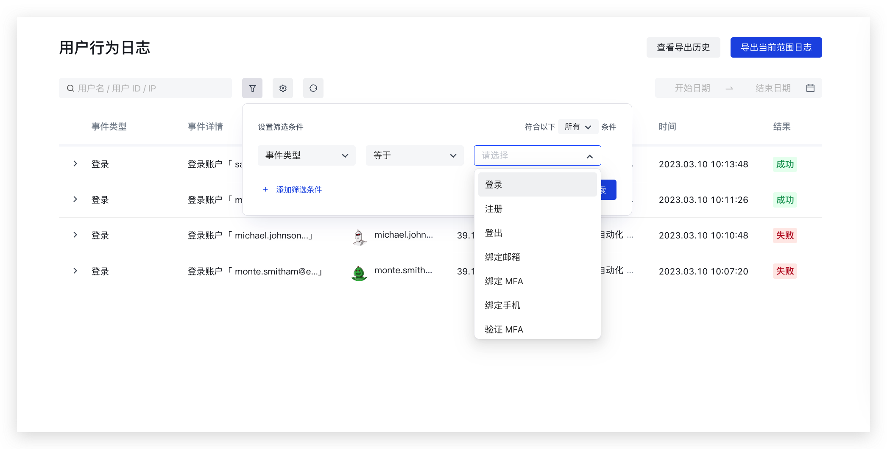

# 事件中心概述

## 背景

Authing 3.0 是以事件驱动（EDA）架构重塑的云原生身份平台，我们通过事件驱动架构大幅提升了平台的响应速度、可扩展性和开发者体验，并能够实现更加及时的安全事件响应和更加卓越的客户体验。

Authing 作为领先的 IDaaS 身份云厂商再次为行业带来变革，并为客户再一次降低身份场景下业务打通和数据集成的难度，并有效提升了企业的 IT 建设在身份云场景的投入回报。

使用 Authing 的事件相关 SDK，开发者可以订阅 Authing 平台产生的事件，当事件发生时，Authing 服务会实时把事件的类型及当前事件关联的数据以 WebSocket 方式以 JSON 的数据格式主动推送给开发者。也可以在 Authing 控制台添加自定义事件，然后使用事件 SDK 向 Authing 服务推送自定义事件，用来触发特定的工作流程。式将事件内容以 JSON 格式进行推送。

> 事件订阅可以让你的应用及时响应 Authing 里的动作，从而实现业务的高度自定义改造。<br/>事件发布可以让 Authing 的部分服务在自定义条件下触发特定操作，间接实现「改造」Authing 业务逻辑的能力。

## 使用场景

#### 场景一： 构建实时用户分析控制台


（通过订阅 Event 选择性、实时广播式更新数字，而非通过轮询/Long Poll）

#### 场景二：在组织架构或员工信息变动时实时同步给下游应用（互操作），同步完成后给特定的用户开通邮箱


（通过订阅 Event 单点式进行推送通知，而非通过轮询/Long Poll）

#### 场景三：在任意用户登录时记录登录信息，反写到自有日志数据库中

```javascript
event.sub('authing.user.login', async (userInfo) => {
    mysql.write(userInfo);
})
```

#### 场景四：当用户离职时，应用需要第一时间处理离职用户的业务数据

```typescript
event.sub('authing.user.resigned', async (userInfo) => {
    doSomeThing(userInfo);
})
```

#### 场景五：当用户注销给管理员提醒

```javascript
event.sub('authing.user.delete-account', async (userInfo) => {
    doSomeThing(userInfo);
})
```

#### 场景六：非组织类数据同步与响应



#### 场景七： MFA 持续自适应认证


#### 场景八：审计日志



> 以上是八个简单的使用场景，开发者可以根据不同需求，在 Authing 订阅不同事件。<br/>可以在 [Authing API Explorer ](https://api-explorer.authing.cn/)查找所有公开的事件

## 管理端 SDK 订阅事件流程

### 一、订阅系统公共事件步骤

1. 在 [Authing 控制台](https://console.authing.cn/) 的<strong>设置 -> 基础设置 -> 密钥</strong><strong>管理</strong>页面，可以获取到用户池 ID（UserPool Id）和用户池密钥（UserPool Secret），如下图所示：


1. 初始化 SDK

```java
ManagementClientOptions clientOptions = new ManagementClientOptions();
clientOptions.setAccessKeyId(ACCESS_KEY_ID);  // 用户池 id
clientOptions.setAccessKeySecret(ACCESS_KEY_SECRET); // 用户池密钥

ManagementClient client = new ManagementClient(clientOptions);  // 初始化 sdk
```

¶  clientOptions 完整参数如下：

- `accessKeyId`: Authing 用户池 ID 或者协作管理员的 Access Key ID。
- `accessKeySecret`: Authing 用户池密钥或者协作管理员的 Access Key Secret。
- `host`: Authing  API 服务器地址，默认为 `https://api.authing.cn`。如果你使用的是 Authing 公有云版本，请忽略此参数。如果你使用的是私有化部署的版本，此参数必填，格式如下: [https://authing-api.my-authing-service.com](https://authing-api.my-authing-service.com)（最后不带斜杠 /）。
- `timeout`: 请求超时时间，可选，单位为毫秒，默认为 10000（10 秒）。
- `lang`: 接口 Message 返回语言格式（可选），可选值为 zh-CN、en-US、ja-JP 和 zh-TW，默认为 zh-CN。
- `websocketHost`: Authing  事件 websocket 服务器地址，默认为 `wss://``events.authing.com` 。如果你使用的是 Authing 公有云版本，请忽略此参数。如果你使用的是私有化部署的版本，此参数必填，格式如下: `wss://``events.``my-authing-service.com` 最后不带斜杠 /）。

1. 订阅事件

初始化完成 ManagementClient 之后，你可以获取 ManagementClient 的实例，然后调用此实例上的 `subEvent` 方法订阅所需的事件数据，如「用户注册时间」的订阅代码如下：

```java
client.subEvent("authing.user.login", new Receiver() {  // 订阅用户注册事件
    @Override
    public void onReceiverMessage(String msg) {
        System.out.println(msg);
    }
});
```

> 管理端 SDK 可以订阅当前用户池相关的公共事件和私有事件

### 二、订阅用户池私有事件

1. 在 Authing 控制台查看事先定义好的事件编码（参考 [通过控制台的自动化功能发布事件流程](https://steamory.feishu.cn/wiki/wikcnBFLSynfkhvuDBZNm0nBqIf#PkwedAoUIoA2O4xQR5jcvDlsnvg)）。
2. 按照 订阅公共事件步骤 的 1、2 流程完成 SDK 初始化。
3. 然后调用 SDK 的订阅方法，示例代码如下：

```java
client.subEvent("custom_aouaw.myEvent", new Receiver() {  // 订阅用户注册事件
    @Override
    public void onReceiverMessage(String msg) {
        System.out.println(msg);
    }
});
```

## 管理端 SDK 发布事件流程

若公共事件不能满足业务需要，当某些业务需要业务系统提供数据触发 Auhting 的身份自动化流程时，开发者可以提前在控制台定义好自定义事件，然后使用  sdk 推送业务系统的特定数据，来达到触发身份自动化编排流程，特定的业务行为，步骤如下：

1. 在 [Authing 控制台](http://console.authing.cn) <strong>自动化  -> 身份自动化 -> 创建工作流 </strong>创建一个自动化工作流。


1. 打开刚刚创建的自动化流程，在 <strong>选择触发器 -> 通过应用事件触发 -> 自定义事件 -> 新增自定义事件</strong> 页面填写自定义事件的名称和自定义编码，完成自定义事件的创建。


> - 自定义编码整个用户池不能重复，且不允许使用 Authing 已经存在的事件编码。<br/>- 管理端 SDK 仅能发布用户池已经定义好的私有事件，无法发布系统公共事件。

1. 按照 订阅公共事件步骤 的 1、2 流程完成 SDK 初始化。
2. 发布用户池私有事件

```java
String myEventData = "{\"id\":\"myid\",\"createdAt\":1675579686427,\"updatedAt\":1675579686427}";
    CostGetAllRightItemRespDto result = managementClient.pubtEvent("custom_aouaw.myEvent", myEventData);
    System.out.println(result);
```

managementClient.pubtEvent 方法参数说明：

- `eventCode` <String>  事件编码。
- `data` <String> 事件体，json 格式。

## 认证端 SDK 发布事件流程

若终端用户需要接受事件，可通过客户端（如 iOS、Android、JavaScript 等） SDK 订阅所需事件，步骤如下：

1. 免费创建一个 [Authing 帐号](https://www.authing.cn/)。
2. 在 Authing 控制台[创建一个自建应用](https://docs.authing.cn/v2/guides/app-new/create-app/create-app.html)。在选择类型时请选择除 `后端应用` 外的其他应用。


1. 在 <strong>应用 -> 自建应用 -> 应用配置</strong>页面查看应用的 appId 和 appSecret ，然后初始化客户端 SDK，JavaScript 代码如下：

```javascript
const authentication = new AuthenticationClient({
  appId: "AUTHING_APP_ID",
  appSecret: "AUTHING_APP_SECRET",
  appHost: 'https://xxx.authing.cn',
  accessToken: "ACCESS_TOKEN"
})
```

1. 发布自定义事件（参考 [通过控制台的自动化功能发布事件流程](https://steamory.feishu.cn/wiki/wikcnBFLSynfkhvuDBZNm0nBqIf#PkwedAoUIoA2O4xQR5jcvDlsnvg)）

```javascript
try {
  const data = await authentication.pub("YOUR_CUSTOM_EVENT", JSON.stringify({
    "email": "test@example.com",
    "phone": "188xxxx8888",
    "name": "张三",
    "customData": {
        "school": "pku",
        "age": 22
    },
  }))
  console.log("data: ", data);
} catch (error) {
  console.log("error: ", error); 
}
```

> 认证端 SDK 仅可以发布用户池自定义的私有事件。

## 认证端 SDK 订阅事件流程

1. 参考 认证端 SDK 发布事件流程中的 1、2、3 步骤初始化 SDK
2. 订阅所需事件

```javascript
authentication.sub("authing.user.updated", (source) => {
  console.log("source: ", source);
}, (err) => {
  console.log("error: ", err);
})
```

> 认证端 SDK 可以订阅当前用户相关的共有事件和用户池自定义的私有事件。

## 通过控制台的自动化功能发布事件流程

1. 在 [Authing 控制台](http://console.authing.cn) <strong>自动化  -> 身份自动化 -> 创建工作流 </strong>创建一个自动化工作流。
2. 配置好触发器之后，选择 <strong>添加节点 -> 信息收发 </strong>功能下选择<strong> </strong>`发布事件` 节点（或者直接在搜索框通过关键词搜索 ）<strong>。</strong>


1. 填写需要发布的事件及数据源，并保存工作流。


> 当工作流触发时会自动把配置中的数据发送到 Authing 事件中心，之后可以使用 SDK 订阅或者在工作流节点当做触发器使用。
