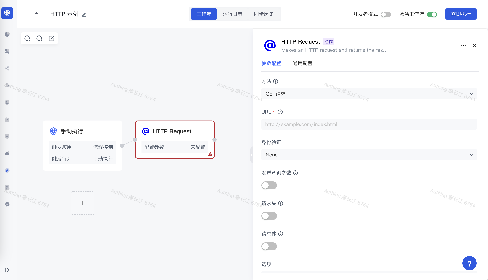
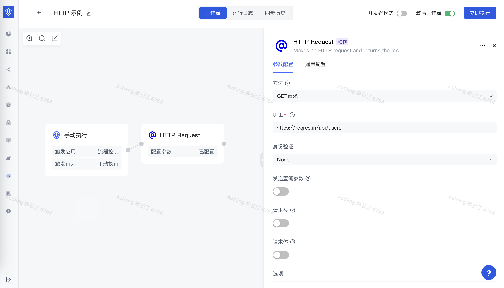
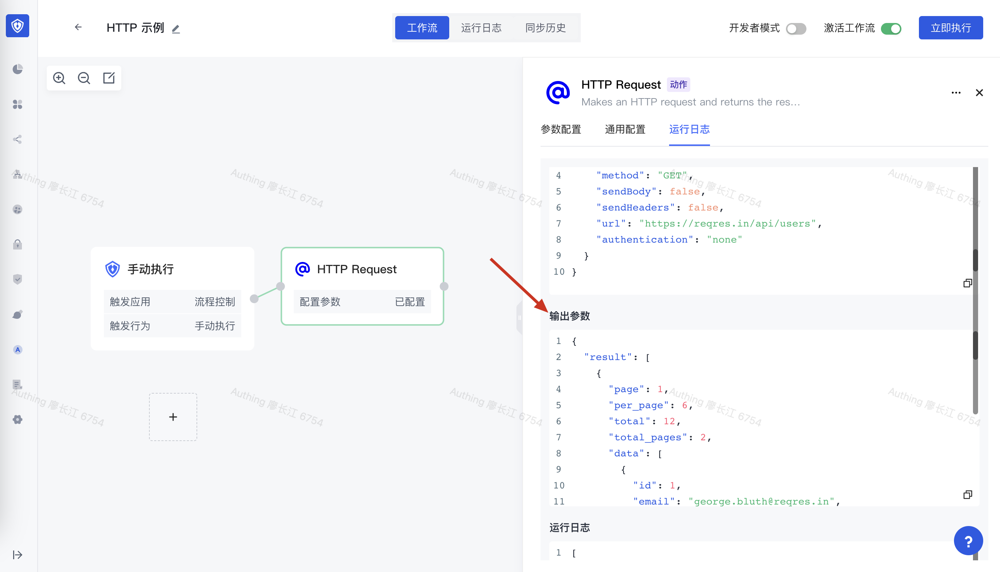
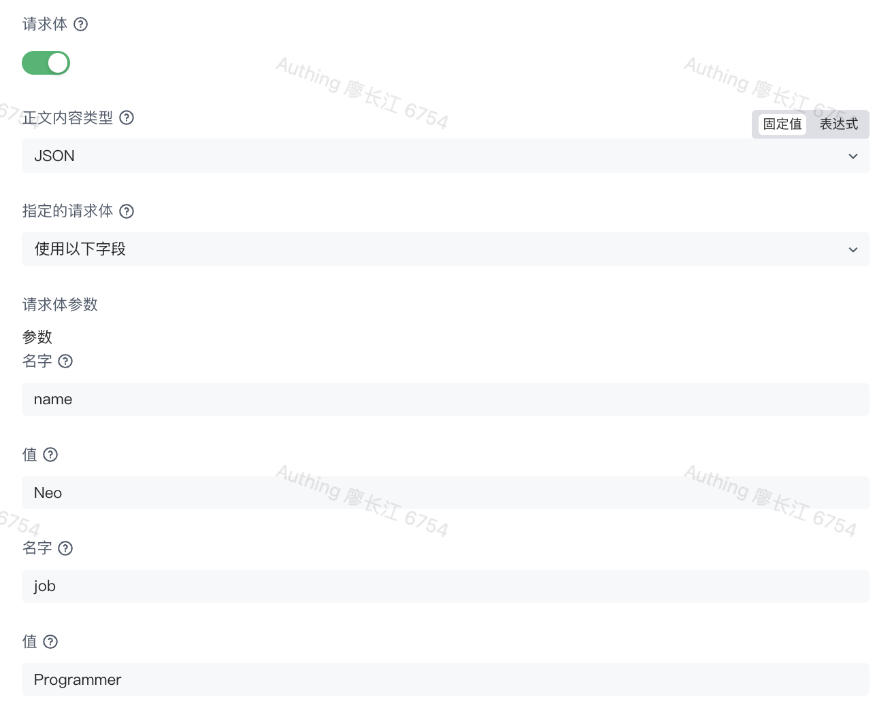
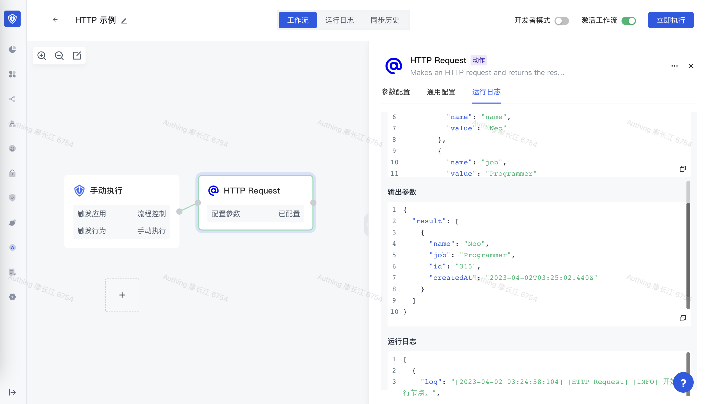

# HTTP Request

HTTP Request 节点是 Authing 身份自动化中最通用的节点之一。 它允许你使用 REST API 发出 HTTP 请求以查询来自任何应用程序或服务的数据。

## 基本概念

使用此节点前，你需要先了解一些基本的 HTTP 术语和概念。

### 请求方法

选择用于请求的 HTTP 方法：

- DELETE
- GET
- HEAD
- OPTIONS
- PATCH
- POST
- PUT

### URL

需求请求的 API 端点。

### 身份验证方式

#### 预定义凭证

使用 Authing 身份自动化内置的凭证，比如 Authing 身份自动化中预集成了 Slack 的 API 认证方式，你可以直接使用，需要手动处理换取 Token、添加请求头的动作。

#### 通用凭证

选择通用凭据类型以使用以下方法之一设置身份验证：

- Basic 认证方式
- Digest 认证方式
- 请求头认证方式
- OAuth1
- OAuth2

### 查询参数、请求头和请求体

你可以选择随请求发送附加信息。 你需要发送的数据取决于你与之交互的 API 以及你发出的请求类型。

- 发送查询参数：在 HTTP 请求中发送 Query Parameters
- 发送请求头：在 HTTP 请求中发送请求头（headers）
- 发送请求体：在 HTTP 请求中发送请求体（body）

### 其他选项

- 批处理：控制如何对大型响应进行批处理。
- 忽略 SSL 问题：忽略 SSL 证书问题
- 重定向：选择是否遵循重定向。 默认情况下禁用。
- 响应：提供有关预期 API 响应的设置。
- 代理：如果需要指定 HTTP 代理，请使用此选项。
- 超时：设置请求的超时时间。

## 基本示例

下面我们演示一个基本的示例，使用 HTTP Request 节点请求 https://reqres.in/ 的数据。

创建一个新工作流并添加 HTTP 请求节点，在 URL 字段中输入 https://reqres.in/api/users。 后面所有示例都将调用此端点：

### 获取用户列表

确保方法设置为 GET。点击执行，可以看到拿到了数据：

### 添加用户

1. 在方法下拉列表中选择 POST，
2. 打开请求体按钮
3. 点击添加参数
4. 在<strong>名字</strong>字段中输入 `name`。
5. 在<strong>值</strong>字段中输入 `Neo`。
6. 点击添加参数
7. 在<strong>名字</strong>字段中输入 `job`。
8. 在<strong>值</strong>字段中输入 `Programmer`。

点击保存之后执行：

## 更多示例

### 从 URL 获取二进制文件

1. 在 URL 字段中输入文件的 URL。 例如，你可以输入 [https://www.authing.com/favicon.ico](https://www.authing.com/favicon.ico) 来获取 Authing 的 Logo。
2. 选择添加选项 > 响应。
3. 将响应格式设置为文件。

### 将二进制文件发送到 API 端点

将 HTTP 请求节点与先前已获取二进制文件的节点连接。 例如，这可能是 HTTP 请求节点、读取二进制文件节点、Google Drive 节点等。

在方法下拉列表中选择 POST。 检查你的 API 的 API 文档以确保你选择了正确的 HTTP 请求方法。

在 URL 字段中输入要将二进制文件发送到的 URL。

启用发送正文。

在正文内容类型中，选择二进制数据。

在输入数据字段名称中，输入包含二进制数据的字段名称。

选择执行节点以运行节点。

有关完整示例，请参阅此工作流模板。

### 执行后获取 HTTP 状态码

选择添加选项 > 响应。

启用包含响应标头和状态。

当你执行节点时，会在输出中包含标头、状态代码和状态消息。

### 发送 XML 数据

启用发送正文。

在正文内容类型中，选择原始。

在内容类型中，输入 application/xml。

在正文字段中输入 XML 数据。
