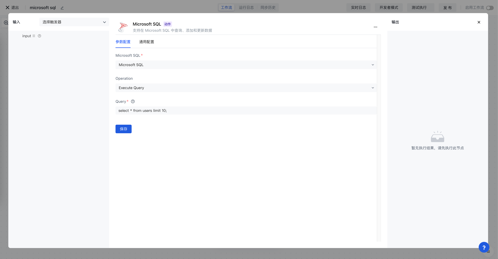

# Microsoft SQL

Microsoft SQL 应用可以让你在 Authing 身份自动化中操作 Microsoft SQL 数据库，包含执行查询、插入数据、更新数据等。

## 准备工作

1. 如果你还没有创建 Microsoft SQL 数据库，请先创建好 Microsoft SQL 数据库。
2. 在 Authing 身份自动化配置你的 Microsoft SQL 数据库密钥。

## 支持的操作

1. 执行查询
2. 插入数据
3. 更新数据
4. 删除数据
