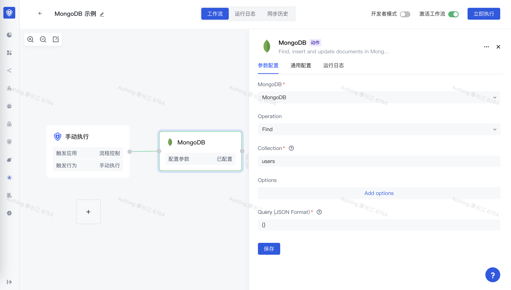

# MongoDB

MongoDB 应用可以让你在 Authing 身份自动化中操作 MongoDB 数据库，包含执行查询、插入数据、更新数据等。



## 准备工作

1. 如果你还没有创建 MongoDB 数据库，请先创建好 MongoDB 数据库。
2. 在 Authing 身份自动化配置你的 MongoDB 数据库密钥。

## 支持的操作

1. Aggregate 聚合
2. Delete 删除
3. Find 查询
4. Find And Replace 查询并替换
5. Find And Update 查询并更新
6. Insert 插入
7. Update 更新

## 基本示例

首先在你的 MongoDB 数据库中，创建一个测试表，这里我们创建一个 `users` 的 Collection，有 `_id`、`name`、`email` 三个字段，并插入了几条测试数据：

```typescript
db.createCollection("users")

db.users.insertOne(
   { name: "Bob", email: "bob@example.com"}
)
db.users.insertOne(
    { name: "Lucy", email: "lucy@example.com"}
 )
```

设置 MongoDB 节点的操作为 Find，Collection 设置为 Find、Query 查询语句设置为 `{}`：


执行节点：


