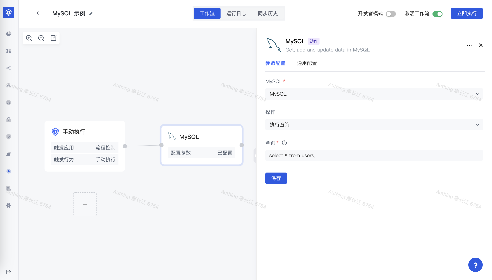
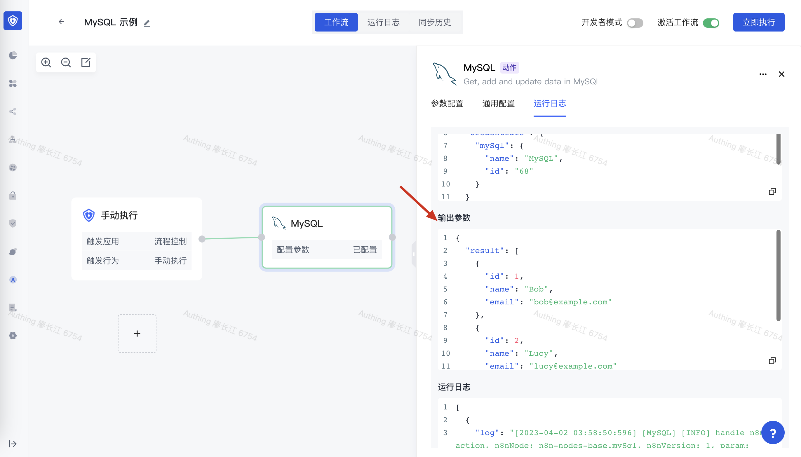

# MySQL

MySQL 应用可以让你在 Authing 身份自动化中操作 MySQL 数据库，包含执行查询、插入数据、更新数据等。



## 准备工作

1. 如果你还没有创建 MySQL 数据库，请先创建好 MySQL 数据库。
2. 在 Authing 身份自动化配置你的 MySQL 数据库密钥。

## 支持的操作

1. 执行查询
2. 插入数据
3. 更新数据

## 基本示例

首先在你的 MySQL 数据库中，创建一个测试表，这里我们创建一个 `users` 用户表，有 `id`、`name`、`email` 三个字段，并插入了几条测试数据：

```typescript
CREATE TABLE `users` (
  `id` bigint NOT NULL AUTO_INCREMENT COMMENT '主键',
  `name` varchar(64) NOT NULL DEFAULT '' COMMENT '名称',
  `email` varchar(128) CHARACTER SET utf8mb4 COLLATE utf8mb4_0900_ai_ci NOT NULL DEFAULT '' COMMENT '邮箱',
  PRIMARY KEY (`id`)
) ENGINE=InnoDB AUTO_INCREMENT=72 DEFAULT CHARSET=utf8mb4 COLLATE=utf8mb4_0900_ai_ci COMMENT='用户表';

INSERT INTO `users` (`id`, `name`, `email`) VALUES
(1, 'Bob', 'bob@example.com'), 
(2, 'Lucy', 'lucy@example.com');
```

设置 MySQL 节点的操作为执行查询、在查询语句中写入 `select * from users`：


执行节点：


