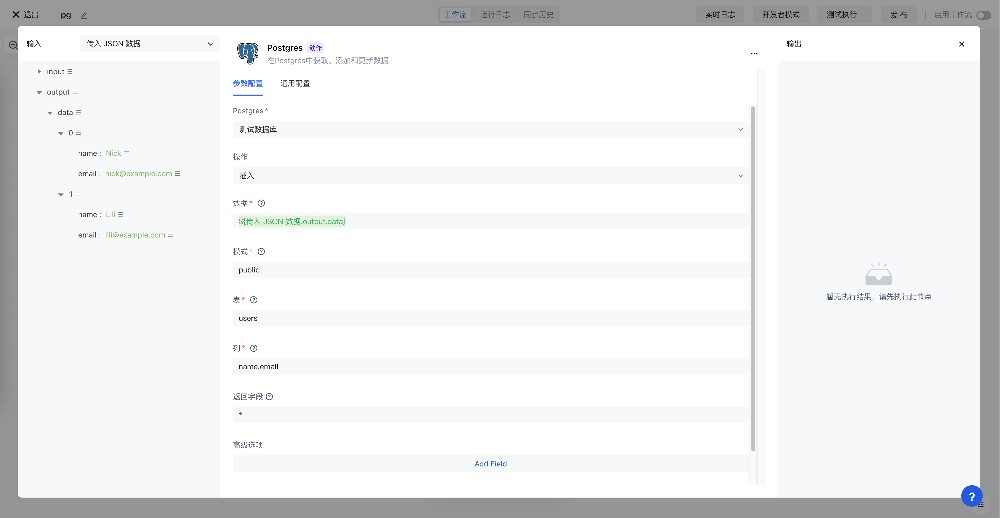
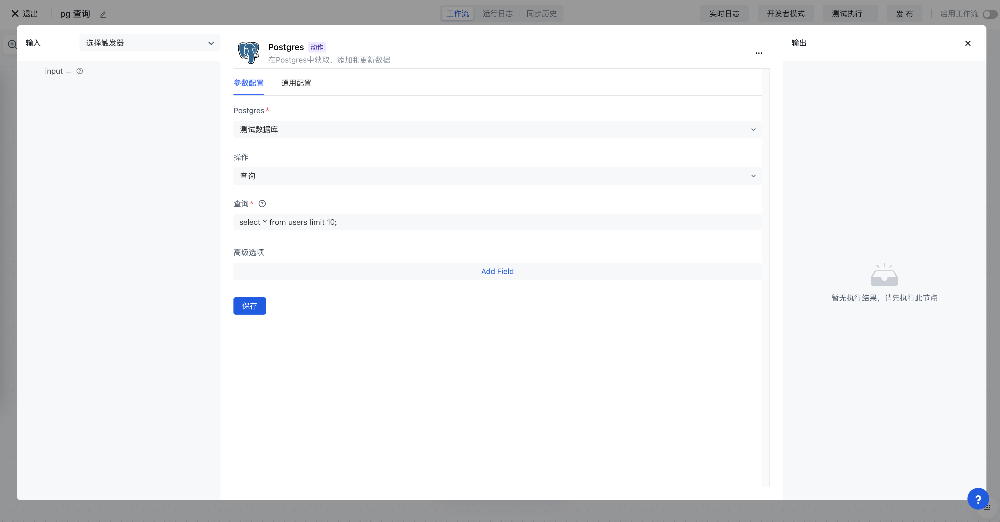
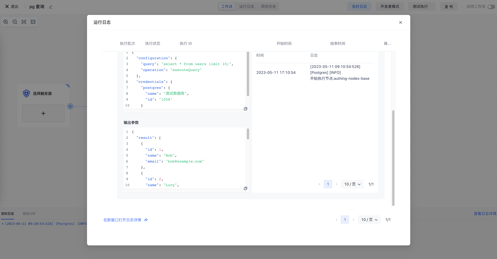

# PostgreSQL

Postgres 应用可以让你在 Authing 身份自动化中操作 Postgres 数据库，包含执行查询、插入数据、更新数据等。



## 准备工作

1. 如果你还没有创建 PostgreSQL 数据库，请先创建好 PostgreSQL 数据库。
2. 在 Authing 身份自动化配置你的 Postgres 数据库密钥。

## 支持的操作

1. 执行查询
2. 插入数据
3. 更新数据

## 基本示例

首先在你的 Postgres 数据库中，创建一个测试表，这里我们创建一个 `users` 用户表，有 `id`、`name`、`email` 三个字段，并插入了几条测试数据：

```typescript
CREATE SEQUENCE IF NOT EXISTS users_id_seq;

-- Table Definition
CREATE TABLE "public"."users" (
    "id" int4 NOT NULL DEFAULT nextval('users_id_seq'::regclass),
    "name" varchar(64) NOT NULL,
    "email" varchar(64) NOT NULL,
    PRIMARY KEY ("id")
);

INSERT INTO "public"."users" ("id", "name", "email") VALUES
(1, 'Bob', 'bob@example.com'), 
(2, 'Lucy', 'lucy@example.com');
```

设置 Postgres 节点的操作为执行查询、在查询语句中写入 `select * from users limit 10 `：



执行节点：


