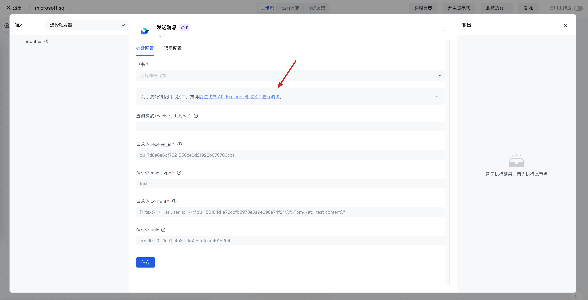

# 飞书

飞书应用可以让你在 Authing 身份自动化中直接操作飞书的 API，包含发送飞书消息、创建审批流、在飞书多维表格中插入数据等。

## 准备工作

1. 注册飞书账号。
2. 在飞书开发平台创建好飞书企业自建应用（注意：请给此应用设置必要权限，否则将无法调用飞书的相关 API）。
3. 在 Authing 身份自动化配置你的飞书企业自建应用密钥。

## 支持的操作

飞书应用支持飞书所有的 API，包含发送飞书消息、创建审批流、在飞书多维表格中插入数据、创建任务等等，详情请见[飞书 API Explore](https://open.feishu.cn/api-explorer)[r](https://open.feishu.cn/api-explorer)。

## 查看飞书 API 文档

在飞书应用的每个动作中，都包含此接口对应的飞书 API Explorer 链接，你可以在飞书 API Explorer 中对此接口进行调试，了解此接口的基本用法。

