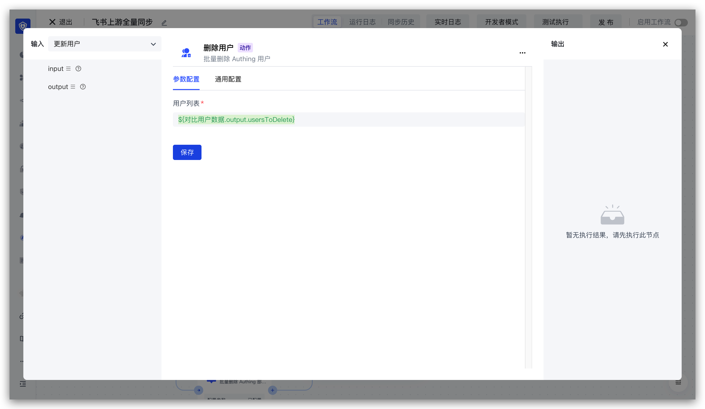

# 删除用户节点

上游同步用户信息实体

- `profile`：用户信息
- `originalValue`：用户原始信息
- `customData`：用户自定义数据

```json
{
    "phone": "13811111111"
}
```

- `userIdInIdp`：在第三方系统的用户 ID
- `userInfoInIdp`：在第三方的原始用户信息，存储为 JSON 字符串
- `departmentIdsInIdp`：在第三方的部门 ID 列表
- `orgId`：所在的组织机构 ID

刪除用户节点配置如下：


