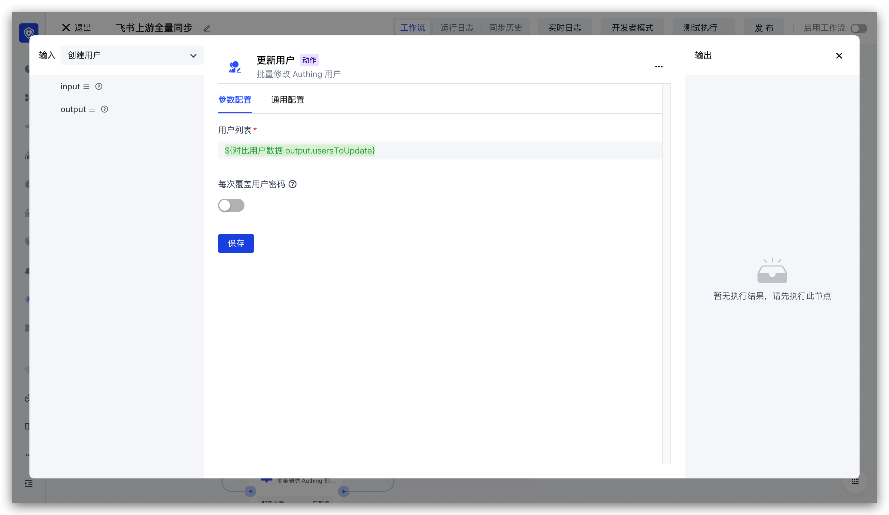

# 更新用户节点

上游同步用户信息实体

- `profile`：用户信息
- `originalValue`：用户原始信息
- `customData`：用户自定义数据

```json
{
    "phone": "13811111111"
}
```

- `userIdInIdp`：在第三方系统的用户 ID
- `userInfoInIdp`：在第三方的原始用户信息，存储为 JSON 字符串
- `departmentIdsInIdp`：在第三方的部门 ID 列表
- `orgId`：所在的组织机构 ID

更新用户节点配置如下：



每次覆盖用户密码：

当开启此开关时，如果传入的用户数据中 password 字段有值时，会使用此密码覆盖用户当前密码。如果你只是希望在用户创建时设置<strong>默认密码</strong>，请不要开启此开关；如果你希望通过传入的 password 字段的值来控制用户最新密码，可以开启此开关。
