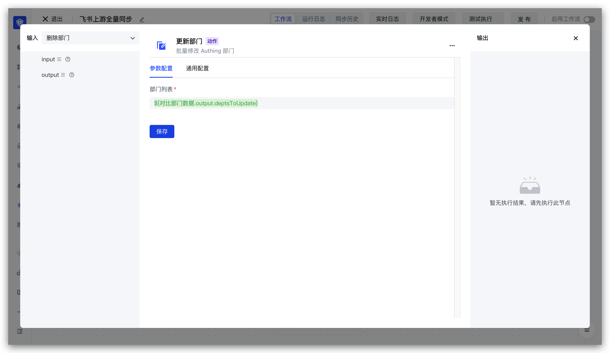

# 更新部门节点

上游同步部门信息实体

- `originalValue`：部门参与同步的数据
- `data`：部门数据
- `customData`：扩展字段
- `departmentIdInIdp`：第三方部门 ID
- `departmentInfoInIdp`：第三方部门详情
- `parentDepartmentIdInIdp`：第三方父部门 ID

更新部门节点配置如下：

