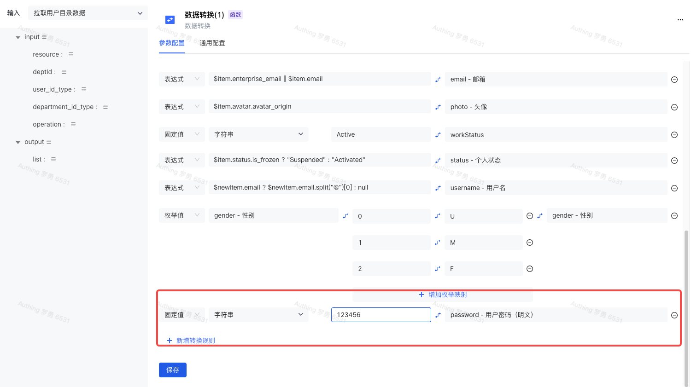
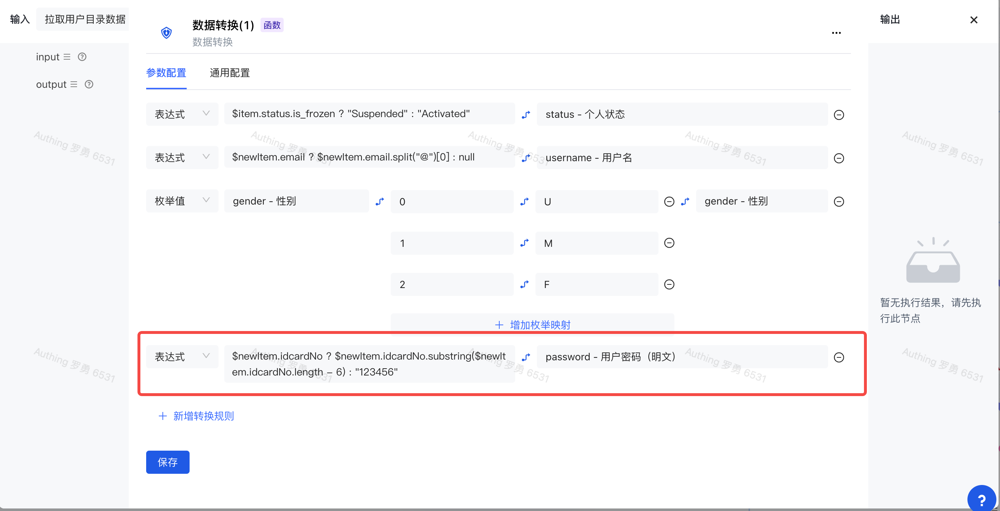
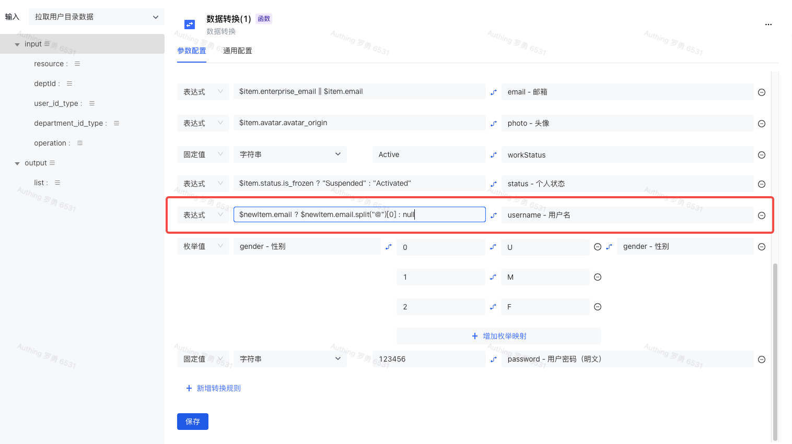
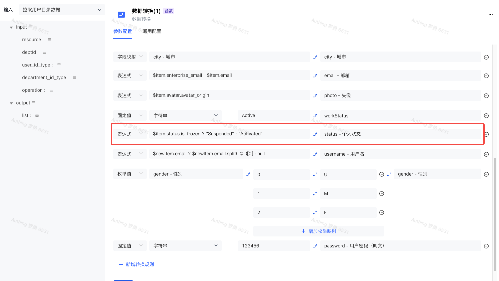
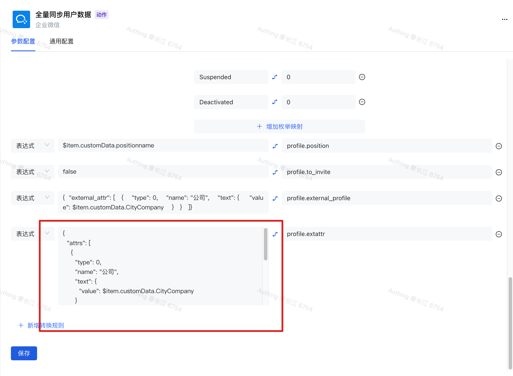

# 常见问题

## 如何设置密码？

在「数据转换」节点中，新增一条转换规则，类型选择「固定值」，值类型选择「字符串」，然后在后面的输入框中输入你想要设置的密码，映射的字段输入或选择 `password` 即可。

## 如何截取身份证号后六位作为密码？

在「数据转换」节点中，新增一条转换规则，类型选择「表达式」，然后在后面的输入框中输入 `$newItem.idcardNo ? $newItem.idcardNo.substring($newItem.idcardNo.length - 6) : '123456'`(当身份证号码不存在时，采用默认密码：`123456`)，映射的字段输入或选择 `password` 即可。

## 如何截取邮箱前缀作为用户名？

在「数据转换」节点中，找到或者新建一条「username 用户名」 转换规则，在类型中选择「表达式」，在输入框中输入 `$newItem.email ? $newItem.email.split("@")[0] : null` ，在映射的字段中输入或选择 `username` 即可。

## 如何设置用户状态？

在「数据转换」节点中，找到或者新建一条「status - 个人状态」 的转换规则，在类型中选择「表达式」，在输入框中输入对应状态的转换规则。

例如：飞书的状态映射为：`$item.status.is_frozen ? "Suspended" : "Activated"` ，在映射的字段中输入或选择 `status ` 即可。

用户状态可选值：

- `Activated`：已激活
- `Suspended`：已暂停

## 如何在「数据转换」节点中传入动态 JSON ？

在转换规则中选择「表达式」类型，并在后面的输入框中输入对应的动态 JSON 即可。

## 如何下载 AD Connector 以连接你的 AD 服务

你可以访问 [新版 AD-Connector 及 Agent 安装部署文档-身份自动化](https://steamory.feishu.cn/docx/PGctdGnraofyLrxkR2gcllHhn4d) 查看 AD Connector 下载和配置方式。
