# 企业微信下游同步使用文档（客户使用）

# 背景概述

## 企业微信现状

由于企业微信获取成员数据的接口限制，不再通过接口提供通讯录用户的头像、性别、手机、邮箱、企业邮箱、员工个人二维码等。下文引用于企微接口（[获取部门成员详情](https://developer.work.weixin.qq.com/document/path/90337)）文档说明：

:::hint-info

- 从 2022 年 6 月 20 号 20 点开始，除通讯录同步以外的基础应用（如客户联系、微信客服、会话存档、日程等），以及新创建的自建应用与代开发应用，调用该接口时，不再返回以下字段：头像、性别、手机、邮箱、企业邮箱、员工个人二维码、地址，应用需要通过 [oauth2 手工授权](https://developer.work.weixin.qq.com/document/path/90337#15232)的方式获取管理员与员工本人授权的字段。
- 【重要】从 2022 年 8 月 15 日 10 点开始，“企业管理后台 - 管理工具 - 通讯录同步”的新增 IP 将不能再调用此接口，企业可通过「[获取成员 ID 列表](https://developer.work.weixin.qq.com/document/path/90337#40412)」和「[获取部门 ID 列表](https://developer.work.weixin.qq.com/document/path/90337#36259)」接口获取 userid 和部门 ID 列表

:::

Authing 身份自动化在上述情况下，紧急提供以下方案，提供了低操作成本、低学习成本的同步流程，保证客户仍可正常维护身份数据的上下游统一。

# Authing 解决方案

根据企业微信现状，Authing 身份自动化针对不同场景，均提供了标准的工作流模板，开箱即用：

1. 当你需要将企业微信的身份数据同步至 Authing 时，我们提供“离线文件解析”功能与标准工作流模板，你只需要按照以下步骤（企业微信 -> Authing）获取文件并简单配置工作流参数即可；

- **具体规则：**
  - 文件中有的、Authing 中没有的用户，将在 Authing 进行创建；
  - 文件中有的、Authing 中有的用户，将对比其属性值，相同的不更新，不同的进行更新；
  - 文件中没有的、Authing 中有的用户，在「企微离线全量对比创建与更新」模板中，将不做处理，如需在 Authing 中删除该部分用户，请使用「企微离线全量对比仅删除」模板；
- **建议执行周期：**
  根据实际业务需要灵活调整，建议 2 天手动执行一次；

2. 当你需要将 Authing 的身份数据同步至企业微信时，我们提供标准的工作流模板，通过用户姓名/ID 关联数据，进行创建、更新、删除等自动化操作；

- 建议执行周期：
  根据实际业务需要灵活调整，建议设置为定时触发，每日凌晨执行；

# 企业微信 -> Authing（上游身份数据同步）

## 1. 导出企业微信通讯录（Excel 文件）

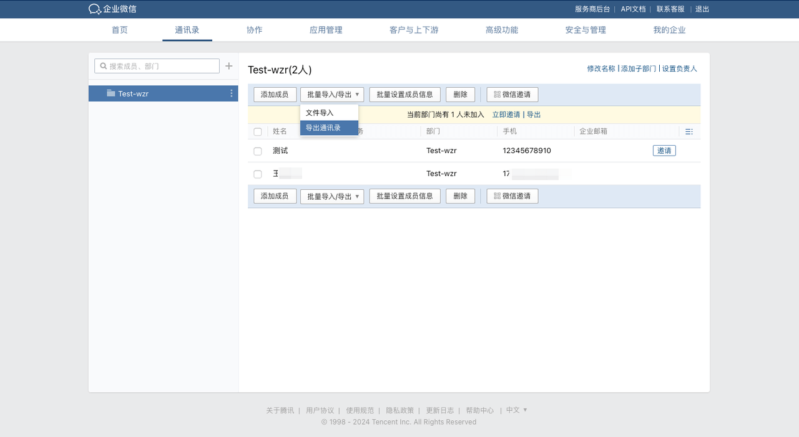

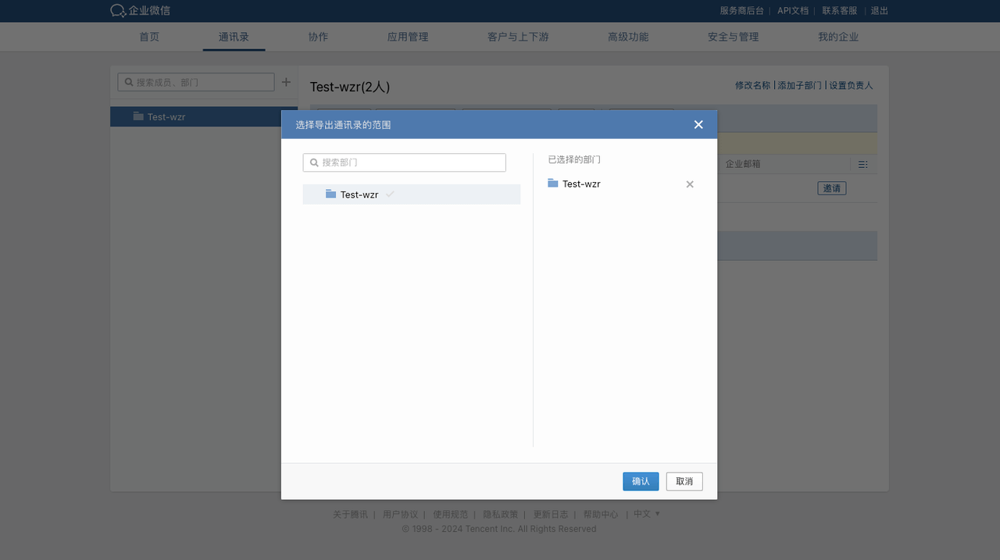

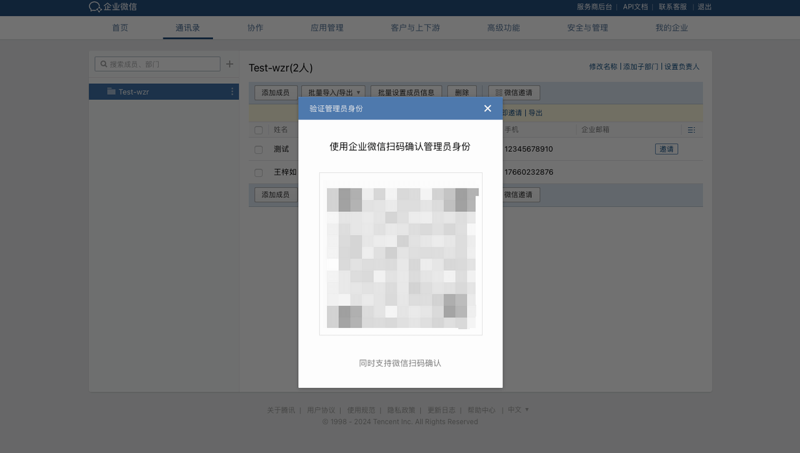

- 在企业微信管理后台 - 通讯录：

1. 使用企业微信扫码，登录企业微信管理后台：[https://work.weixin.qq.com/wework_admin/loginpage_wx?from=myhome_help](https://work.weixin.qq.com/wework_admin/loginpage_wx?from=myhome_help)
   （相关帮助：[https://open.work.weixin.qq.com/help2/pc/17309](https://open.work.weixin.qq.com/help2/pc/17309)）
2. 进入「通讯录」页面，点击「批量导入/导出 - 导出通讯录」；
3. 选择需要导出的部门，点击「确认」；
4. 使用企业微信扫码确认管理员身份；
5. 确认导出文件到本地；

## 2. 在 Authing 配置扩展字段

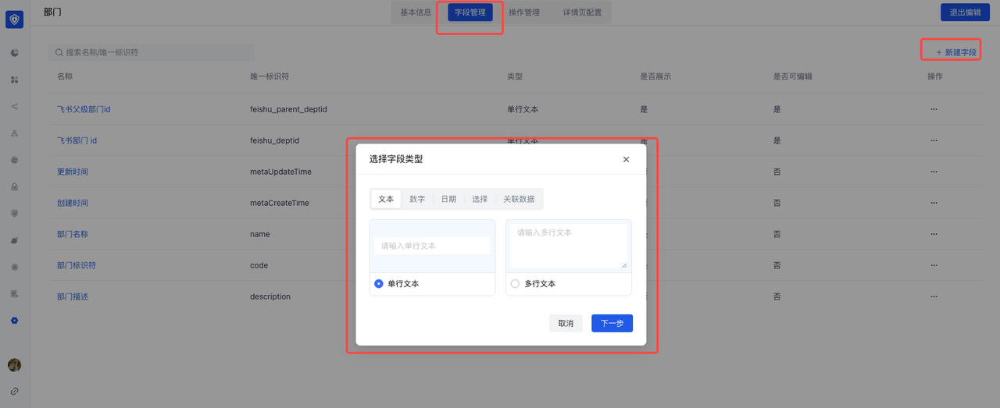

- 在 Authing 控制台配置扩展字段，用于对应企业微信部门/用户的唯一标识字段：

1. 名称：企业微信部门 id、唯一标识符：wechatwork_department_id、单行文本、展示、可编辑
2. 名称：企业微信父级部门 id、唯一标识符：wechatwork_parent_department_id、单行文本、展示、可编辑
3. 名称：企业微信用户 id、唯一标识符：wechatwork_user_id、单行文本、展示、可编辑
4. 名称：用户所属部门 id、唯一标说符号：wechatwork_department_ids、单行/多行文本、展示、可编辑

## 3. 选择模板创建工作流

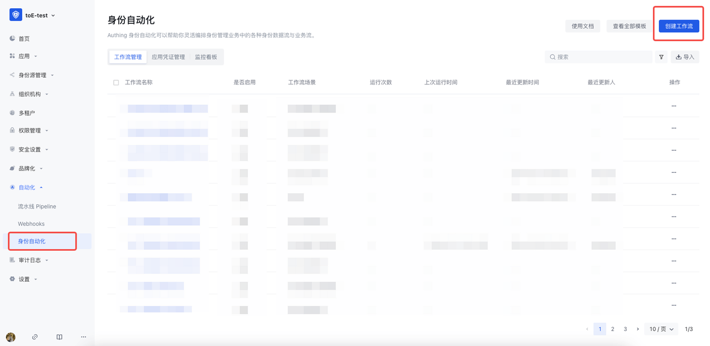
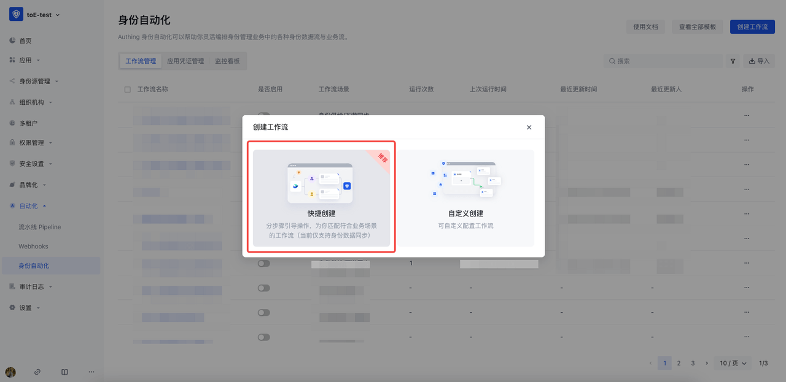
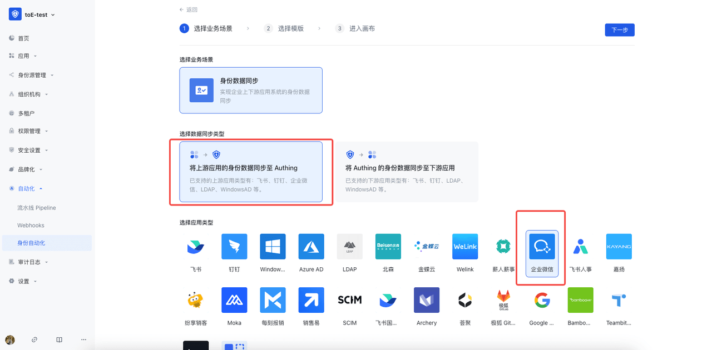
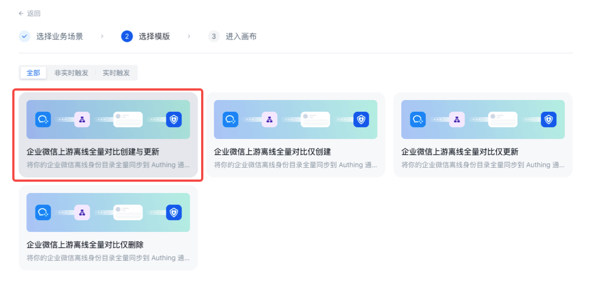

1. 进入 Authing 控制台的「自动化-身份自动化」；
2. 点击「创建工作流」，选择「快捷创建」；
3. 如图选择，并点击「下一步」：

- 数据同步类型：「将上游应用的身份数据同步至 Authing」
- 应用类型：「企业微信」

4. 选择你需要的工作流模板；

- 推荐选择「企业微信上游离线全量对比创建与更新」，如需使用身份自动化删除 Authing 中多余的用户，请创建「仅删除」的模板；

## 4. 在 Excel 节点导入文件

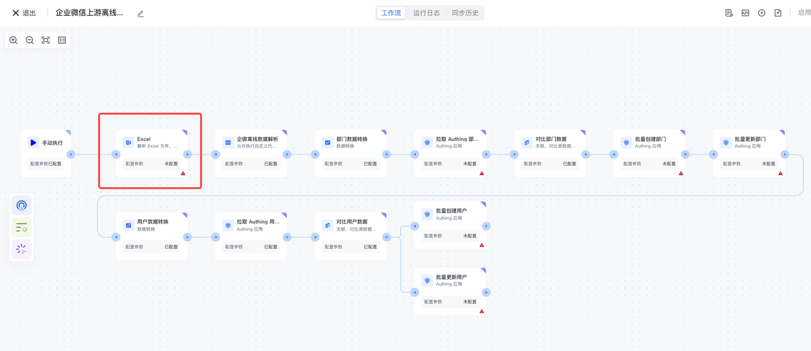
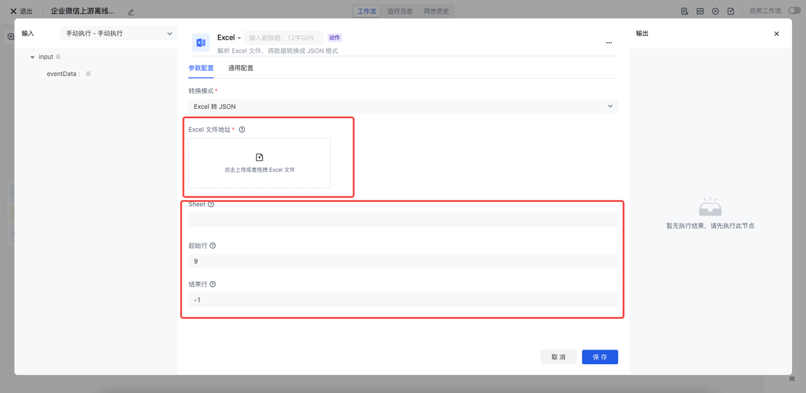

- 进入工作流编辑画布后：

1. 编辑节点「Excel」；
2. 弹窗内上传从企业微信管理后台导出的通讯录文件；
3. 配置其他选项，如：

- sheet（读取的 Sheet, 支持下标或 Sheet 名称，从 0 开始。为空时，读取所有 Sheet）
- 起始/结束行（从哪一行开始读取文件，坐标从 0 开始 / 读取到哪一行，-1 表示最后一行）

## 5. 配置其他节点

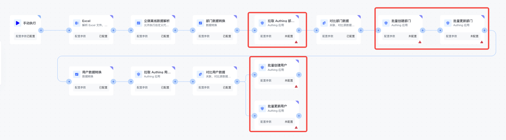

- 大部分节点已经预先配置完成，仅需要将以上个别节点内的必填项配置完成即可。如：

1. 拉取 Authing 部门数据节点：选择组织、是否忽略顶级部门等；
2. 批量创建/更新部门、批量创建/更新用户：选择目标组织等；

## 6. 执行工作流

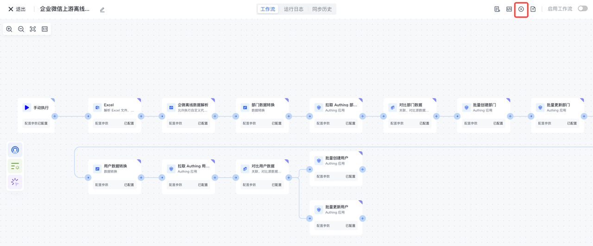

- 当前仅能通过上传 excel 文件配置工作流，因此需要手动执行

# Authing -> 企业微信（下游身份数据同步）

- 若没有企业微信账号，请先前往企业微信控制台申请企业微信账号：https://work.weixin.qq.com/
- 该文档目前仅适用于 Authing 控制台 B2E 用户池中的自动化-身份自动化模块，请确保是在 B2E 用户池场景下且使用最新版本的「身份自动化」功能；
- 若有企业微信服务商资质，可自行根据文档说明在企业微信服务商后台，进行相关的配置。若无企业微信服务商资质，需要授权给北京蒸汽记忆科技有限公司服务商进行相关应用的创建及通讯录的读取操作；

## 1. 配置并授权企业微信代开发应用

- **当你使用北京蒸汽记忆科技有限公司作为企业服务商代开发：**

1. 在移动端打开企业微信，扫描下方二维码授权：
   
2. 授权成功后，请联系北京蒸汽记忆科技有限公司的管理员，进行应用的开发及上线；
3. 应用完成上线后，请在移动端打开企业微信，扫描下方二维码授权（ps：授权前需要到企业微信后台将已授权企业解绑，才可以进行绑定）
   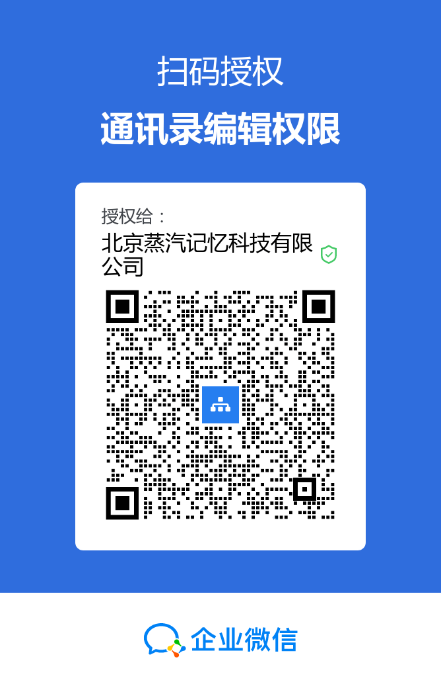

## 2. 创建应用凭证

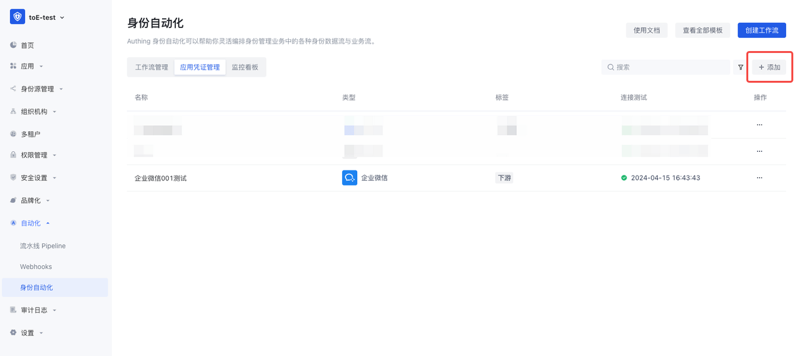
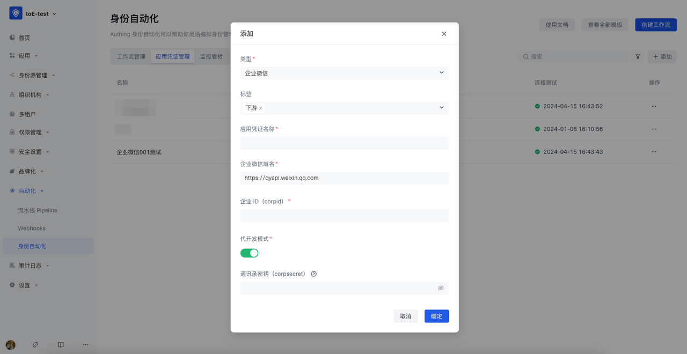

:::hint-info

如何获取企业 ID、通讯录密钥等信息？

:::

企业 ID（corpID）：
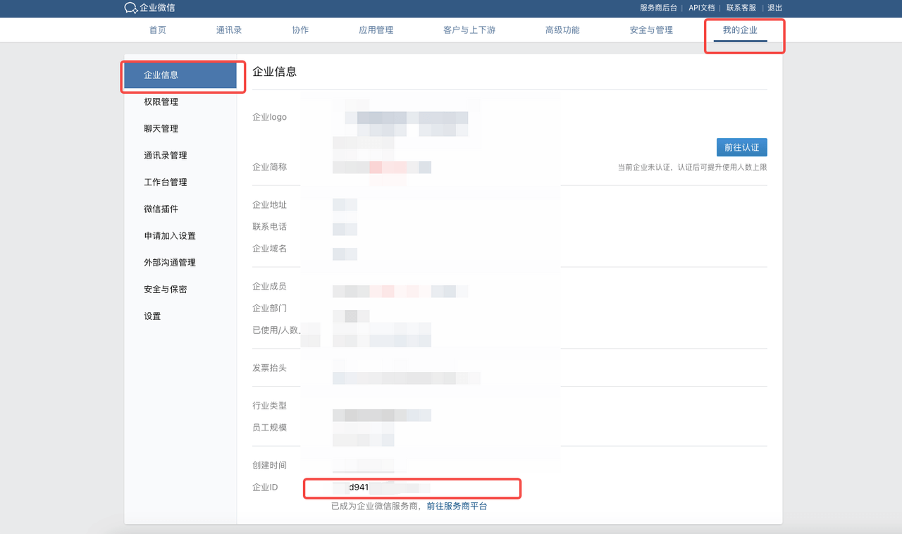

通讯录密钥（corpsecret）：
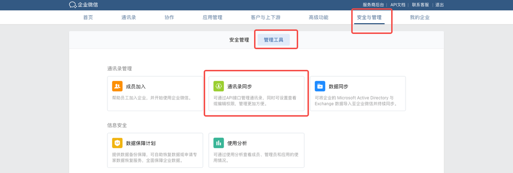
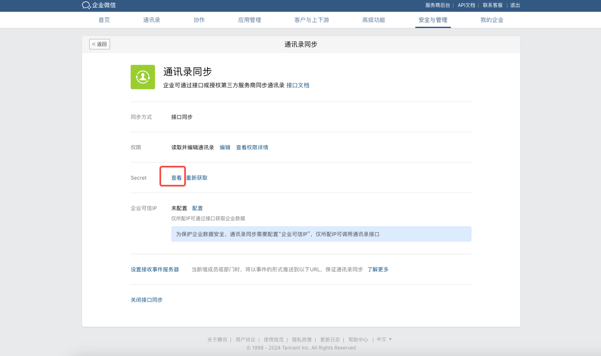

- 在 Authing 创建企微应用凭证：

1. 根据上图指引从企微管理后台获取 appid、appsecret 等信息，填写至 Authing 应用凭证中，可测试连接；
2. 若使用的是 Authing 的公有云，请务必开启「代开发模式」；

## 3. 配置扩展字段

- 配置扩展字段，用于对应企业微信部门/用户的唯一标识字段：

1. 名称：企业微信部门 id、唯一标识符：wechatwork_department_id、单行文本、展示、可编辑
2. 名称：企业微信用户 id、唯一标识符：wechatwork_user_id、单行文本、展示、可编辑

## 4. 选择模板创建工作流

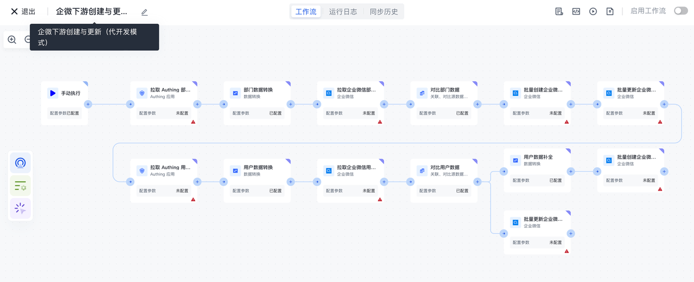

- 请确认当前使用的公有云还是私有化：
  - 公有云客户请选择：代开发模式
  - 私有化客户请选择：自建应用模式
- 代开发模式：由于暂时无法获取用户的敏感信息（如：手机号、邮箱等），需要通过用户的姓名、ID 关联数据
  - Authing 有但企业微信没有的用户，将在企微进行创建；
  - Authing 和企微都有的用户，可选择不更新或全覆盖更新（不判断信息是否有变更，按照最新的数据进行覆盖）

**不更新用户时**，请删除批量更新用户的节点，并如下图配置对比用户数据节点：
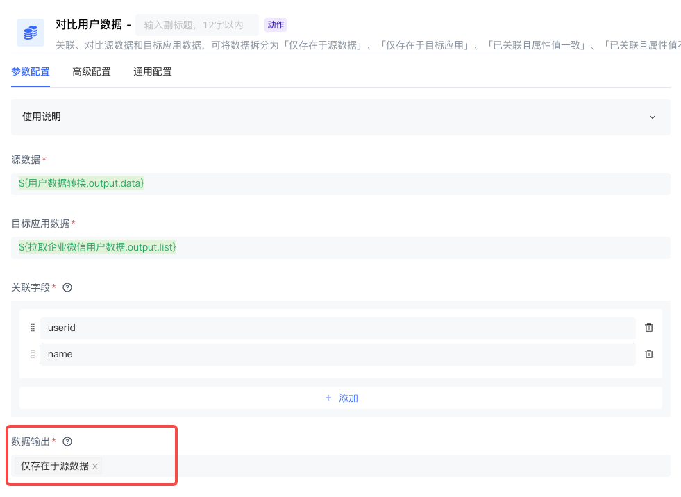

**全覆盖更新用户时**，保留批量更新用户的节点，并如下图配置对比用户数据节点：（可配置忽略更新指定敏感字段，在「高级配置」中手动填入即可）
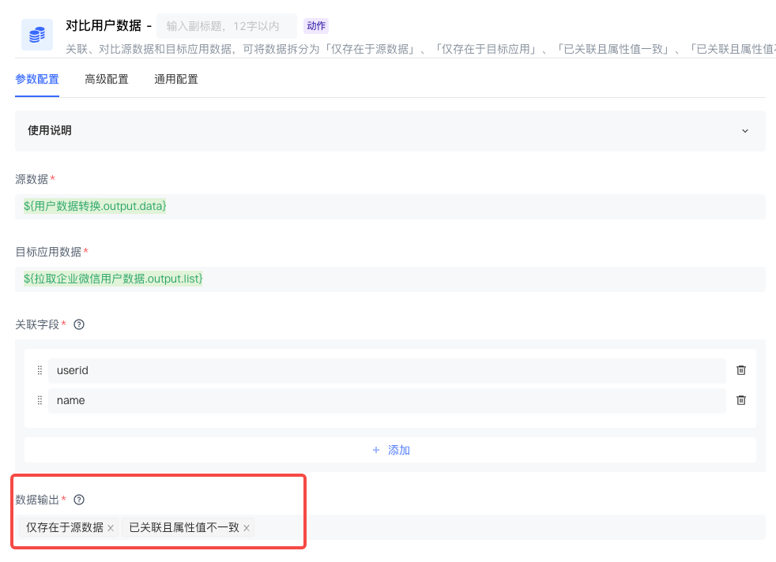

## 5. 配置其他节点

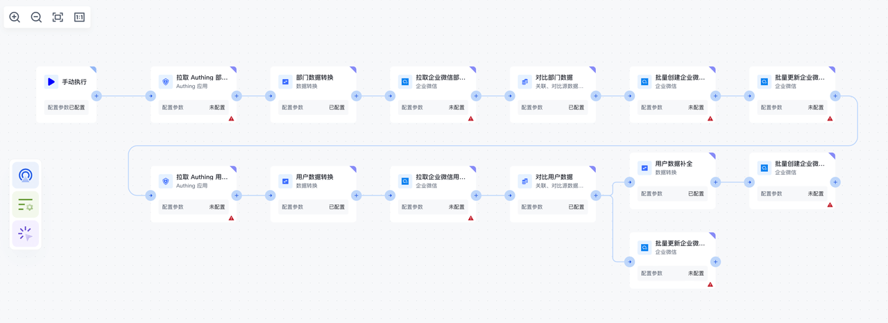

- 大部分节点已经预先配置完成，仅需要将右下角标红色叹号的节点的必填项配置完成即可。如：

1. 拉取企业微信部门/用户数据的节点：选择企微应用凭证等；
2. 批量创建/更新部门、批量创建/更新用户：选择企微应用凭证等；
3. 触发器可配置定时执行规则；

## 6. 执行工作流

可手动执行工作流；
或右上角启用工作流后，系统将根据定时规则执行。

# 其他

执行工作流后，可前往「运行日志」查看每个节点的运行情况和数据传输结果；
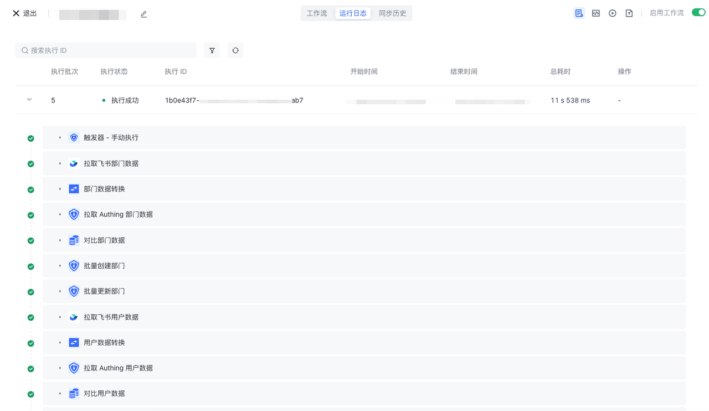
