# 企业微信下游同步使用文档（客户使用）

# 前置准备工作：

- 若没有企业微信账号，请先前往企业微信控制台申请企业微信账号：[https://work.weixin.qq.com/](https://work.weixin.qq.com/)
- 该文档目前仅适用于 Authing 控制台 B2E 用户池中的自动化-身份自动化模块，请确保是在 B2E 用户池场景下且使用最新版本的「身份自动化」功能；
- 若有企业微信服务商资质，可自行根据文档说明在企业微信服务商后台，进行相关的配置；若无企业微信服务商资质，可授权给北京蒸汽记忆科技有限公司服务商进行相关应用的创建及通讯录的读取操作；

# 在 Authing 控制台-身份自动化模块，配置下游同步「企业微信」：

1）打开 Authing Console 控制台，进入身份自动化模块，点击「使用模版」button：

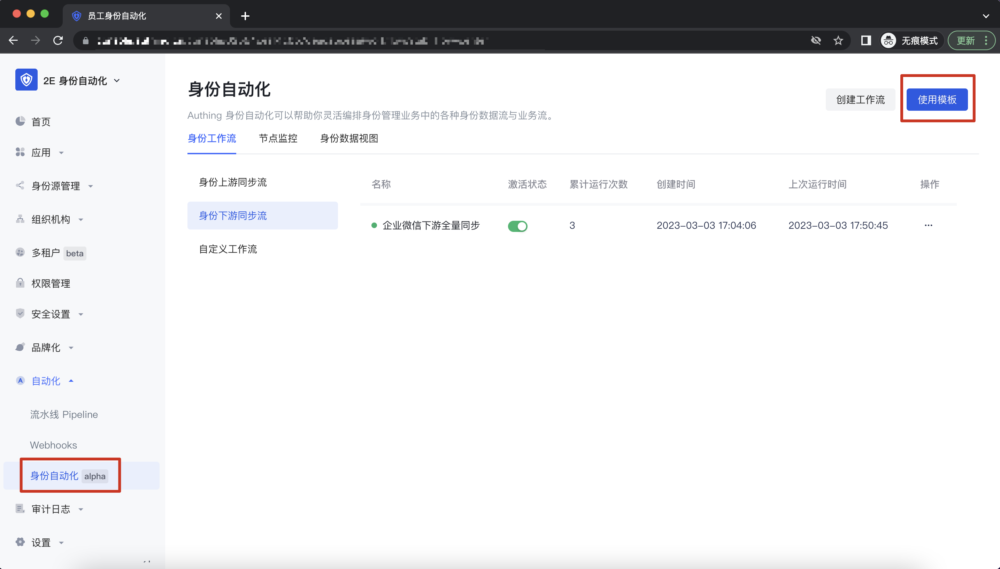

2）在模版分类下，选择「下游同步」模版，选择「企业微信」-「企业微信下游全量同步」，点击「使用模版创建」：

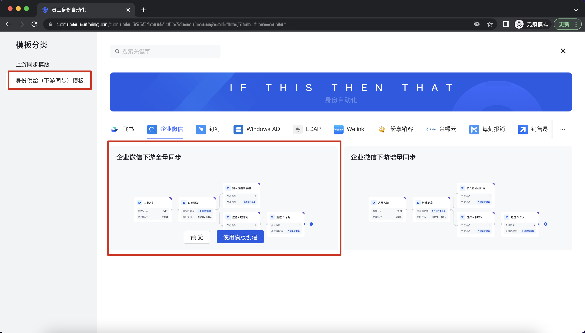

3）选择「触发器」，点击编辑，选择触发器为「通过手动执行触发」，点击「保存」 button，进行下一步操作：

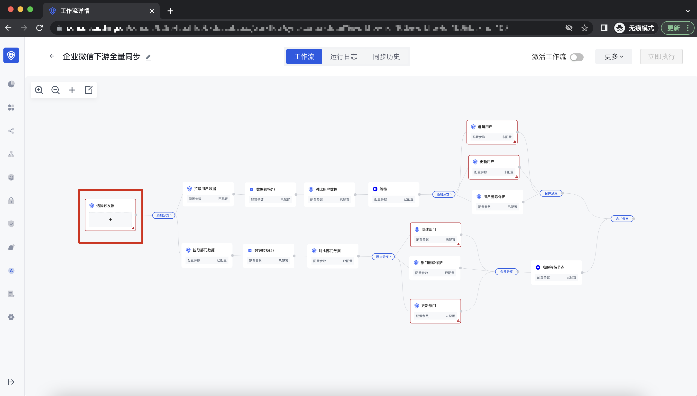

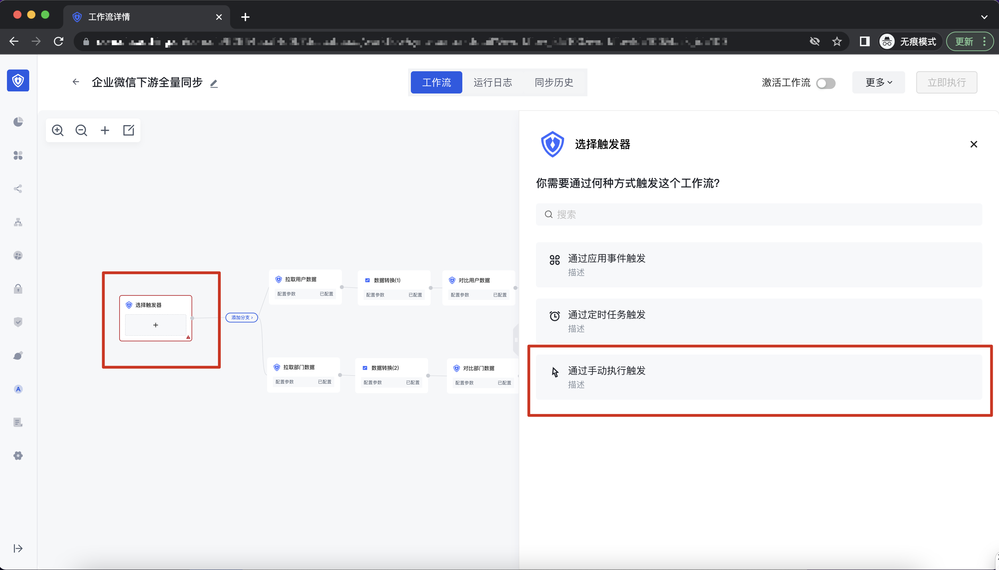

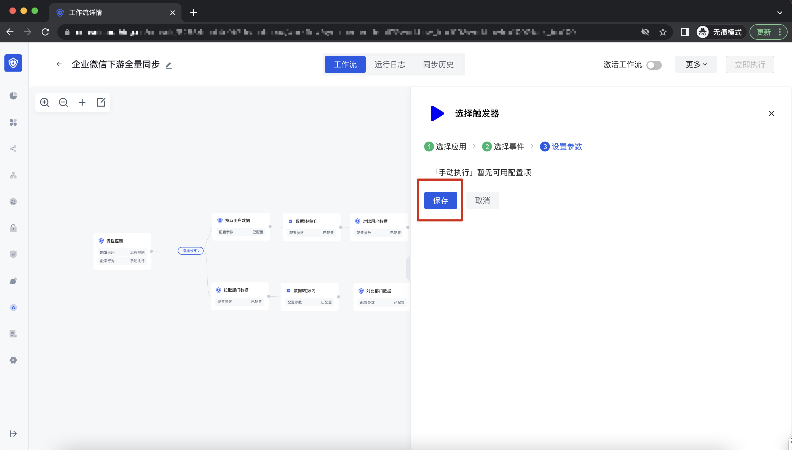

4）选择创建用户，点击编辑，进入到企业微信，点击「添加账号连接」button，进入到「创建账号连接」页面，输入账号相关的字段信息，点击保存；

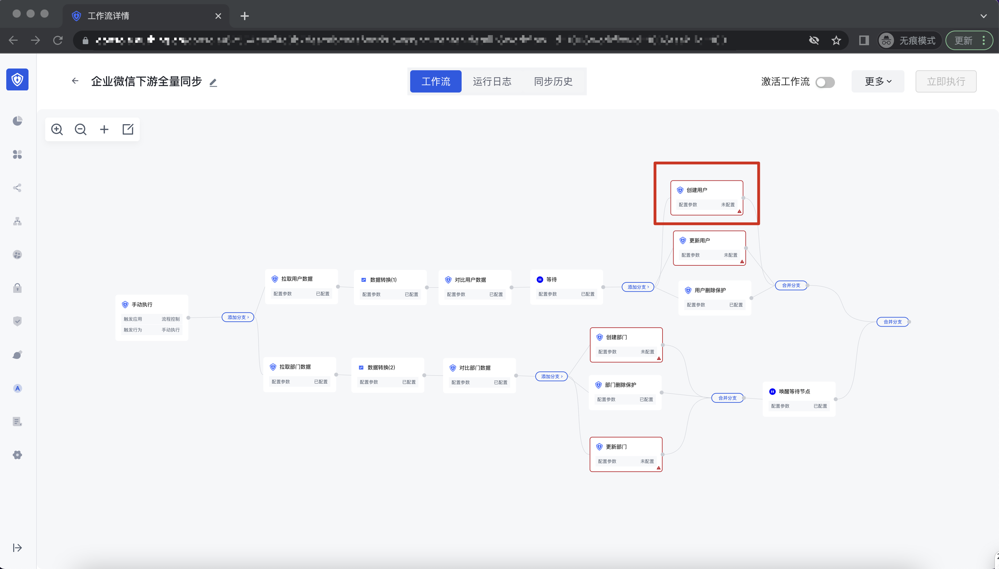

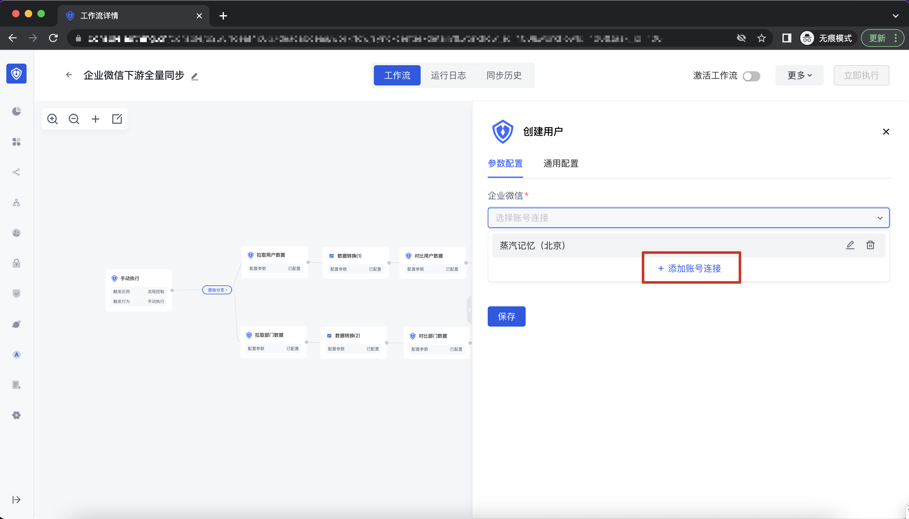

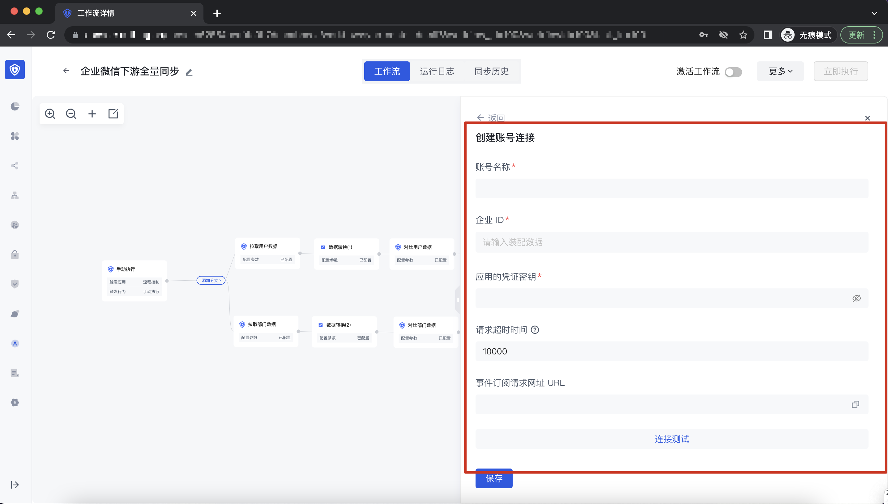

| 字段                 | 字段描述                                                                                                                             |
| -------------------- | ------------------------------------------------------------------------------------------------------------------------------------ |
| 账号名称             | 用于展示该企业微信账号的名称；                                                                                                       |
| 企业 ID              | 通过企业微信后台获取相关的企业 ID；                                                                                                  |
| 请求超时时间         | 请求超时时间，单位为毫秒;                                                                                                            |
| 事件订阅请求网址 URL | 点击保存后，可以看到相应的事件订阅请求网址 URL，将该地址输入到企业微信后台；（该字段暂未生效，目前使用的是旧版本同步中心生成的 URL） |

企业 ID 获取地址及位置：URL

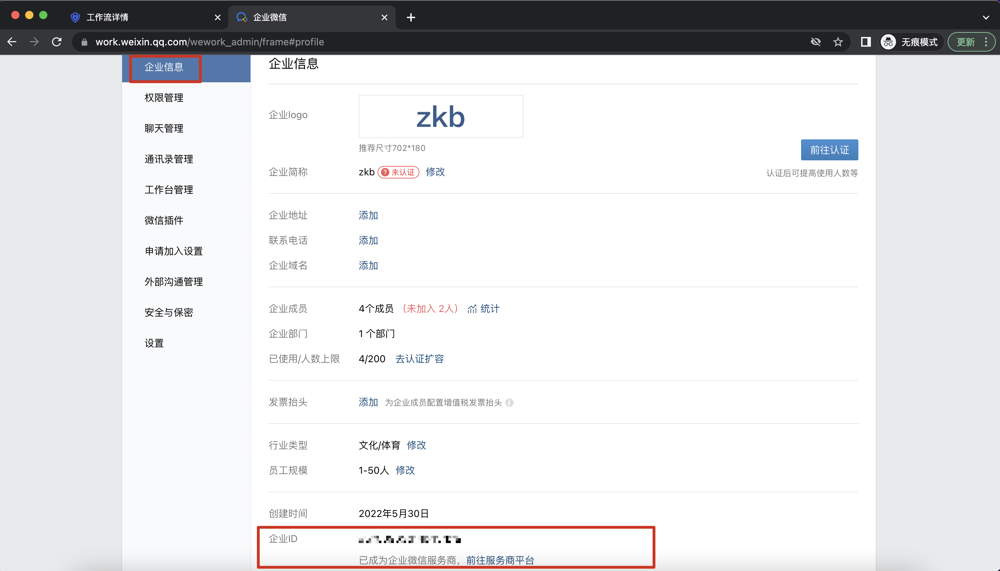

点击保存，返回到企业微信下游同步的界面；

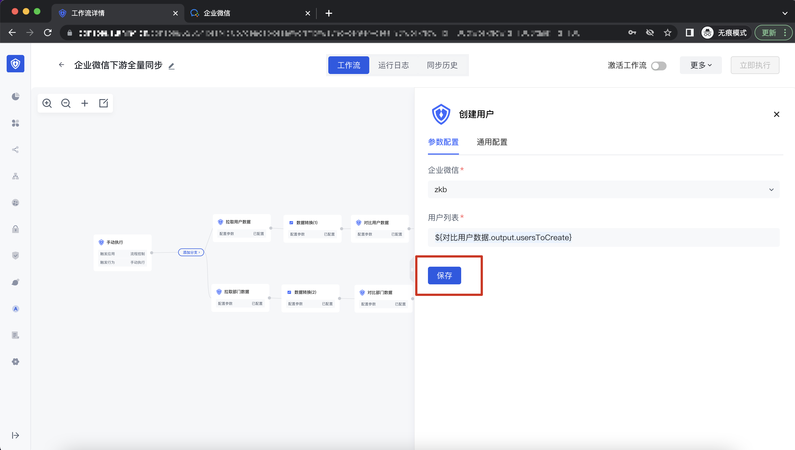

5）分别点击编辑更新用户、创建部门、更新部门，找到并选择刚刚添加的账号，点击保存，完成 Authing 控制台的配置；

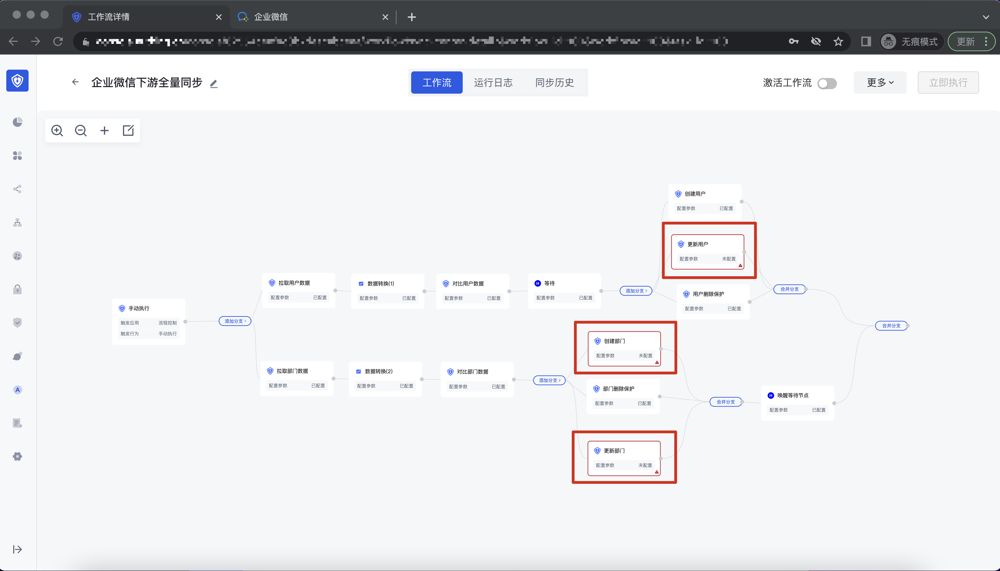

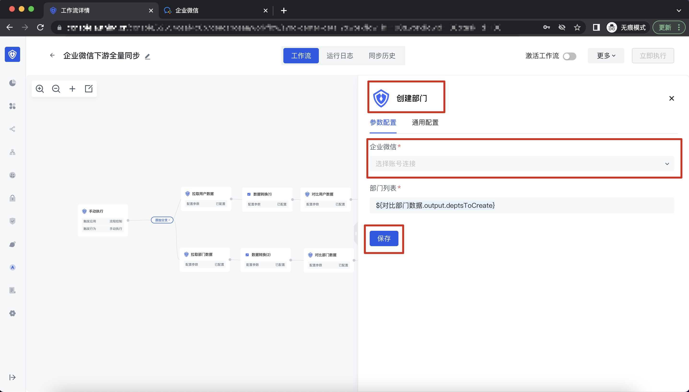

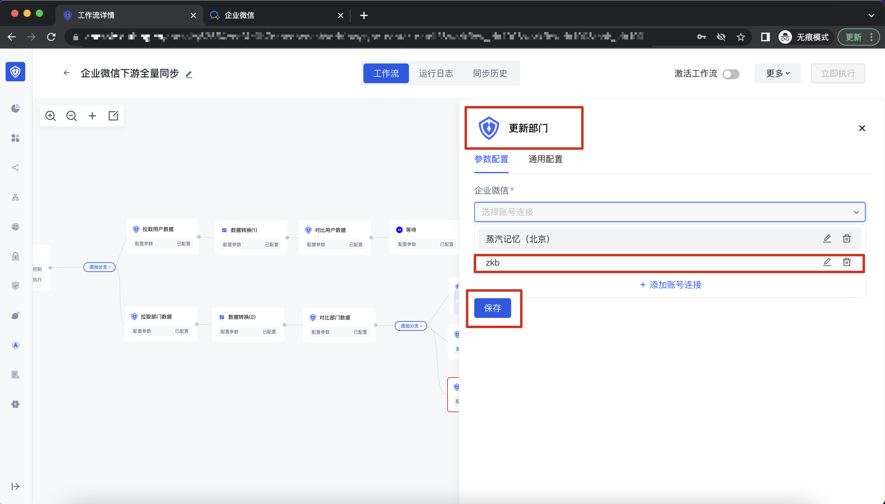

# 企业微信服务商及企业微信的相关配置：

你可以使用北京蒸汽记忆科技有限公司作为企业服务商代开发，也可以使用自己的企业微信服务商控制台进行相关的配置；

## -使用北京蒸汽记忆科技有限公司提供的应用模版：

1）手机端打开企业微信，扫描以下二维码完成授权。<strong>企业管理员扫码授权后，服务商可可为该企业代开发自建应用</strong><strong>：</strong>

2）授权成功后，请联系北京蒸汽记忆科技有限公司的管理员，进行应用的开发及上线；

3）应用上线后，手机端打开企业微信，扫描以下二维码完成授权。经客户企业授权后，服务商可以为客户企业新增和修改通讯录信息，授权后生效时间为 2h，若大于 2h, 需要重新扫码授权，授权前需要到企业微信后台将已授权企业解绑，才可以进行二次绑定：

a.扫描二维码：

b.点击取消授权：

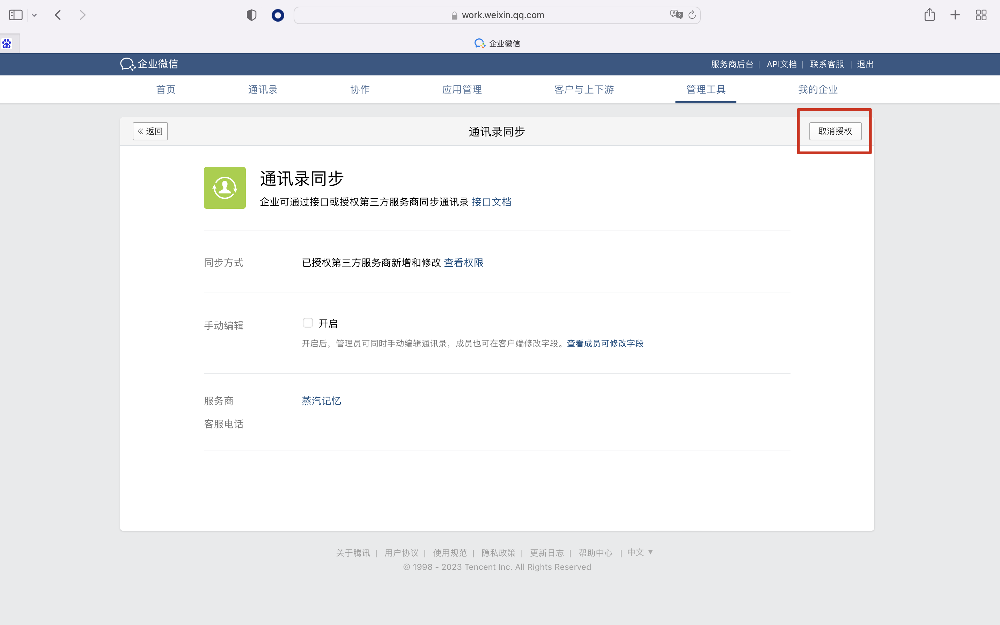

## -自己做为企业微信服务商，为自己创建应用模版：

功能暂不支持，敬请期待！

## 在 Authing 控制台-身份自动化模块，运行下游同步任务：

1）点击激活工作流，开启运行下游同步任务：

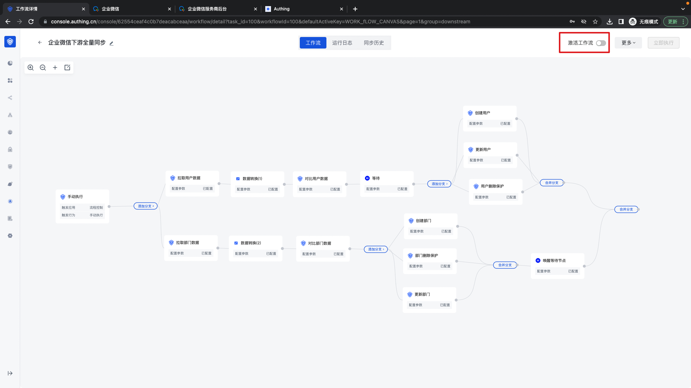

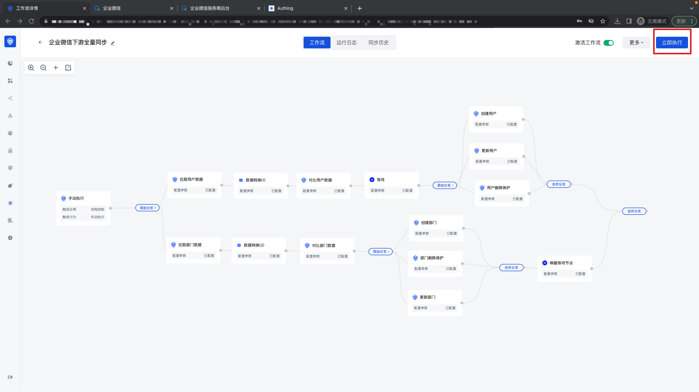

2）进入企业微信后台，通讯录，查看已经同步的部分及用户：

3）也可以通过该同步任务的运行日志，查看任务执行的详细情况：

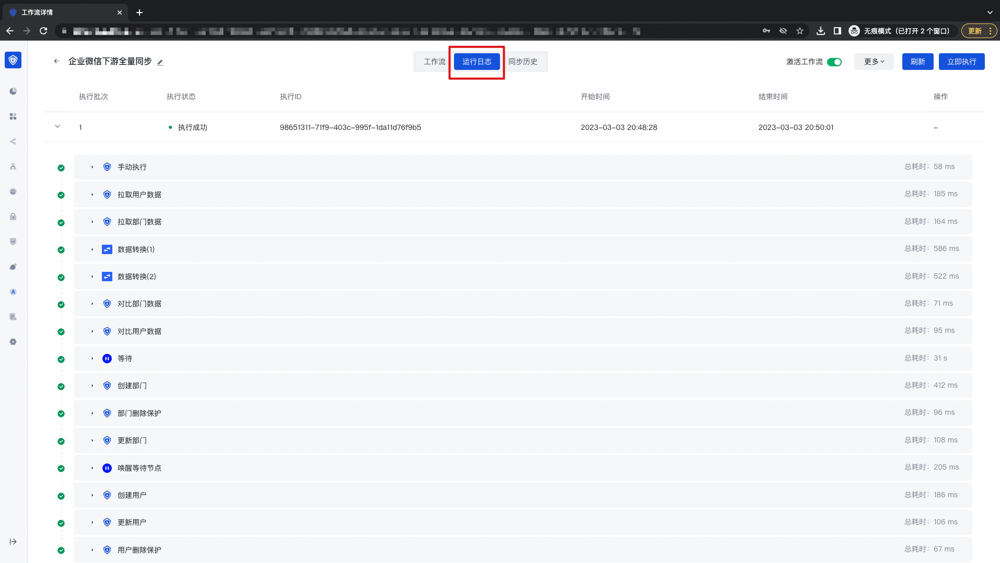

# 同步注意事项：

请注意同步的 Authing 用户池的部门成员，需要有成员名称（name）、成员所属部门（department），否则就会同步失败，详情查看企业微信官方文档：[https://developer.work.weixin.qq.com/document/path/90331](https://developer.work.weixin.qq.com/document/path/90331)

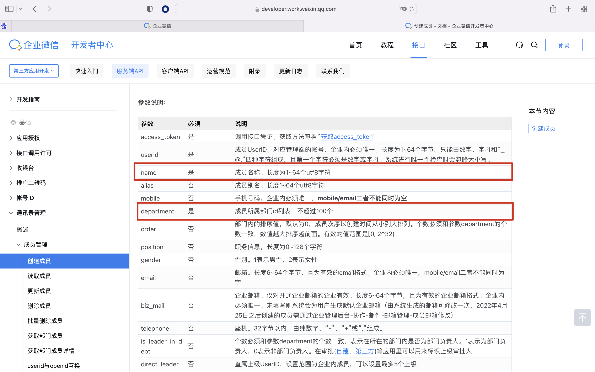
