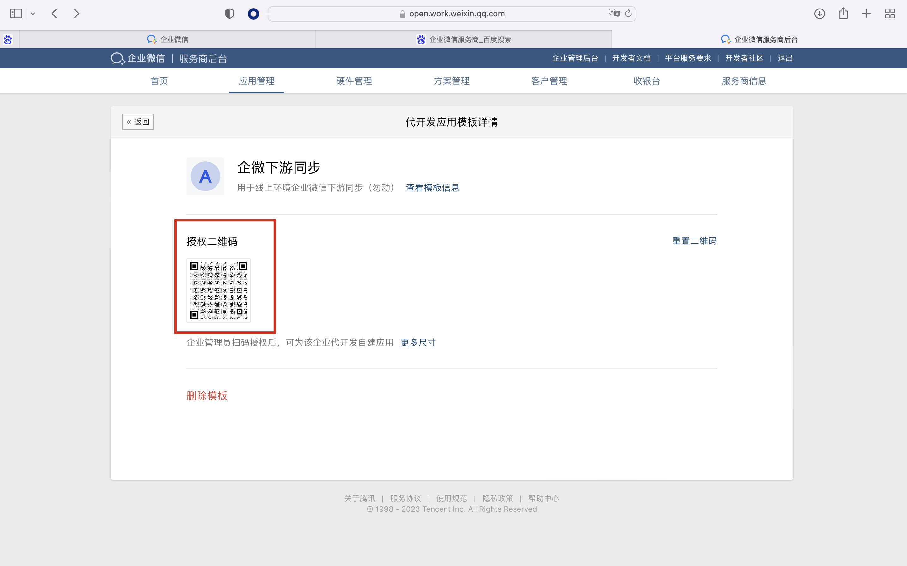
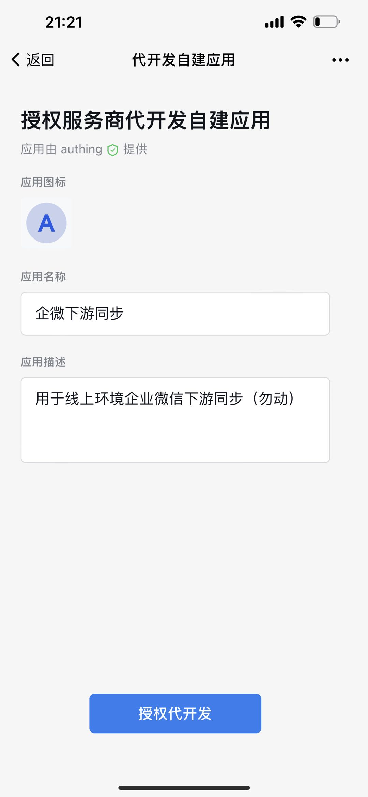
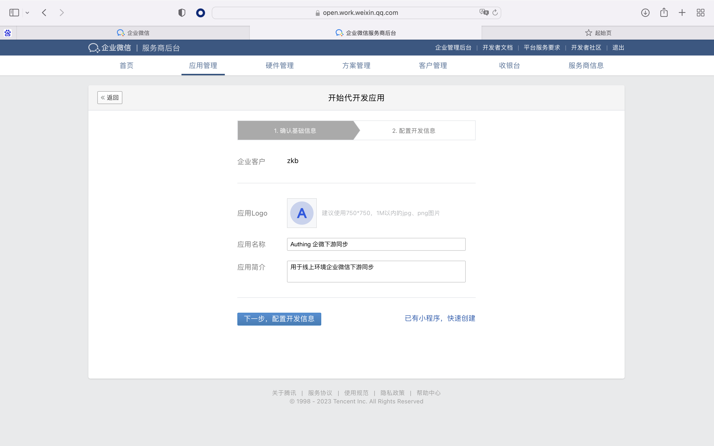
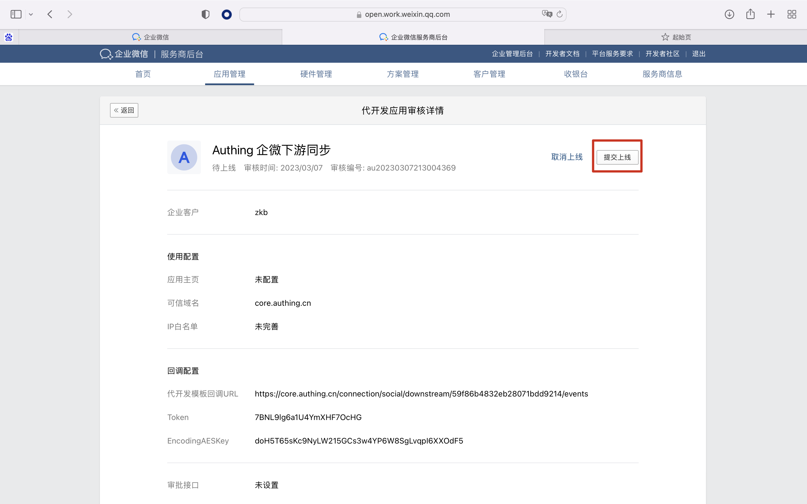
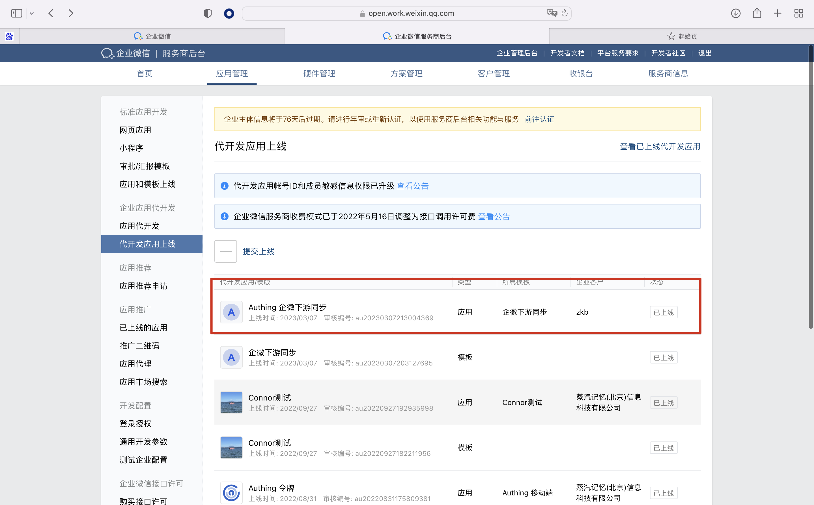
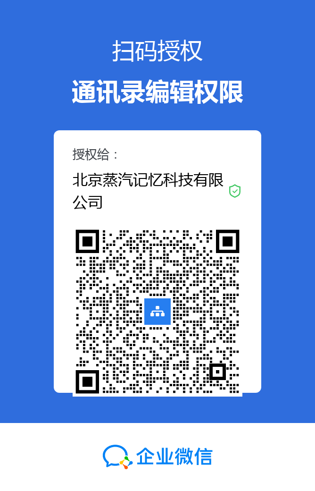
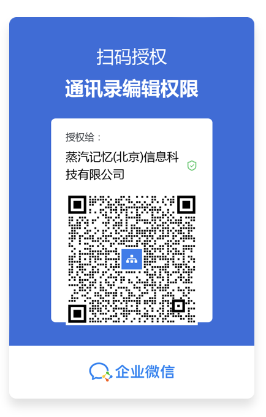

# 企业微信下游同步服务商后台配置（内部使用）

# 前置准备工作：

- 若没有企业微信服务商账号，请先前往企业微信服务商后台申请企业微信服务商账号：[https://open.work.weixin.qq.com/wwopen/login](https://open.work.weixin.qq.com/wwopen/login)
- 该文档目前仅适用于 Authing 控制台 B2E 用户池中的自动化-身份自动化模块，请确保是在 B2E 用户池场景下且使用最新版本的「身份自动化」功能；

# 关于北京蒸汽记忆信息有公司的配置：

## 新建一个「人力资源」类型的代开发应用模版并上线，生成一个授权二维码，企业管理员扫码授权后，可为该企业代开发自建应用；

## 将以下二维码同步客户，让客户的企业微信超级管理员授权给北京蒸汽记忆信息有公司，企业管理员扫码授权后，可为该企业代开发自建应用；

1. 客户扫码确认；

## 当客户授权通过后，帮助客户开发及上线相关的应用；

## 引导客户企业微信超级管理员扫描以下二维码，经客户企业授权后，服务商可以为客户企业新增和修改通讯录信息，授权后生效时间为 2h，若大于 2h, 需要重新扫码授权，授权前需要到企业微信后台将已授权企业解绑，才可以进行二次绑定：

请将以下二维码发送给客户，客户企业微信扫码后，蒸汽记忆服务商后台即可拥有该企业的通讯录新增和修改权限；

## 备注：

Authing 内部测试环境的地址：

[https://console.hydra.authing-inc.co/console/64071a8cc4d08f932ba22905/workflow/?group=downstream](https://console.hydra.authing-inc.co/console/64071a8cc4d08f932ba22905/workflow/?group=downstream)

官方账号及密码：root / Authing!

测试环境的配置：

1）授权代开发应用：

2）授权通讯录新增和修改权限：

