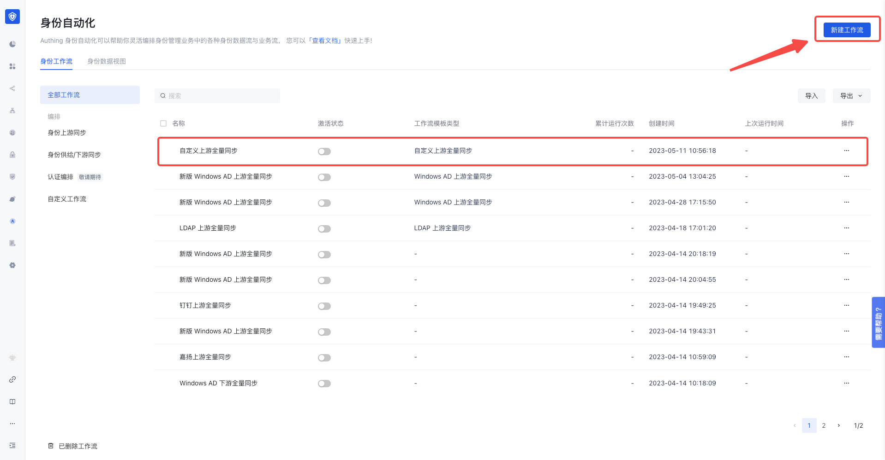
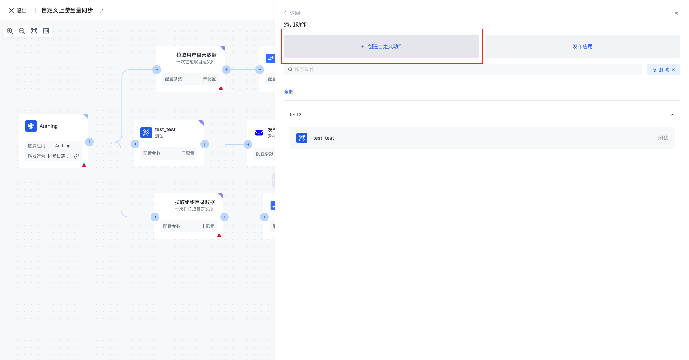
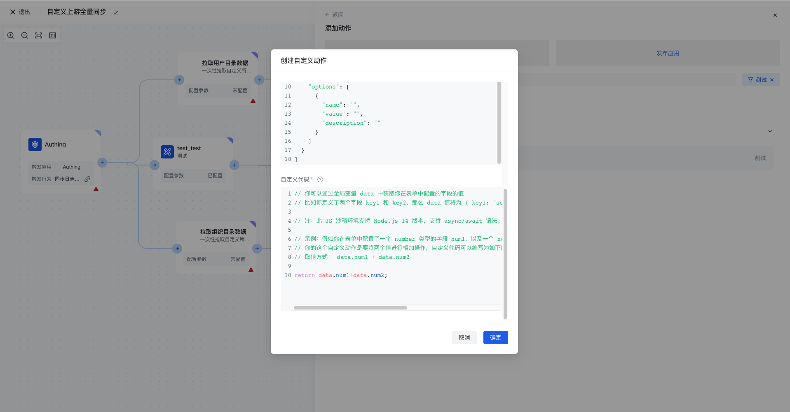
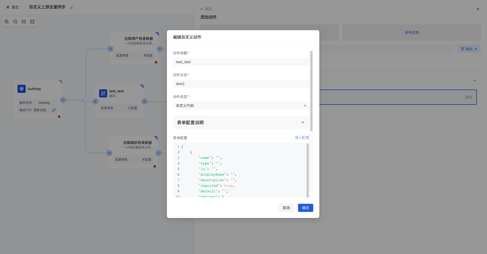

# 创建自定义动作

要创建自定义动作，用户需要按照以下步骤进行操作：

1. 在身份自动化下，选择一个已有工作流或者创建一个新的工作流。

1. 在成功创建「自定义应用」后，点击进入自定义应用，并点击创建「自定义动作」。

1. 在创建自定义应用中，主要有「动作标题」，「动作分类」，「动作类型」（分为自定义代码和 HTTP 请求），以及表单配置。

3.下列是自定义代码实现实例-两数相加实例

1. 自定义动作编辑
2. 选中想要编辑的自定义动作，并点击编辑

1. 在编辑自定义动作弹窗中，对需要编辑的属性进行修改，修改完成后点击确定进行保存。

1. 自定义动作删除
2. 选中想要删除的自定义动作，并点击删除。

