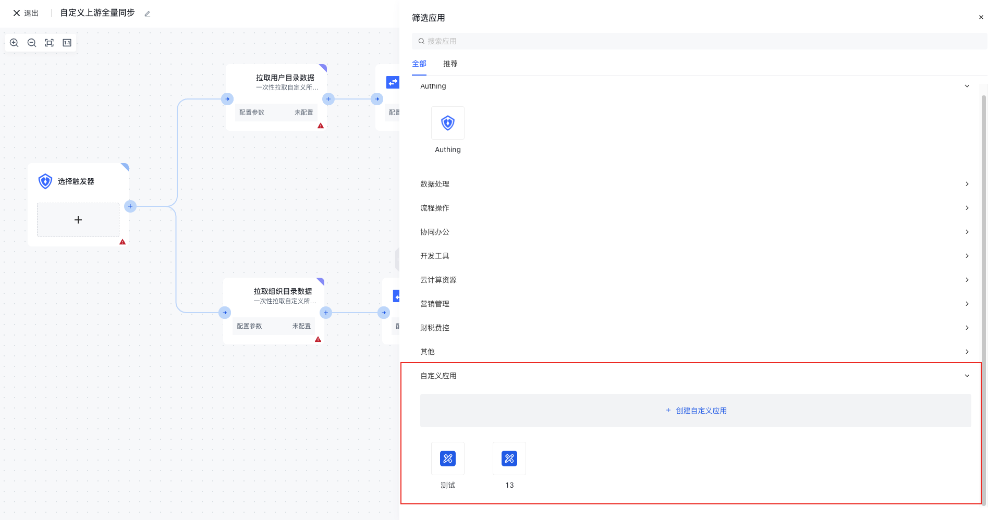

# 自定义应用概述

## 简介

自定义应用支持用户将一些常用的自定义代码片段或者一系列的 HTTP 请求组合在一起，形成仅用户自身可用的工作流节点集合，用户可灵活的管理自定义应用下的动作节点分类以及表单属性配置，以提升用户配置自定义场景工作流的效率。

此外，自定义应用还支持「发布应用」操作，在通过系统管理员审核之后，该应用即可被其他用户使用。同时，用户仍然可以继续使用或更新自己的自定义应用，但是不会影响到发布出来的应用。若用户想将后续的更新也同步到发布的应用中，也可以通过再次提交「发布应用」申请，审核通过之后，发布到公共分类里的应用也将同步更新。

## 使用场景

自定义应用有以下几种常用的使用场景：

- 与外部系统集成：自定义应用可以从一个系统中提取数据并将其推送到另一个系统中，或者根据某些事件自动更新多个系统中的记录，从而确保所有系统中的数据准确且最新。
- 定制化工作流程：自定义应用可以引导用户完成特定的流程，或者强制执行某些规则或验证以确保数据质量，从而确保流程被一致地遵循，数据准确且完整。
- 使用各种工具和技术：在创建自定义应用程序时，可以使用各种工具和技术来实现自动化、集成和定制化工作流程，例如 Nodejs 编写脚本、使用 API 与其他系统进行集成、使用 JavaScript 编写自定义表单验证逻辑等.
- 基于 HTTP 请求实现更强大的自动化功能：使用 HTTP 请求，可以实现更高级的自动化功能。

自定义应用程序可以基于 HTTP 请求实现更强大的自动化功能。使用 HTTP 请求，您可以从一个系统中提取数据并将其推送到另一个系统中，或者根据某些事件自动更新多个系统中的记录。

如果您需要更多关于如何使用这些 API 的信息，您可以查看相应的文档。如果您需要帮助编写代码，请提供更多上下文和具体问题，我会尽力帮助您。
