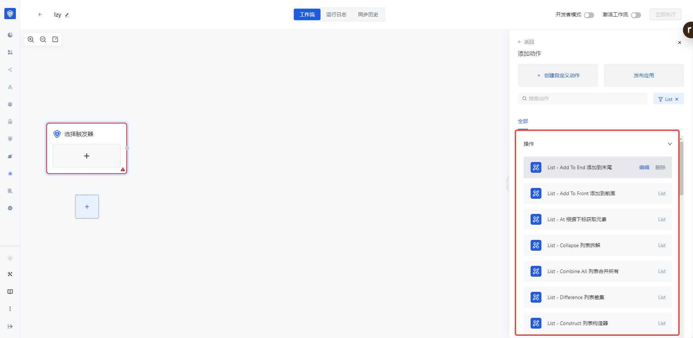
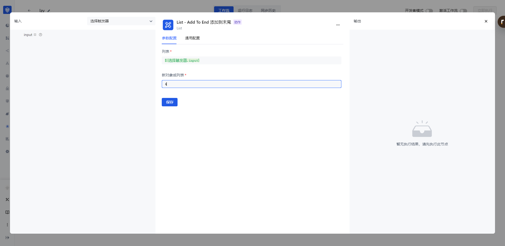
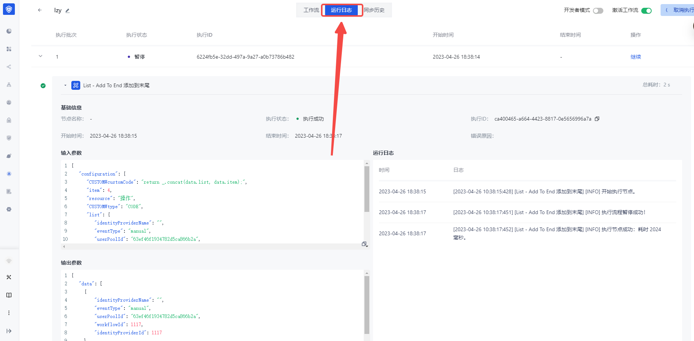

# 使用自定义应用

要使用自定义应用，用户需要按照以下步骤进行操作：

1. 当「自定义动作」添加成功后，会出现在所属「自定义应用」下的操作中。

1. 选择该「自定义动作」并创建节点,并设置入参，可以从上游传递下来，也可以自定义固定值，保存成功后即可执行

1. 可以点击该节点执行按钮进行测试。

1. 点击执行后，可以点击工作流画布中上方的「运行日志」，然后在「运行日志」中查看相关节点的运行信息，运行情况等。

