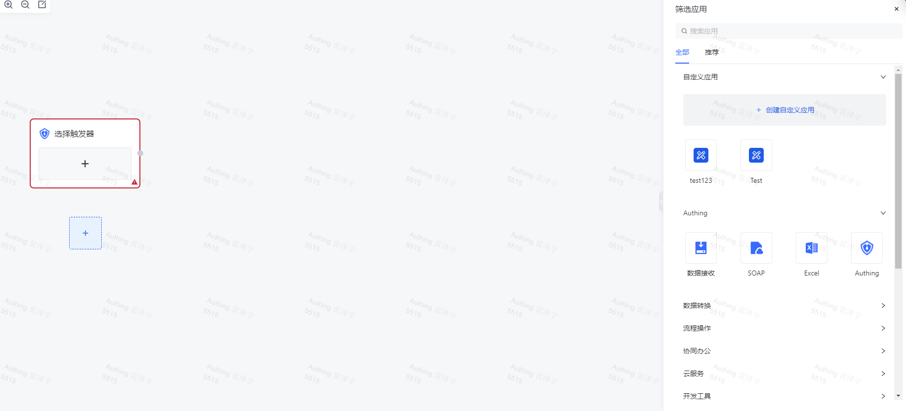
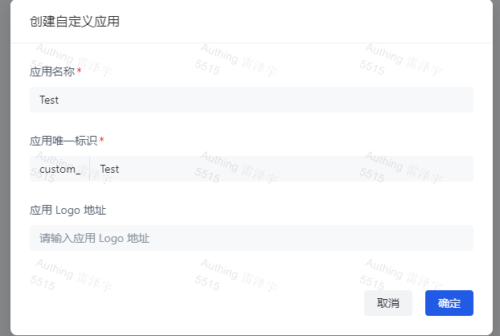
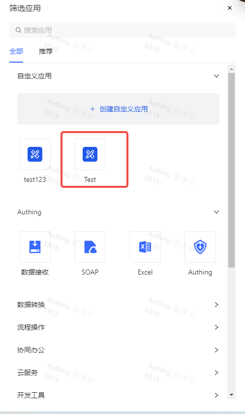

# 创建自定义应用

要创建自定义应用，用户需要按照以下步骤进行操作：

自定义应用功能是基于工作流进行实现的，等同于用户自定义工作中的节点来完成预期目标。

1. 选择一个已有工作流或者创建一个新的工作流。

1. 点击添加节点，在侧边栏点击创建「自定义应用」。

1. 在创建自定义应用弹窗中，输入自定义「应用名称」和应用唯一标识「应用编码」,以及「应用 Logod」（非必填）。

1. 在创建成功后，就能在右边的侧边栏中，找到刚创建的自定义应用。

