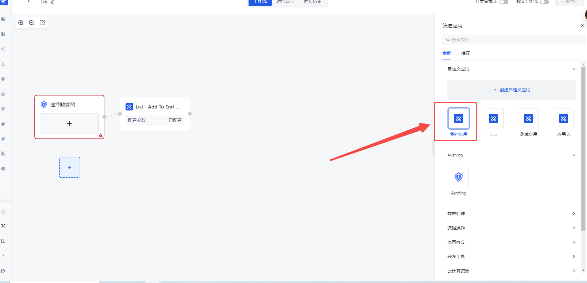
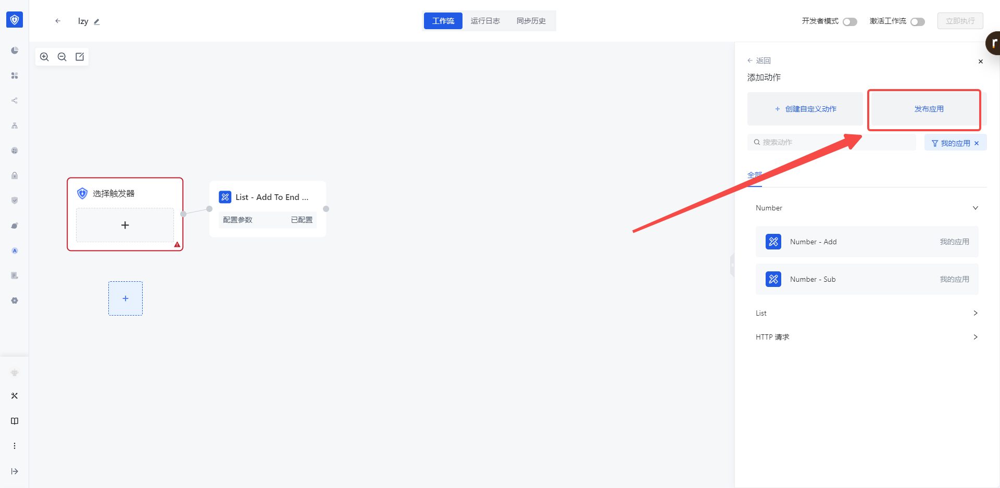
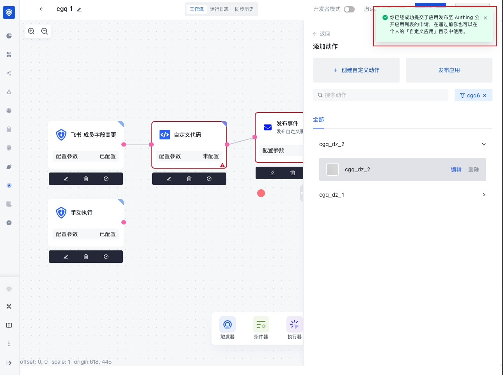

# 发布自定义应用

要发布自定义应用，用户需要按照以下步骤进行操作：

1. 选择一个已有工作流或者创建一个新的工作流。

1. 在右边侧边栏，选择要发布的应用

1. 然后点击在右边侧边栏中的「发布应用」。

1. 点击确认应用发布后，会提示应用发布到 Authing 公开应用列表的申请审批中。

1. 关于应用发布的相关信息会提交到相关后台人员审核，审核通过后该应用会变成公共应用节点，并提供给所有用户使用。
