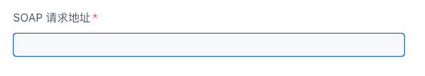
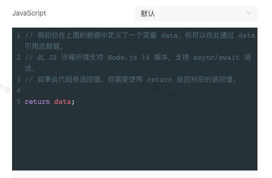
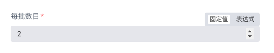
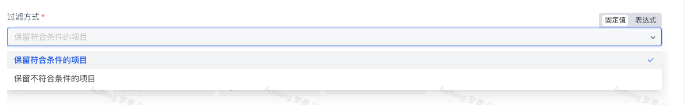
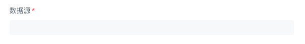
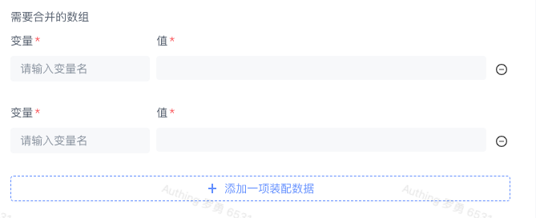
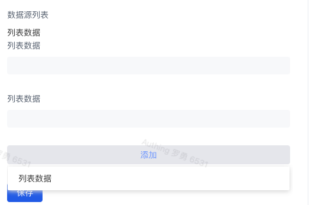
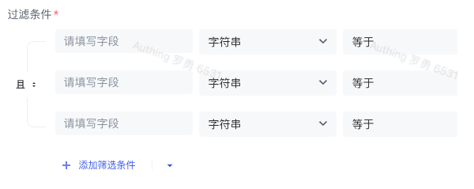

# 自定义应用节点说明

1. 节点属性列表

- `type`: 字段类型，可选值：`string, number, boolean, options, jsonObject, notice, inputData, multiInputData, fixedCollection, filterCondition`
- `name`: 字段名称
- `displayName`: 字段展示名称
- `description`: 字段描述
- `required`: 是否必须
- `default`: 默认值
- `options`: 下拉选项列表，type 为 options 时有效

  - `value`: 拉表单字段值
  - `name`: 拉表单字段名
  - `description`: 拉表单字段描述
  - `action`: 拉表单字段动作
- `displayOptions`: 显示选项

  - `show`:

    - `<name>: [<value>]`
- `in`:  HTTP 请求参数类型: `PATH, HEADER, QUERY, BODY`

1. 节点属性类型

- `string`: 字符串输入框

  - `typeOption`:

    - `{"editor": "codeNodeEditor"}` 自定义代码输入框
- `number`: 数字输入框
- `options`: 下拉选项，需配合 options 列表属性使用

  - `notice`: 文本类型，支持 markdown 语法
- `jsonObject`: JSON 输入框，有 JSON 格式验证
- `inputData`: 数据源
- `multiInputData`: 多数据源
- `fixedCollection`:  动态输入集合
- `filterCondition`: 过滤条件
- `string`:



- `typeOption`：

```json
// 代码编辑器
{
  "editor": "codeNodeEditor"
}
```



- `number`:



- `options`:



- `jsonObject`:
- `inputData`:



- `multiInputData`:



- `fixedCollection`:



- `filterCondition`:


