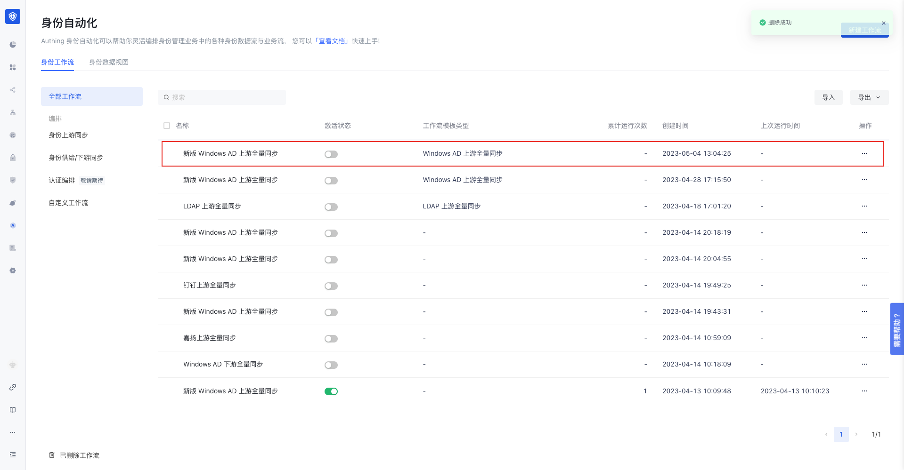
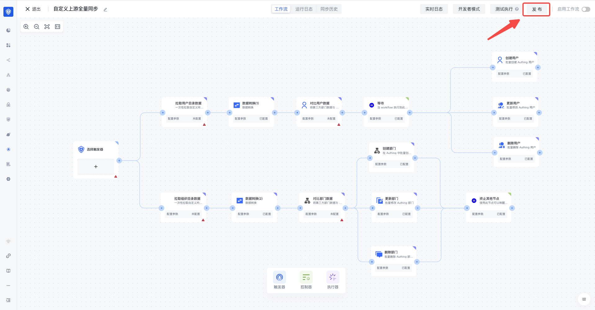
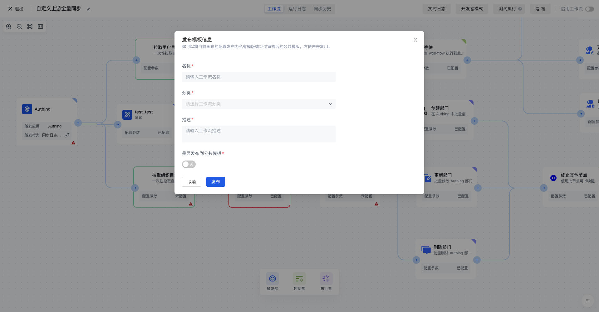
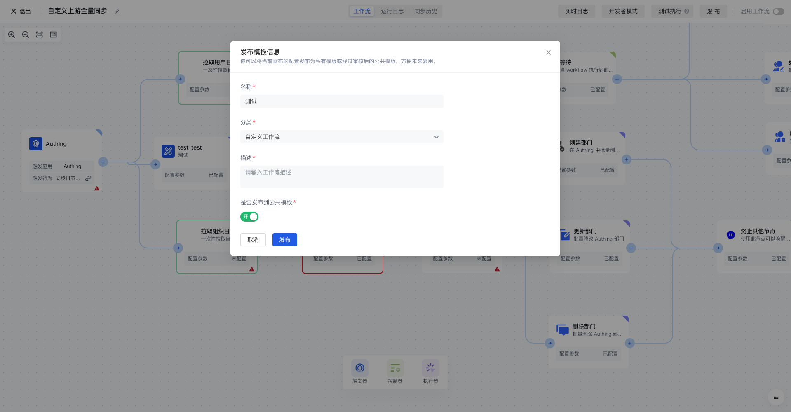
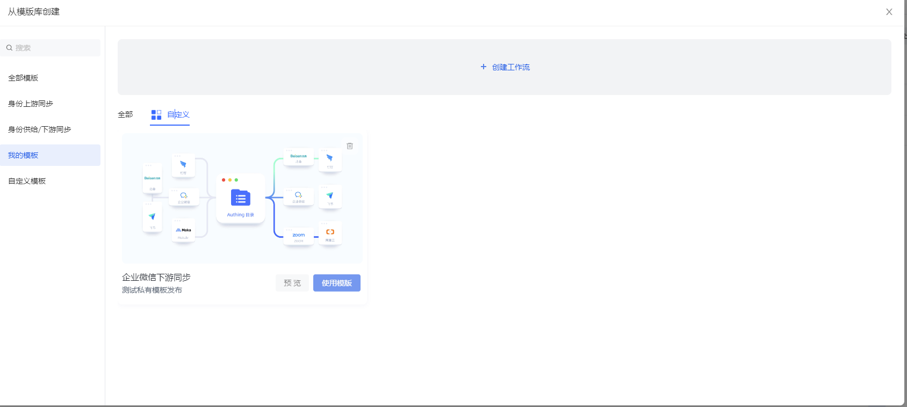

# 发布自定义模板

1. 联系管理员获取工作流模板发布权限（ 以用户池 ID 为维度）。
2. 进入身份自动化中，选择要发布为工作流模板的工作流。

1. 当该用户池开启模板发布权限时，工作流画布页面右上角会出现发布按钮。

1. 点击模板发布按钮，填写发布工作流模板相关信息

- 当前仅支持发布到自定义工作流模板
- 当选择是否发布到公共模板：

  - `否`：发布到当前用户池下「我的模板」分类中。（<strong>其他用户池无法</strong><strong>查看或使用</strong><strong>该模板</strong>）
  - `是`：该工作流模板将发布到公共的「自定义工作流」模板分类中。（<strong>发布</strong><strong>模板后</strong><strong>需要管理员</strong><strong>审核</strong><strong>，</strong><strong>在</strong><strong>审核未通过前会在</strong><strong>「</strong><strong>我的模板</strong><strong>」中显示</strong><strong>，</strong><strong>审核</strong><strong>通过后会发布到公共的</strong><strong>「</strong><strong>自定义工作流</strong><strong>」模板分类中</strong>）

