# 编写第一个 workflow

这篇文档将会如何从零开始创建一个 Workflow，将一个 mock 的用户数据源导入到 Authing。最终创建出来的流程图如下：

> 线上用户池地址：[https://console.authing.cn/console/63bea7828f47719bfa80df93/workflow/detail?task_id=138&workflowId=138&defaultActiveKey=WORK_fLOW_CANVAS&page=1&group=custom](https://console.authing.cn/console/63bea7828f47719bfa80df93/workflow/detail?task_id=138&workflowId=138&defaultActiveKey=WORK_fLOW_CANVAS&page=1&group=custom)，如果想直接查看请联系 ou_05bf3085ffc4a9cbb4fda96a24ae3770 添加协作管理员。


会涉及到以下几个核心节点：

- HTTP：发送 HTTP 请求
- 数据转换：将此用户数据源的用户字段格式转换为 Authing 标准格式
- 数据过滤：根据用户的某些字段作为过滤条件，过滤出符合条件的用户
- 循环：循环处理批量数据
- IF：判断用户是否存在，如果存在则走更新，否则走创建
- Authing 节点：基于 V3 API 封装，包含 V3 API [https://api-explorer.authing.cn/](https://api-explorer.authing.cn/)  管理侧所有功能。
- 邮件：此 Demo 会演示在用户创建之后给用户发送邮件。

# 第一步：编写 HTTP 节点拉取数据

这里我们使用 [https://random-data-api.com/](https://random-data-api.com/) 提供的免费服务 mock 数据，将用到 [https://random-data-api.com/api/v2/users?size=100](https://random-data-api.com/api/v2/users?size=100) 这个接口生成随机数据。

从应用列表中搜索「HTTP」，选择「HTTP Request 这个应用」：

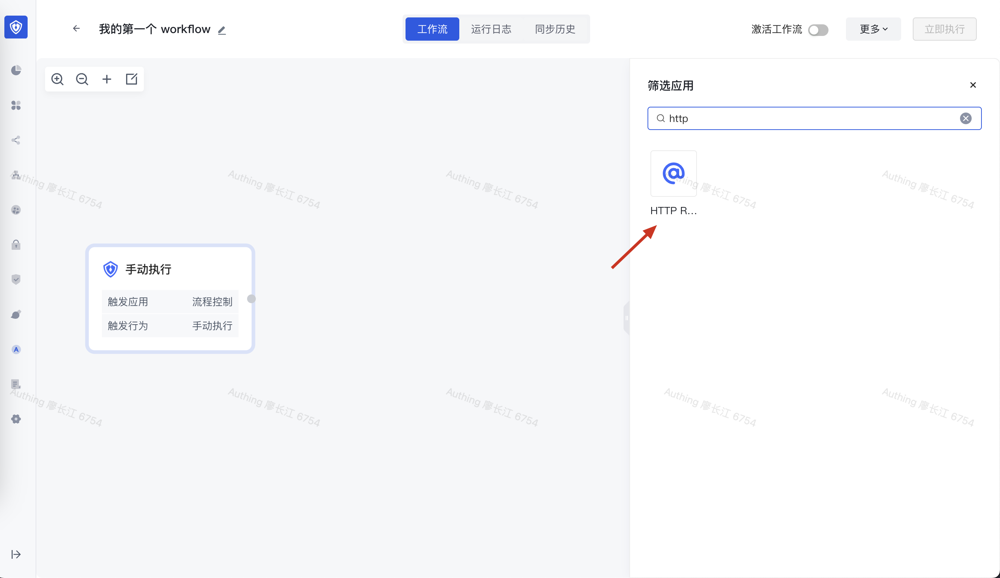

在配置项的 URL 处填写地址：[https://random-data-api.com/api/v2/users?size=100](https://random-data-api.com/api/v2/users?size=100)，点击保存。

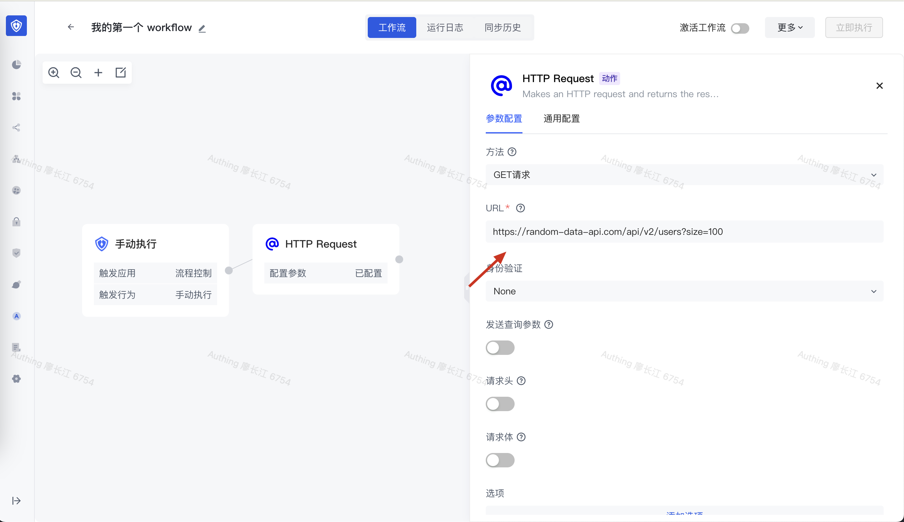

点击 HTTP 节点的「执行」按钮：

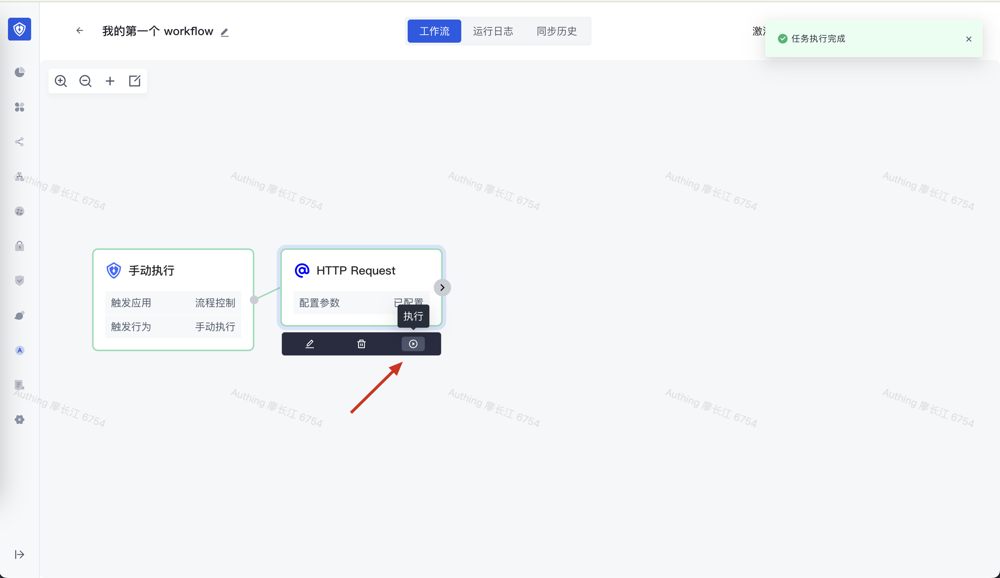

执行完成之后，点开此节点，可以在「运行日志」的的「输出参数」看到此接口返回的结果。

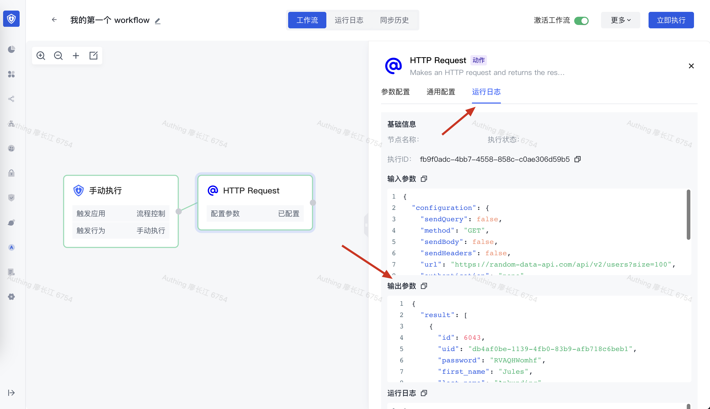

# 第二步：编写数据过滤节点过滤用户

添加一个「数据过滤」节点，在数据源中勾选前面 「HTTP Request」节点的输出结果，这里我们选中 <strong>result</strong> 数据项，点击你可以看到数据源字段自动输入了 <strong>${HTTP Request.output.result}</strong> ，这就是我们从「HTTP Request」节点获取到的数据。

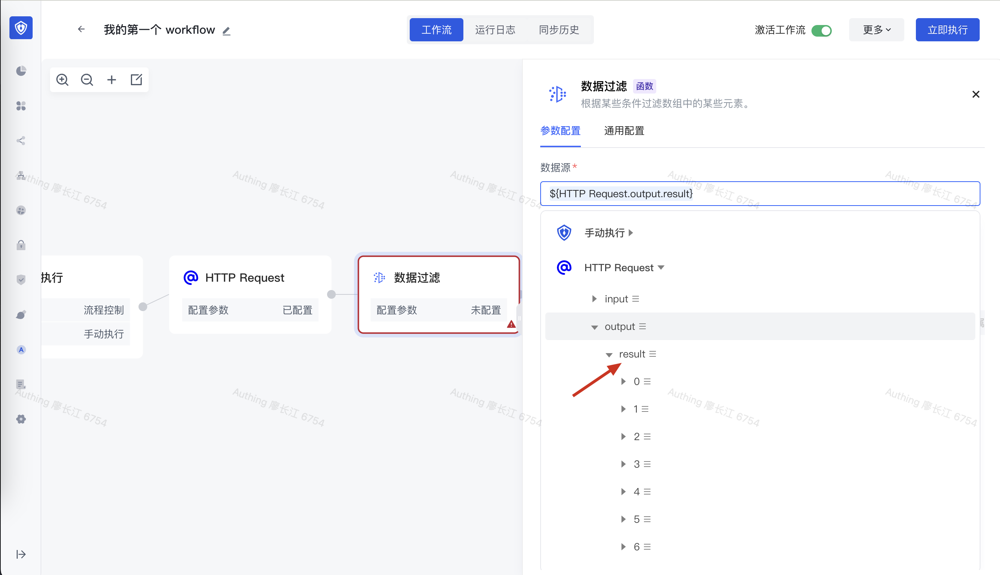

接下来我们编写一下过滤规则。在这里我们会设置一个比较简单的过滤条件：性别（gender）为女（Female）。如果想了解数据过滤节点的详细使用方法，请见[数据过滤](https://steamory.feishu.cn/wiki/wikcnYVzh5ARbSi4qrrDtUWSkCd?appStyle=UI4&domain=www.feishu.cn&locale=zh-CN&refresh=1&tabName=wiki&theme=light&userId=6738160787958792462) 文档。

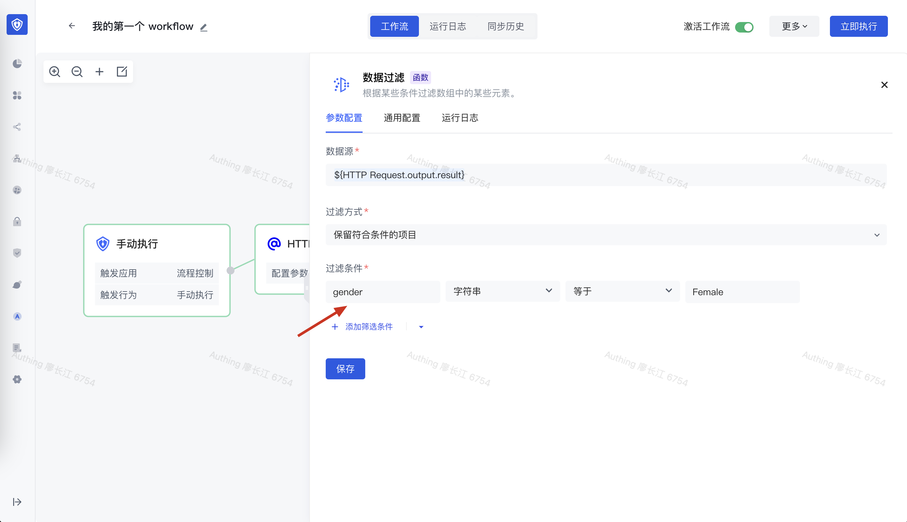

接着点击数据过滤节点的「执行」按钮，等执行完成之后，可以看到此节点的输出结果：

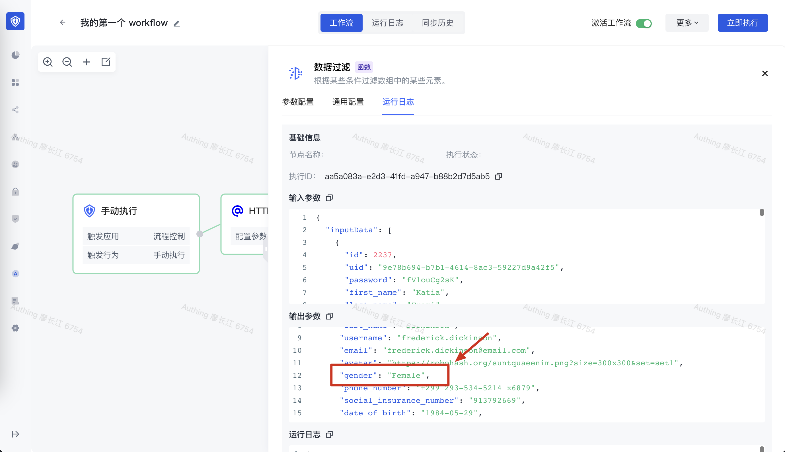

可以看到只有性别为 Female 的用户保留下来了。

## 

# 第三步：编写数据转换节点转换用户为 Authing 标准格式

在编写此节点之前，我们先在 Authing 用户池中创建几个自定义字段，后面我们会把此用户数据源的某些字段存储到我们的自定义字段中：

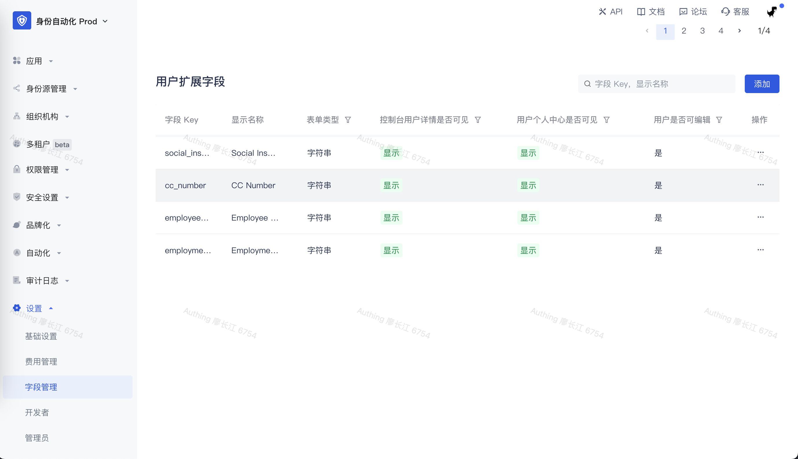

接下来，添加一个「数据过滤」节点，和上一步类似，这里数据源需要装配前面的「数据过滤」节点的数据，作为此节点的输入。

这里在配置转换规则的时候，我们把「转换场景约束」中的「目标字段」设置为「Authing」，这样我们在做字段转换的时候就能够看到 Authing 目前所有的字段，包含扩展字段。

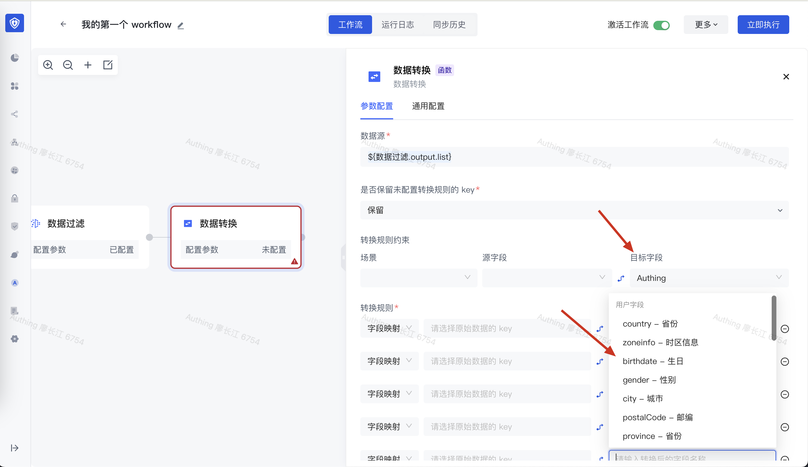

接下来开始编写转换规则。这里我们介绍四种最创建的转换规则：

1. 字段映射：将原始数据的一个 key 映射到新数据的一个 key，值保持不变。
2. 固定值：给新数据的某个 key 设置一个固定值。
3. 表达式：可以对原始数据的值编写自定义表达式，实现诸如以下场景：
4. 取嵌套比较深的数据：如 $item.address.country
5. 取邮箱 @ 之前的部分作为用户名
6. 取社保账户的后四位作为初始密码
7. 枚举值转换：比如在此例子中，性别可能包含的值为 Female、Male，但是在 Authing 中，合法的值是 F 、M 和 U。

在此场景中，我们编写了以下的转换规则，重点说明以下几个规则：

- 将数字类型的 ID 转成字符串类型，这里使用的是 <strong>JS 语法的 toString()</strong> 方法：

```typescript
$item.id.toString()
```

- 设置密码：判断 social_insurance_number 是否存在，如果存在，取后 6 位作为密码；如果不存在，设置默认密码 123456。

```typescript
$item.social_insurance_number ? $item.social_insurance_number.slice($item.social_insurance_number.length - 6, $item.social_insurance_number.length) : "123456"
```

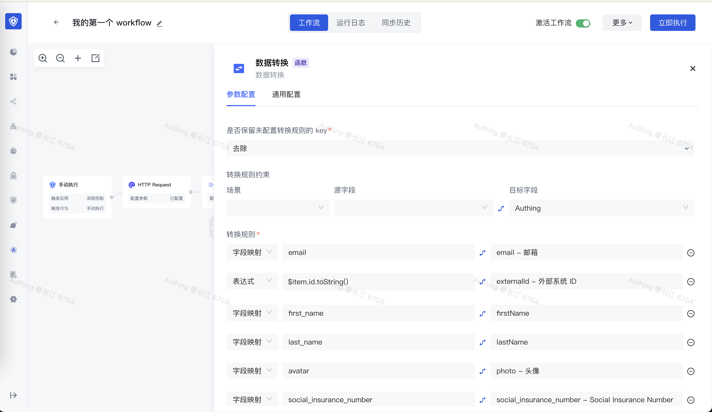

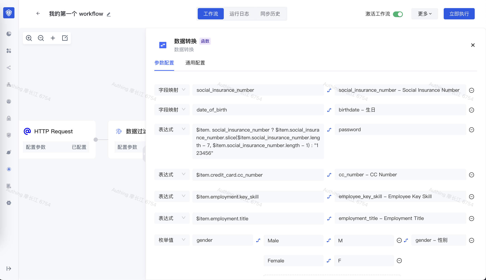

# 第四步：编写循环节点循环处理数据

添加一个循环节点，设置循环模式为「循环列表】，并且在『选择需要循环的列表数据』中装配「数据转换节点」的输出结果。

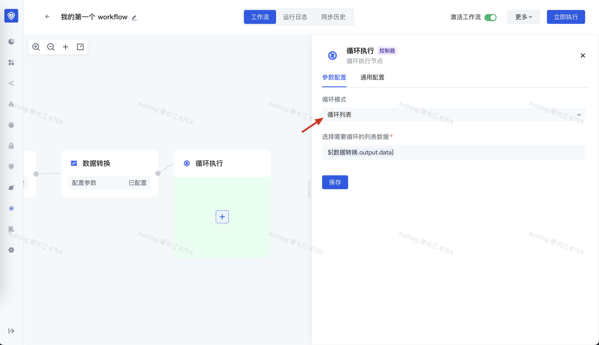

这种模式下，「循环执行」节点会遍历传入的列表，使用遍历的每个元素执行循环体中的流程。你可以使用 <strong>${getLoopItem.output.result.xxxx}</strong> 获取当前元素的值，比如当前元素为以下数据时：

```typescript
{
    "lastName": "Boyer",
    "birthdate": "1992-12-21",
    "gender": "F",
    "externalId": "3082",
    "photo": "https://robohash.org/autvoluptatibuspraesentium.png?size=300x300&set=set1",
    "firstName": "Kelle",
    "password": "434120",
    "employee_key_skill": "Problem solving",
    "phone": "+359 1-591-677-0166 x929",
    "employment_title": "Central Marketing Facilitator",
    "social_insurance_number": "764341202",
    "cc_number": "5564-5675-4676-3918",
    "email": "kelle.boyer@email.com"
}
```

可以通过 <strong>${getLoopItem.output.result.email} </strong>获取当前元素的 email 的值。

有关「循环执行」节点的详细文档，请见 [循环](https://steamory.feishu.cn/wiki/wikcniY51qpnPcCeQbSbZLKq4mb?appStyle=UI4&domain=www.feishu.cn&locale=zh-CN&refresh=1&tabName=wiki&theme=light&userId=6738160787958792462) 。

# 第五步：编写循环体的内容

## 编写 Authing 节点的「判断用户是否存在」接口判断当前用户是否存在

> 有关 Authing 节点的详细使用文档，请见 [Authing](https://steamory.feishu.cn/wiki/wikcnOC85wey0IdKwF4WxFvfyXk?appStyle=UI4&domain=www.feishu.cn&locale=zh-CN&refresh=1&tabName=wiki&theme=light&userId=6738160787958792462) 。

在「Authing」应用中选择「判断用户是否存在」这个动作：


在此我们传入当前元素的 <strong>externalId</strong> 字段，通过 <strong>externalId </strong>来检查当前用户是否存在。

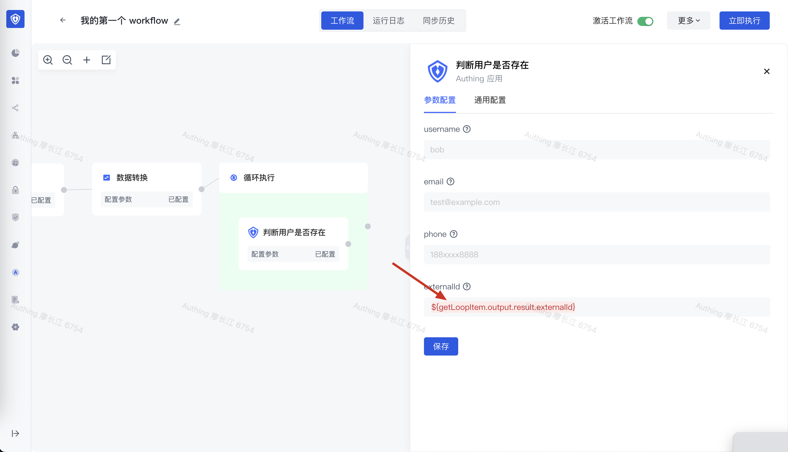

再次点击执行，在运行日志中可以看到，检测结果为符合预期的用户不存在。

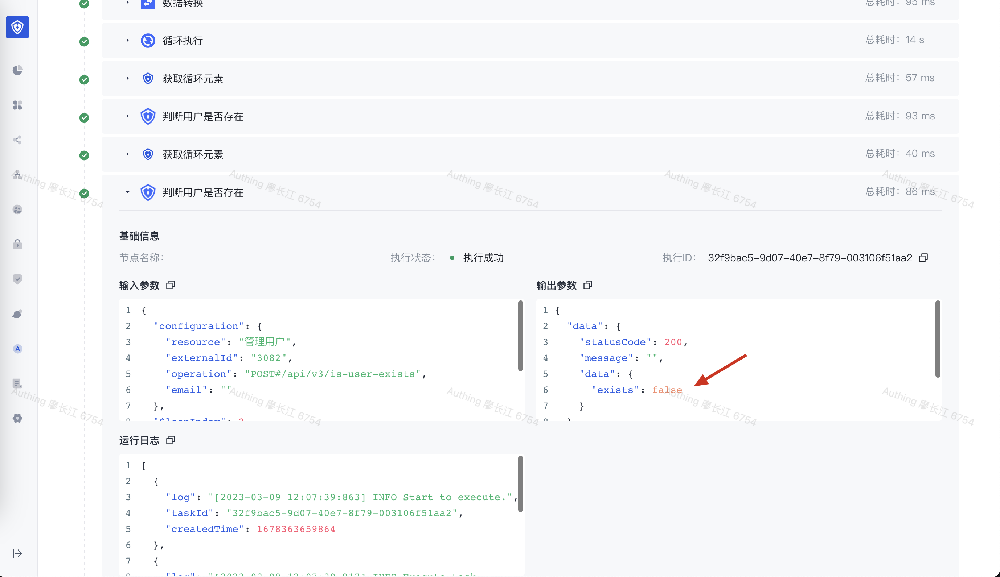

## 编写 IF 节点，将上一节点的执行结果作为 IF 条件

接下来我们希望实现的逻辑是：当用户存在时，走更新逻辑；不存在时，走创建逻辑。所以我们需要将上一节点的执行结果作为 IF 节点的判断条件。有关 IF 节点的详细文档，请见：[IF](https://steamory.feishu.cn/wiki/wikcnUQ9bIQU3fe6gcPON7ZubMg?appStyle=UI4&domain=www.feishu.cn&locale=zh-CN&refresh=1&tabName=wiki&theme=light&userId=6738160787958792462) 。

此节点的配置如下：首先我们定义一个变量，叫做 exists，值取的是上一节点「判断用户是否存在」执行结果 <strong>${判断用户是否存在.output.data.exists}</strong>，然后我们在条件中设置当 exists 的值（通过 <strong>$exists</strong> 引用，这个值是一个布尔类型）为「<strong>是</strong>」：

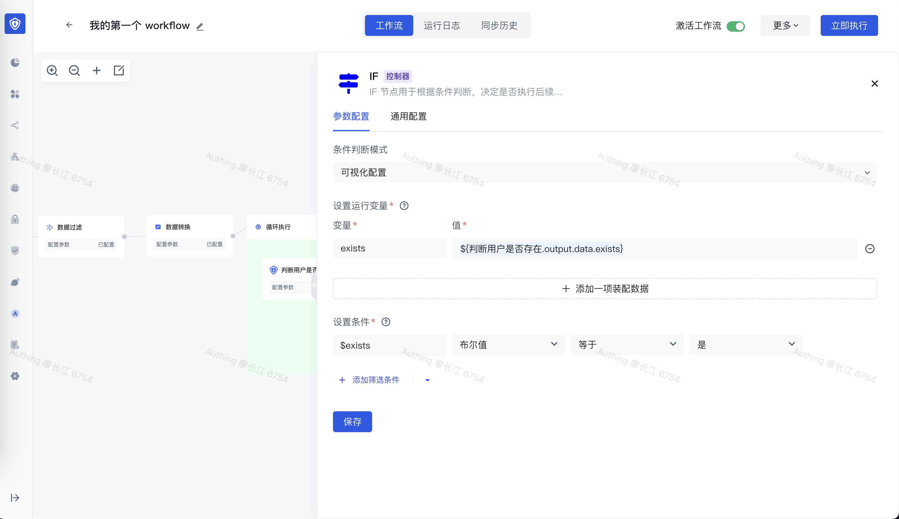

我们在 IF 节点的后面添加两个分支：

- True 分支：更新用户资料
- False 分支：创建用户

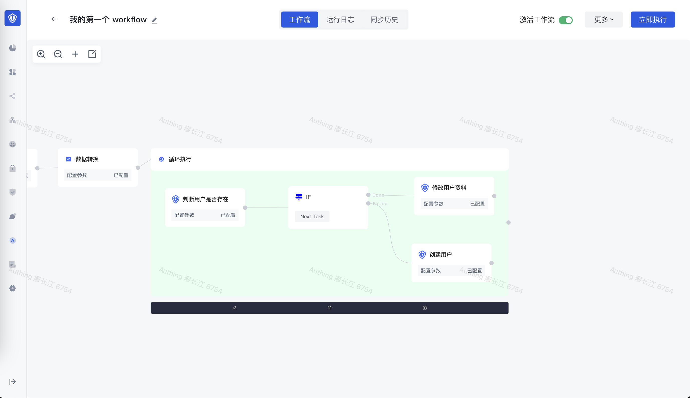

我们期望的结果是：当此条件满足时，将会走「True」分支，否则将走「否」分支。

点击执行，查询运行日志可以看到，走的是「创建用户」分支，这符合我们的预期，因为所有用户都还不存在。

> 当前我们还没有配置「创建用户」和「更新用户资料」节点，所以节点报错，属于正常情况。

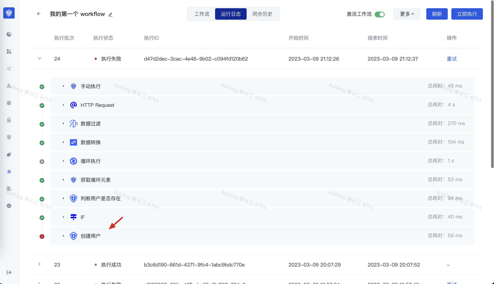

## 编写「创建用户」和「更新用户资料」节点配置

这里不做过多赘述，需要提一下的是，创建用户时给用户设置自定义字段，可以像下面那样写嵌套的 JSON 表达式：

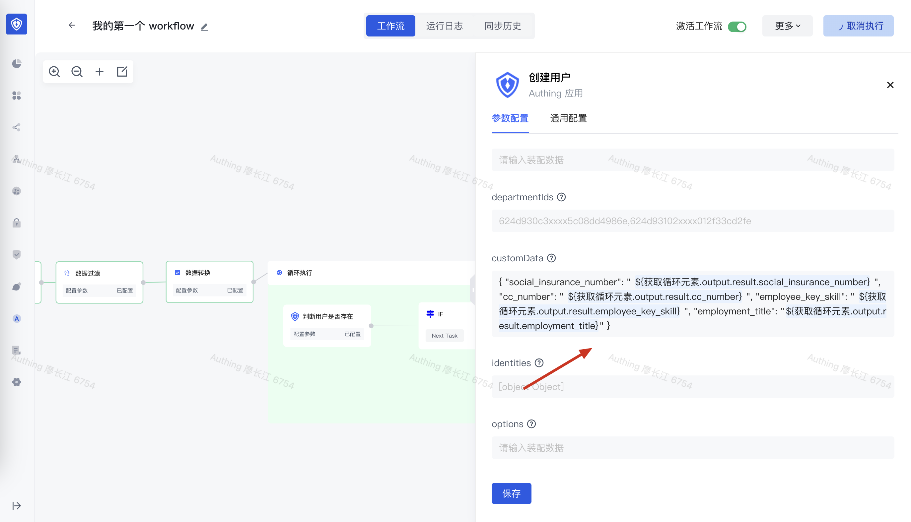

同时，在循环节点传入的列表是第三方的用户数据，不是 Authing 的用户，所以在更新用户资料的时候，无法获取 Authing 的用户 ID。好在我们的 V3 的更新用户资料 API 支持传入一个可选字段 —— <strong>userIdType</strong>，我们可以根据 <strong>externalId</strong> 字段来更新用户：


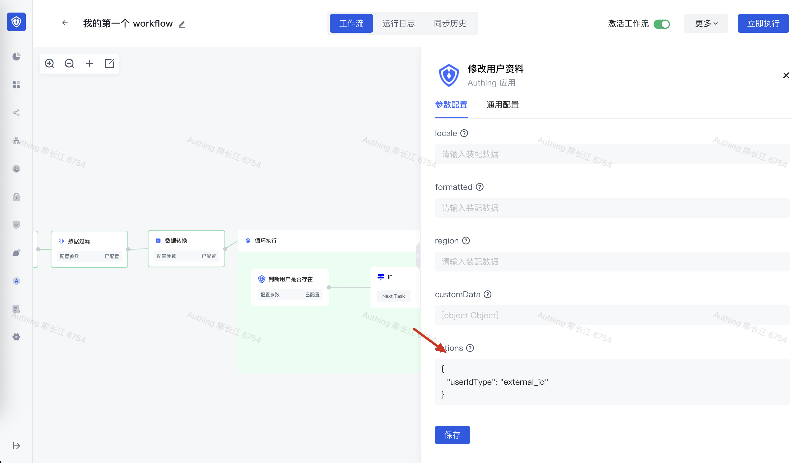

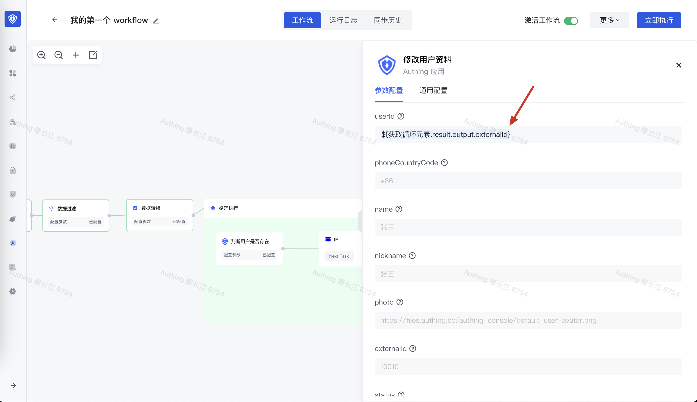

最终来执行一下看下效果，可以看到用户已经被成功导入了：

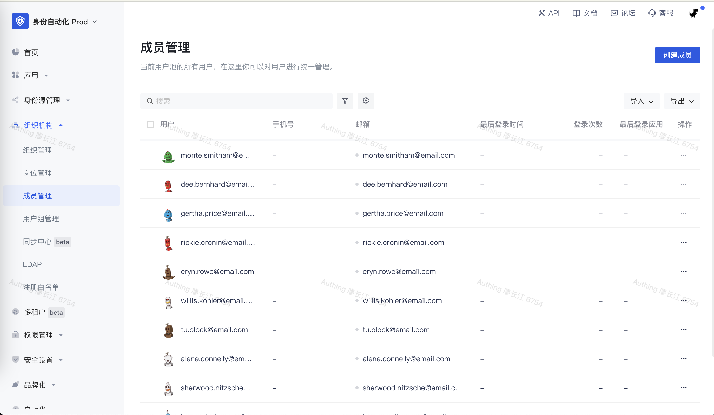

我们选择其中一个用户，用他自定义字段中的 social_insurance_number 后 6 位作为密码尝试登录一下：


可以看到登录成功了：


1. 编写发送邮件节点

相信看到这里，已经不需要过多解释了：

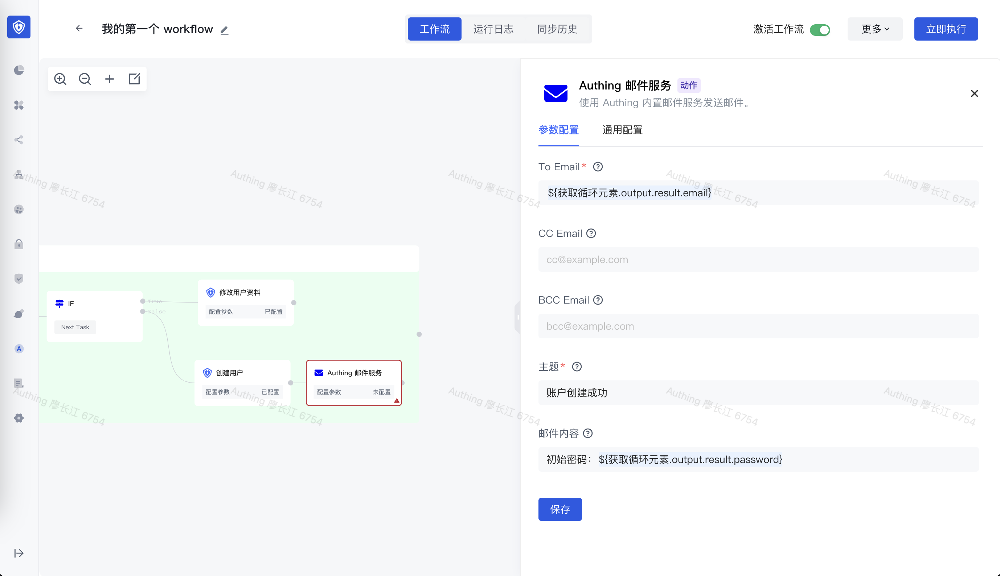

# 查看最终流程图

最后来 Review 一下我们创建的这个流程：首先通过 <strong>HTTP</strong> 节点拉取数据，经过<strong>数据过滤</strong>节点过滤出我们实际想要的数据，然后通过<strong>数据转换</strong>节点将用户信息转换成 Authing 标准格式，最后将此转换过后的列表传入<strong>循环</strong>节点，在循环体中，针对每一条数据，先调用 Authing 节点中的<strong>判断用户是否存在</strong>方法，然后添加 <strong>IF</strong> 节点使用判断用户是否存在节点的结果作为判断依据，最后分别执行<strong>创建用户</strong>或者<strong>更新用户</strong>资料的流程。

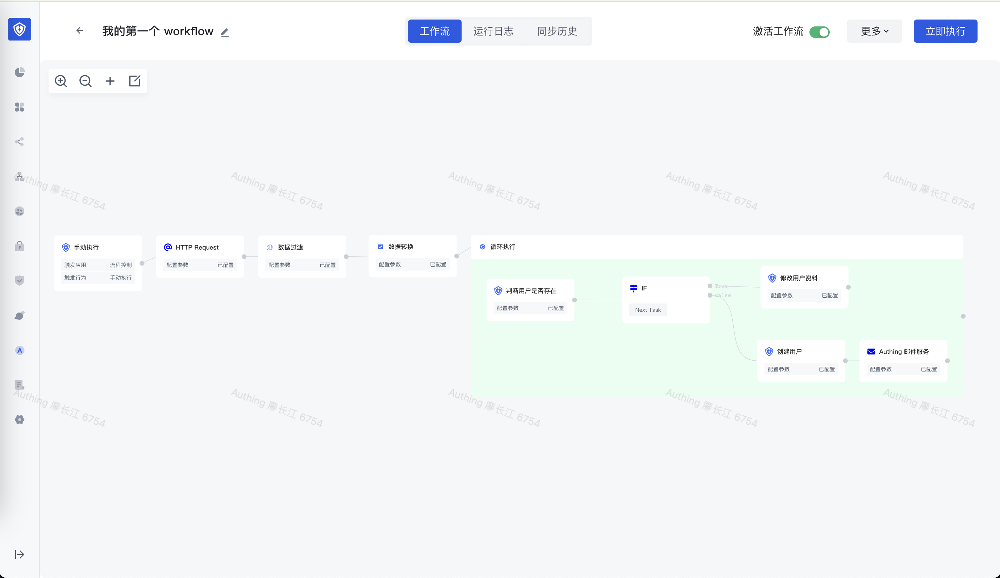

# 思考问题

请你思考以下几个问题：

1. 此 Demo 中的 Mock 用户数据手机号格式 Authing API 校验认为不合法，你有什么思路可以将其转换成我们合法的格式：

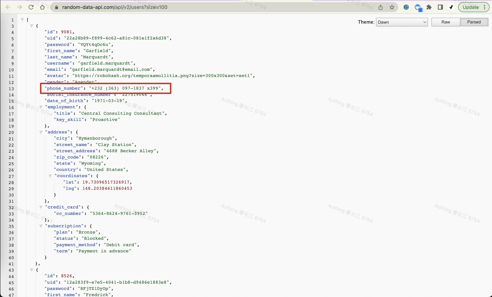

1. 假如 Authing 的 V3 API 无法支持通过 externalId 字段作为主键更新用户资料，必须传入 Authing 的用户 ID，你还有没有其他思路可以完成这件事情？
2. 假如用户数据源非常大，一个 HTTP 请求无法完成，需要分页查询，你有没有什么思路。
