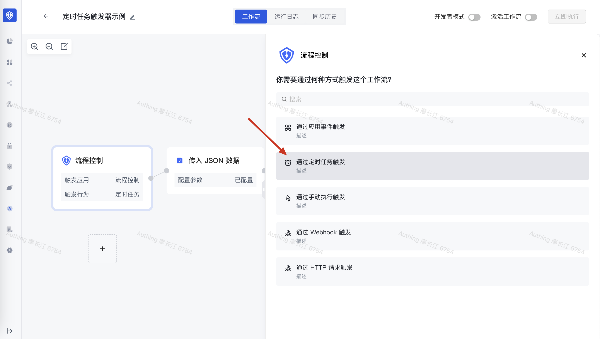
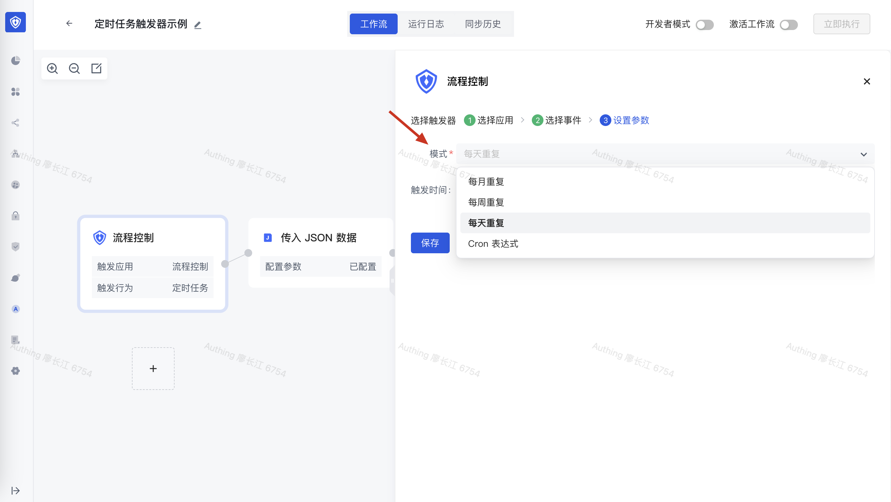
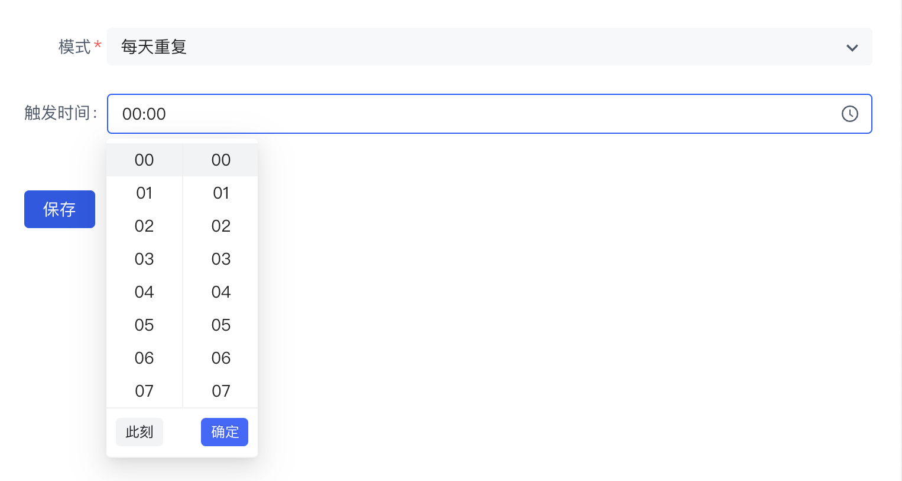
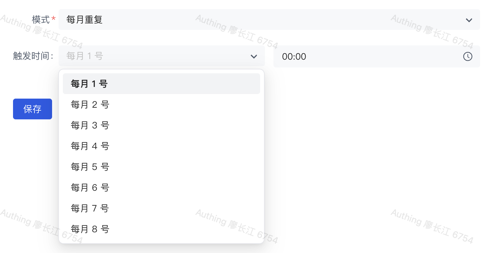
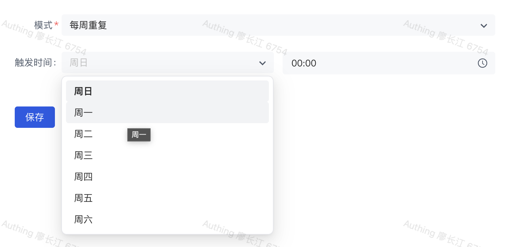

# 定时执行 workflow

如果需要按照一定时间周期触发 workflow，需要将触发器设置为<strong>定时任务</strong>：

定时任务分为以下几种模式：

1. 每月重复
2. 每周重复
3. 每天重复
4. Cron 表达式

## 每天重复

设置每天的触发时间：

## 每月重复

设置每月需要触发的日期，以及时间：

## 每周重复

设置星期几触发，以及具体时间：

## Cron 表达式

这是最灵活的方式，你可以使用[第三方网站](https://cron.qqe2.com/)生成 cron 表达式，下面是一些常见的 cron 表达式：

> 注：Authing 身份自动化允许 cron 表达式最小时间间隔为两小时。

- 0 0 23 * * ?  每天 23 点执行一次
- 0 0 1 * * ?  每天凌晨 1 点执行一次：
- 0 0 1 1 * ?  每月 1 号凌晨 1 点执行一次
- 0 0 23 L * ?  每月最后一天 23 点执行一次
- 0 0 1 ? * L  每周星期天凌晨 1 点实行一次
- 0 0 0,13,18,21 * * ? 每天的 0 点、13 点、18 点、21 点都执行一次
- 0 15 10 ? * 6#3   每月的第三个星期五上午 10:15 触发
- 0 15 10 ? * MON-FRI    周一至周五的上午 10:15 触发
- 0 10,44 14 ? 3 WED    每年三月的星期三的下午 2:10 和 2:44 触发
