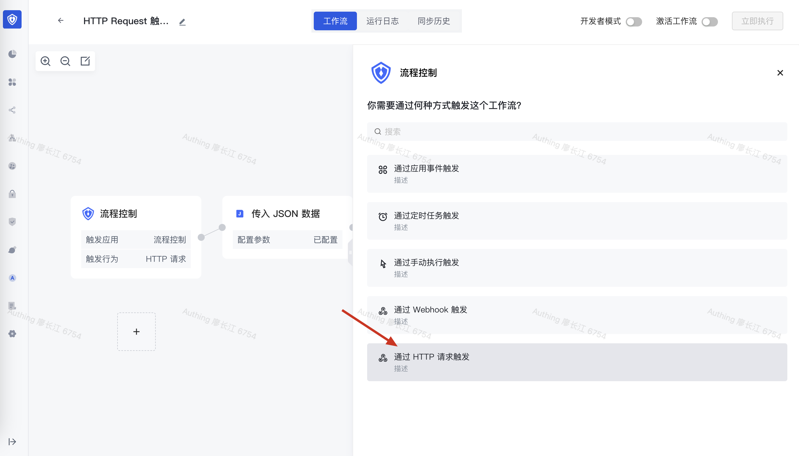
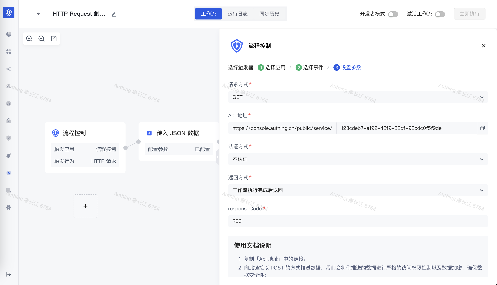
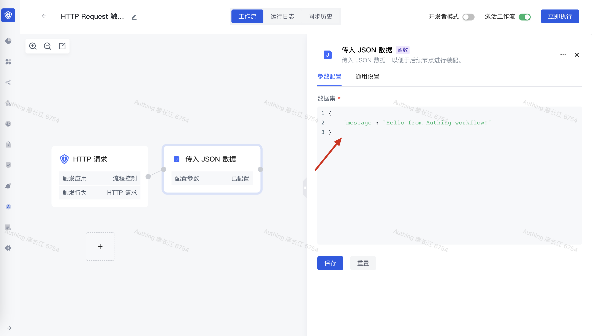
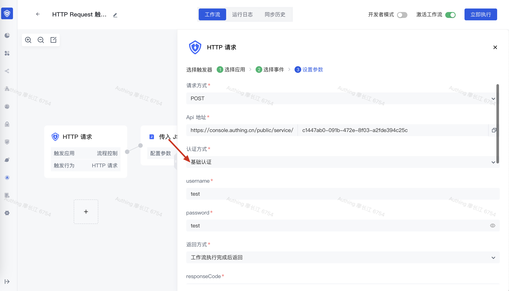
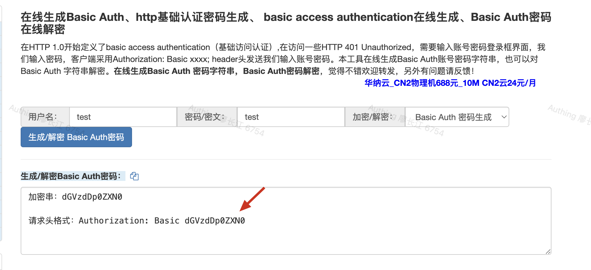
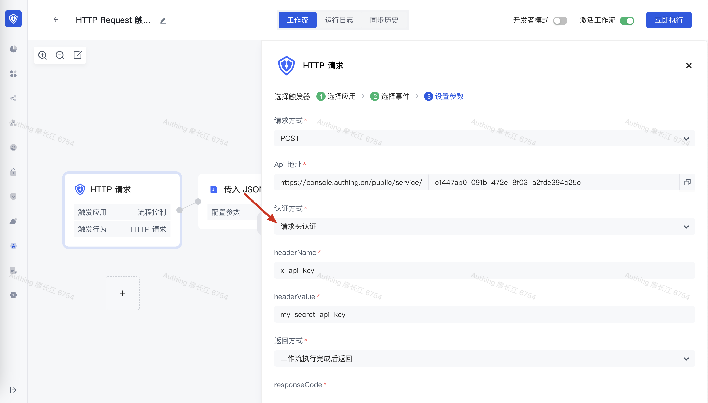
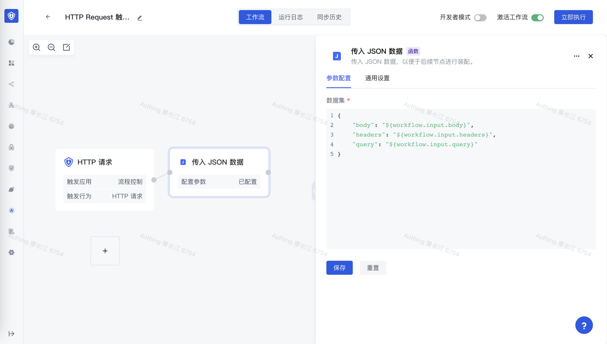

# 通过 API 接口形式调用 workflow

就像你平时请求 API 接口一样，Authing workflow 可以暴露一个 public service API 地址，调用之后你可以通过 HTTP 响应拿到 workflow 的执行结果。

在选择触发器时，选择「通过 HTTP 请求触发」方式：



可以在<strong> </strong><strong>API</strong><strong> 地址</strong>这一项中复制请求地址，还可以配置 HTTP 请求调用方式：

1. 请求方式：支持 GET、POST、PUT、DELETE、HEAD、PATCH 6 种 HTTP 请求方式
2. 认证方式：支持不认证、基础认证（Basic）、请求头认证三种方式
3. 不认证：这种情况下不会设置任何鉴权方式，任何拿到此 API 地址的第三方都可以调用此接口。
4. 基础认证：通过 HTTP Basic 方式进行认证，你需要配置用户名和密码，客户端调用方式见下文。
5. 请求头认证：需要配置请求头的 key 和密钥值，比如要求客户请求的时候传递一个 x-api-key 的请求头，内容为你配置的密钥
6. 返回方式：
7. 立即返回：客户端请求触发 workflow 执行之后立即返回，客户端可以获取到 workflow 的执行实例 ID，可以通过执行实例 ID 异步拿到执行结果。
8. 工作流执行完成后返回：阻塞式等到 workflow 执行完成之后再返回，和我们平时调用 API 接口类似，你可以同步得拿到 workflow 的执行结果。<strong>其中，workflow 的执行结果为你最后一个节点的输出值</strong>。
9. HTTP 状态码：控制 HTTP 请求响应的状态码，默认为 200。



## 快速示例

这里我们采用默认配置：使用 GET 请求、不加任何鉴权方式，等待 workflow 执行完成之后返回。在 workflow 中添加一个 JSON 节点，用来返回测试数据：

```typescript
{
    "message": "Hello from Authing workflow!"
}
```



接下来我们复制 API 地址，在浏览器中进行访问，可以看到直接返回了 workflow 的执行结果：


## HTTP Basic 认证方式

在上一个示例的基础上，我们设置认证方式为「<strong>基础认证</strong>」，将 Basic 认证用户名和密码设置为 test 和 test。



为了测试方便，这里我们使用 [http://web.chacuo.net/safebasicauth](http://web.chacuo.net/safebasicauth) 此网站来生成 Basic 请求头值：



接下来使用 Postman 或者 curl 等开发工具请求此接口：

> 你需要将下面示例中的 API 地址和 Authorization 值替换成自己的。

```typescript
curl --location --request POST 'https://console.authing.cn/public/service/xxxxxx-xxxx-xxxxx-xxxxxx' \
--header 'Authorization: Basic xxxxxxxxx'
```

执行之后，也可以拿到正确的结果：

```typescript
{
  "code": 200,
  "message": "SUCCESS",
  "data": {
    "output": {
      "data": {
        "message": "Hello from Authing workflow!"
      }
    },
    "status": "COMPLETED"
  }
}
```

## HTTP Header 认证方式

我们再将认证方式设置为「<strong>请求头认证</strong>」，将请求头设置为 x-api-key，密钥设置为 my-secret-api-key：



通过 Postman 或者 curl 请求，可以看到拿到了 workflow 的执行结果：


## 获取 HTTP 请求中传递的参数

在 workflow 运行的节点中，你可以获取 HTTP 请求传递过来的参数，包含：

- 请求体：通过 ${workflow.input.body} 获取
- 查询参数：通过 ${workflow.input.query} 获取
- 请求头：通过 ${workflow.input.headers} 获取

这里我们把 JSON 节点的内容修改为：

```typescript
{
    "body": "${workflow.input.body}",
    "headers": "${workflow.input.headers}",
    "query": "${workflow.input.query}"
}
```



再次通过 Postman 或者 curl 请求，注意这里我们设置了请求头、请求体以及查询参数：

```typescript
curl --location --request POST 'https://console.authing.cn/public/service/c1447ab0-091b-472e-8f03-a2fde394c25c?param1=value1&param2=value2' \
--header 'x-api-key: my-secret-api-key' \
--header 'Content-Type: application/json' \
--data-raw '{
    "key1": "value1",
    "key2": "value2"
}'
```

通过返回结果我们可以看到，最终我们在节点中拿到了这些信息：

```typescript
{
    "code": 200,
    "message": "SUCCESS",
    "data": {
        "output": {
            "data": {
                "headers": {
                    "x-request-id": "2a0baec567eda9d215278c704f1445eb",
                    "content-length": "33",
                    "x-forwarded-proto": "https",
                    "postman-token": "59148df2-c25c-4d39-a953-257638e3a974",
                    "x-forwarded-port": "443",
                    "accept": "*/*",
                    "x-real-ip": "111.196.161.238",
                    "x-forwarded-scheme": "https",
                    "x-forwarded-host": "console.authing.cn",
                    "sw8": "1-MTFkMTQyZWMwZWRkNGYzY2IwN2IzN2JiNDhlZjVkMTI=-NzQ2MzM2OWY5ZWI5NDkwNTkwNjgzYzFjYTMzY2Y2OTc=-3-YXV0aGluZy1zZXJ2ZXI=-YXV0aGluZy1zZXJ2ZXItY2Q5OWQ4OTc4LXhxam5y-L2FwaS92MS93b3JrZmxvdy93ZWJob29rL2FwaS9jMTQ0N2FiMC0wOTFiLTQ3MmUtOGYwMy1hMmZkZTM5NGMyNWM=-YXV0aGluZy1mbG93LWVuZ2luZS5hdXRoaW5nLnN2Yy5jbHVzdGVyLmxvY2FsOjgwODA=",
                    "x-api-key": "my-secret-api-key",
                    "host": "authing-flow-engine.authing.svc.cluster.local:8080",
                    "content-type": "application/json",
                    "connection": "close",
                    "x-scheme": "https",
                    "accept-encoding": "gzip, deflate, br",
                    "user-agent": "PostmanRuntime/7.29.2"
                },
                "query": {
                    "param1": "value1",
                    "param2": "value2"
                },
                "body": {
                    "key1": "value1",
                    "key2": "value2"
                }
            }
        },
        "status": "COMPLETED"
    }
}
```
