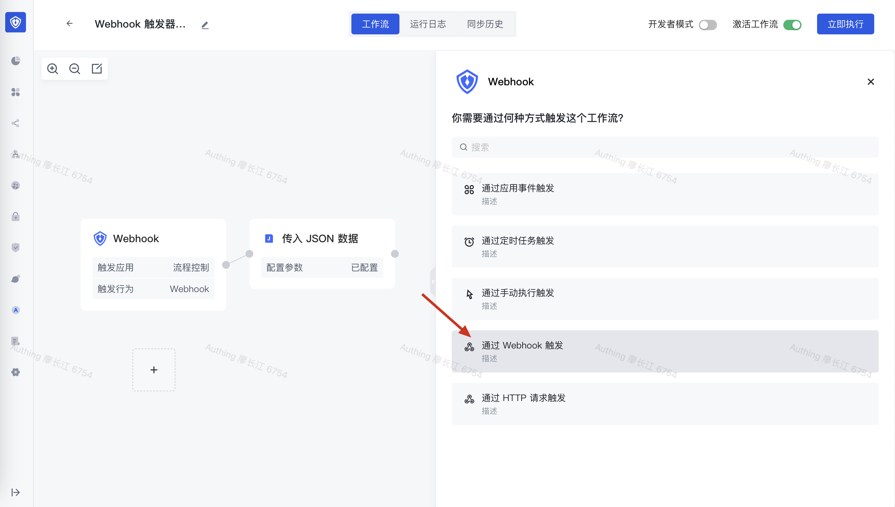
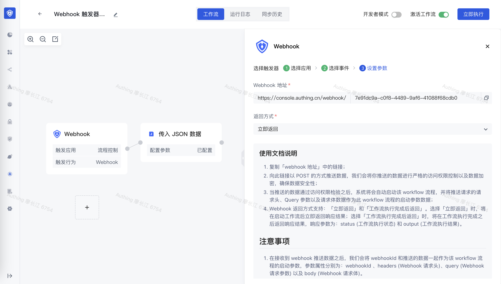

# 通过 webhook 触发 workflow

通过 Webhook 方式和<strong>通过 </strong><strong>API</strong><strong> 接口形式调用 workflow 方式</strong>比较类似，区别点在于，Webhook 方式比较适合于异步执行不依赖于执行结果的场景，比如在你的系统中发生某些动作之后，异步请求一下 workflow 的 webhook 地址，而你的系统本身并不依赖于 workflow 的执行结果。

在选择触发器时，选择「通过 Webhook 触发」方式：

你可以在<strong> Webhook 地址</strong>这一项中复制请求地址：

## 获取 HTTP 请求中传递的参数

通过 Webhook 触发的 workflow 获取 HTTP 请求参数和 API 接口调用形式方式一致，请求体、查询参数和请求头都可以在 workflow 的 input 中获取，详情见[通过 API 接口形式调用 workflow](https://steamory.feishu.cn/wiki/wikcnif20qWSDpu2qPaD2OZG9Eb?appStyle=UI4&domain=www.feishu.cn&locale=zh-CN&refresh=1&tabName=space&theme=light&userId=6738160787958792462) 。
