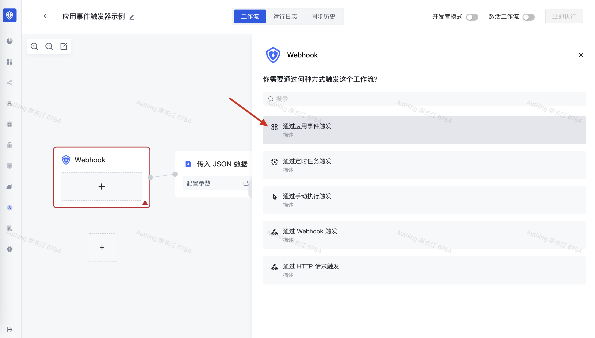
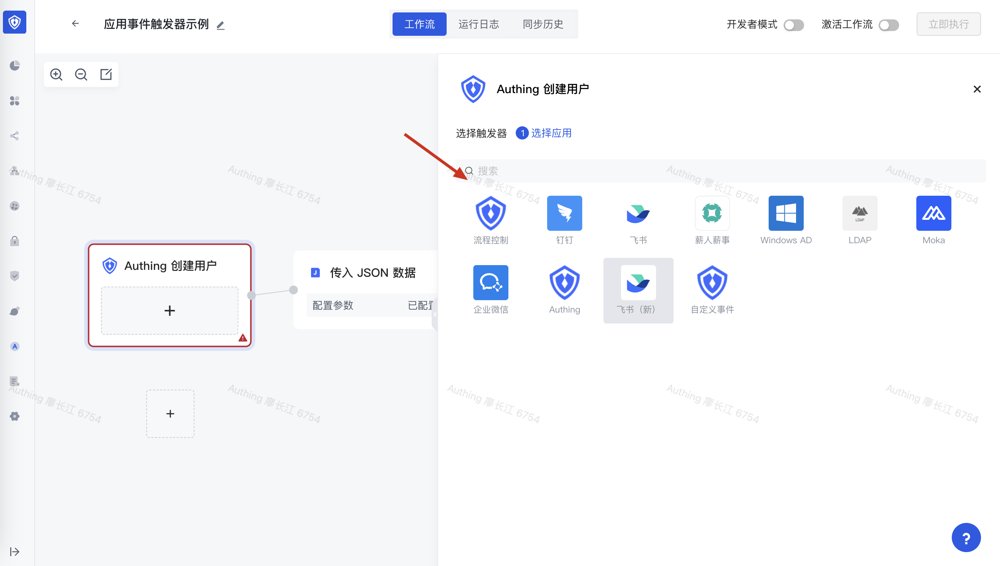
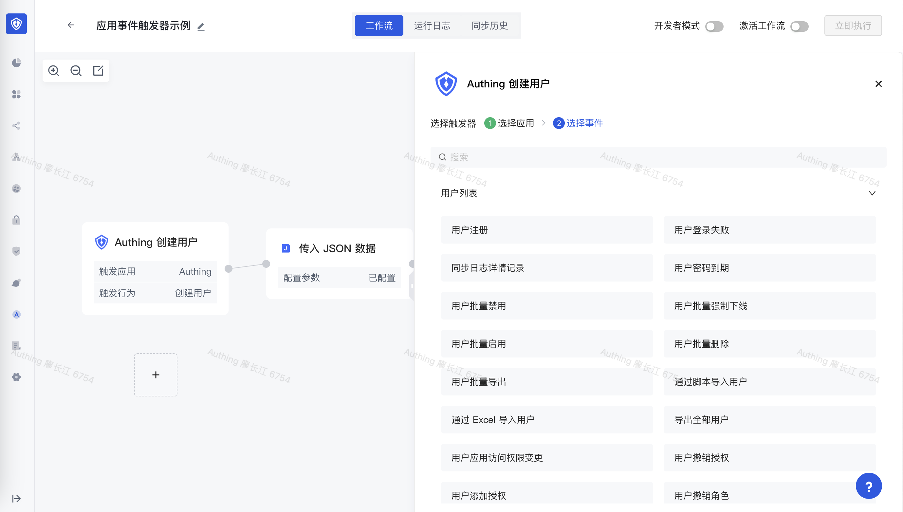
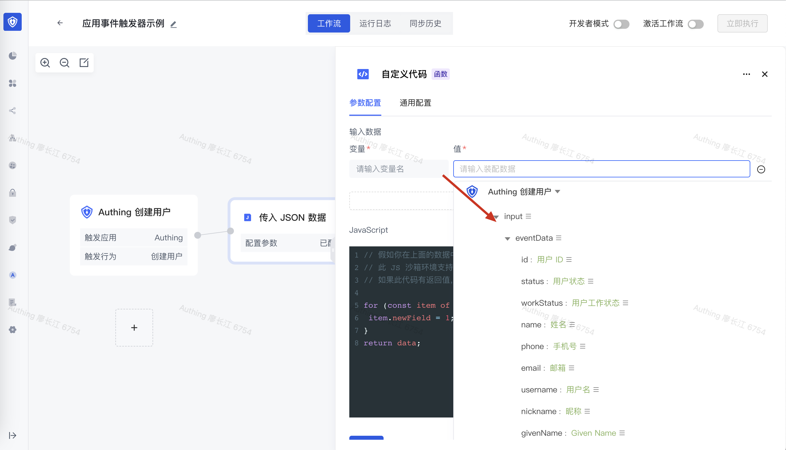
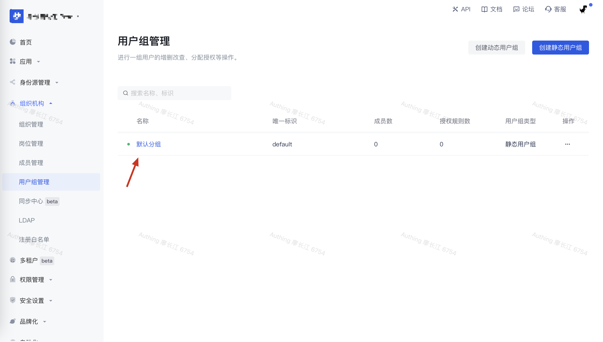
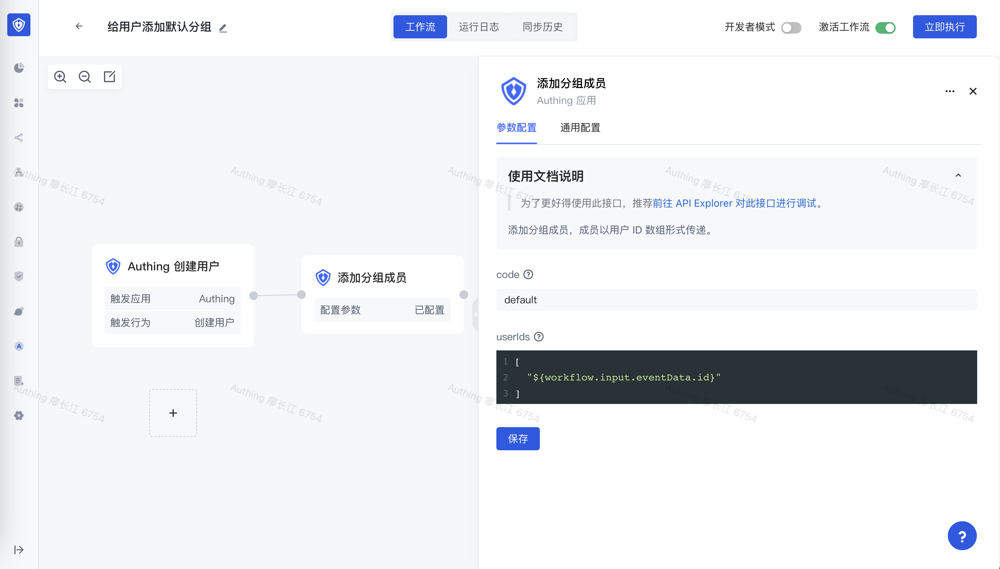
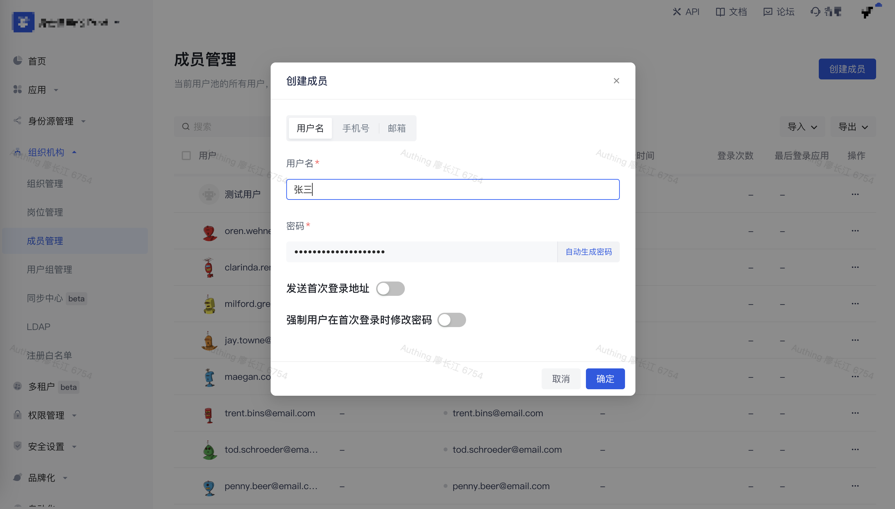
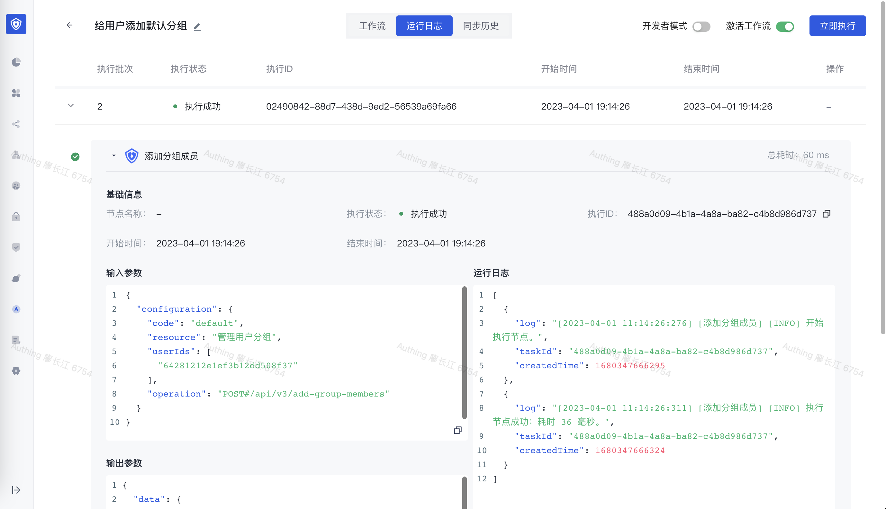

# 通过事件触发 workflow

和前面介绍的 workflow 触发方式不同，这种触发方式是“被动”的 —— 当一个外部的应用系统（也可以是 Authing）发生了某个事件之后，推送一个事件给 Authing workflow，将事件的内容作为 input 参数，触发 workflow 的执行。



你可以看到 Authing 身份自动化当前支持的所有第三方事件：



## 配置事件连接器

当要监听外部事件之前，你需要先配置好事件连接器，不同第三方的配置方式各不相同，请分别参考不同事件连接器的文档。

## 选择需要监听的事件

### 监听第三方应用事件

以飞书为例，我们集成了[飞书系统中支持的所有事件](https://open.feishu.cn/document/ukTMukTMukTM/uYDNxYjL2QTM24iN0EjN/event-list)，你可以选择需要监听的事件。你可以通过 ${workflow.input.eventData} 获取到事件体的具体内容。


### 监听 Authing 内部事件

选择 Authing 应用之后，你可以看到 Authing 系统内部的所有事件：



你可以通过 ${workflow.input.eventData} 获取到事件体的具体内容：



## 制造应用事件触发 workflow 执行

当选择好了要监听的事件之后，接下来可以在第三方应用（或 Authing）制造对应的事件，触发 workflow 的执行。

## 快速示例

这里我们以 Authing 用户创建之后给用户添加默认分组为例。所以我们首先需要监听 Authing 应用下的创建用户事件，接下来在用户池中创建一个默认分组：



接下来我们在 workflow 中添加一个 Authing 节点，并选择「[添加分组成员](https://api-explorer.authing.cn/?tag=tag/%E7%AE%A1%E7%90%86%E7%94%A8%E6%88%B7%E5%88%86%E7%BB%84/API%20%E5%88%97%E8%A1%A8/operation/GroupsManagementController_addGroupMembers)」这个动作，在 code 中填入我们之前创建的默认分组的 code —— default，在 userIds 中填入：

```typescript
[
  "${workflow.input.eventData.id}"
]
```



配置完成点击激活，在 Authing 中创建一个用户：



可以看到此用户被成功加入了这个默认分组：


再看 workflow 的执行记录，可以看到 workflow 被成功触发了：


