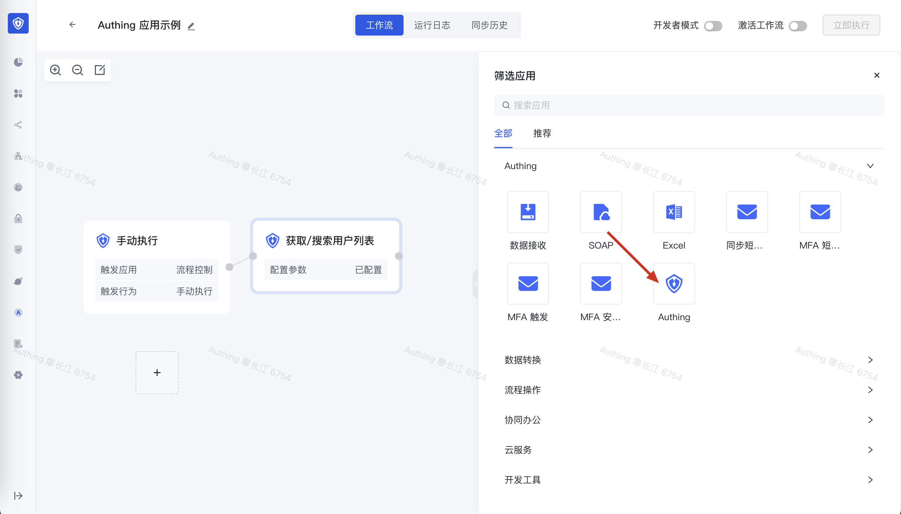
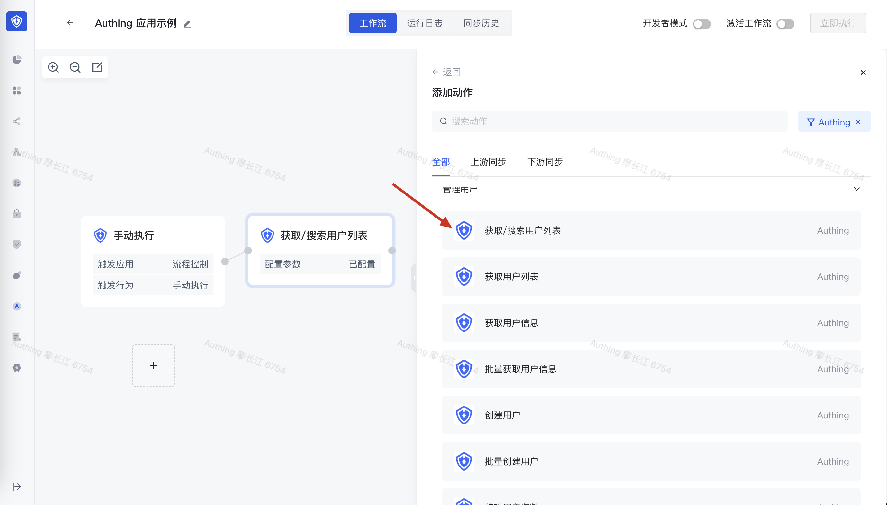
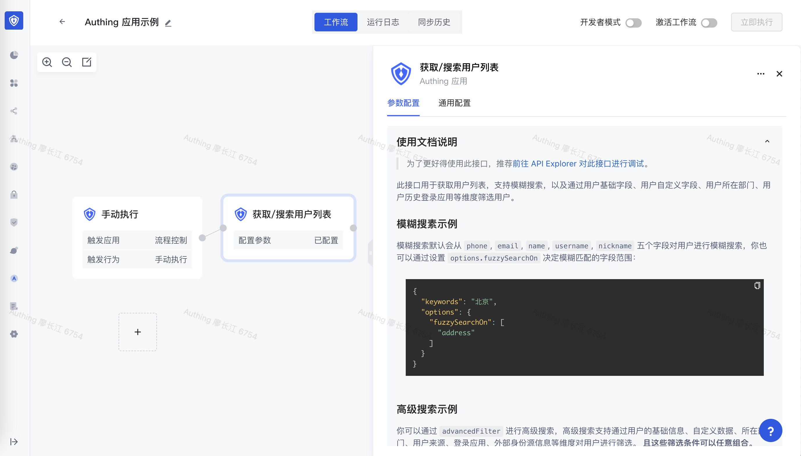
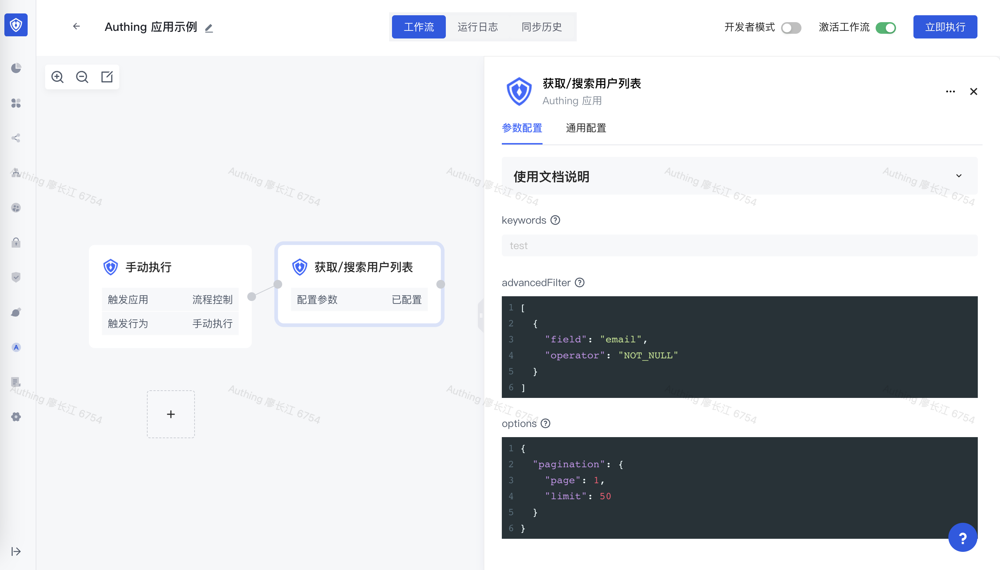
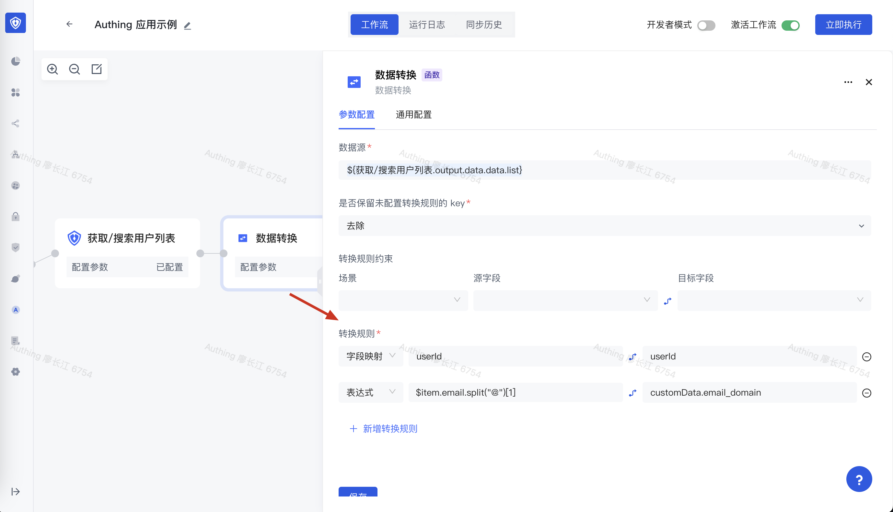
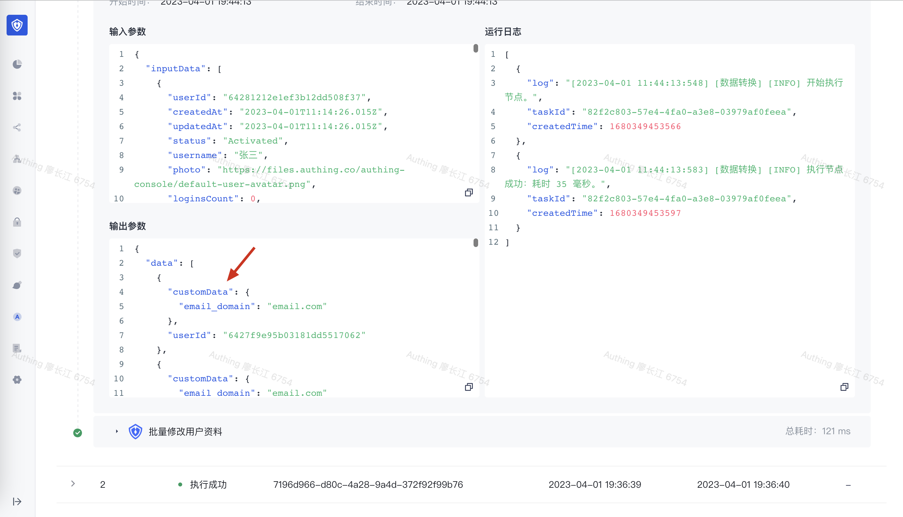
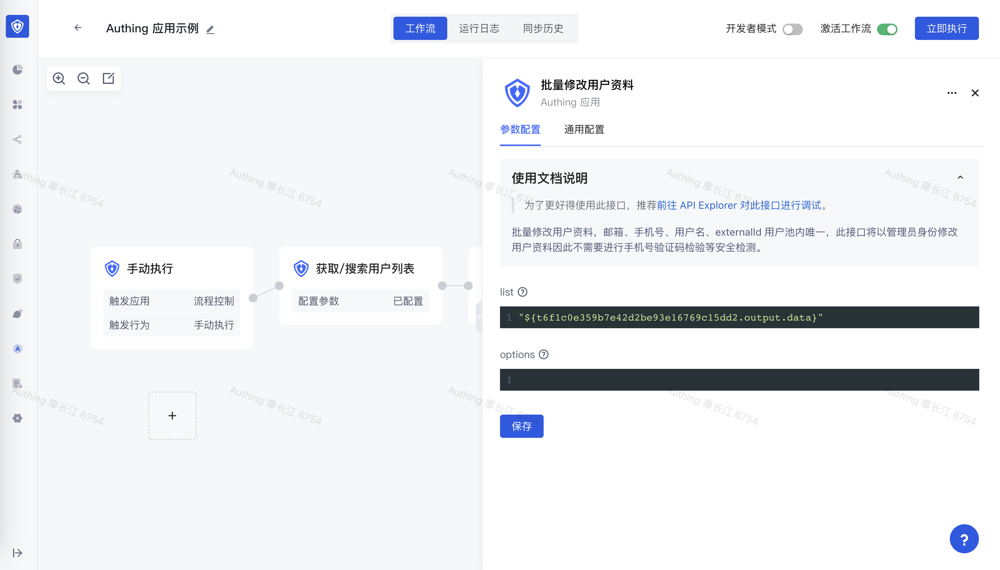
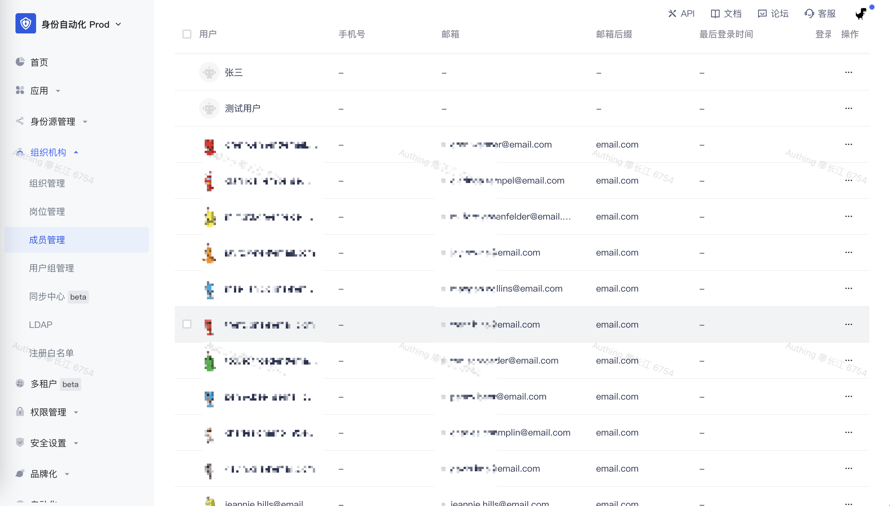

# 操作 Authing 内部资源

Authing 身份自动化中集成了 [Authing 所有的开放 API](https://api-explorer.authing.cn/)，如管理用户、管理组织机构、管理分组、管理角色、管理应用等接口，这意味着你可以将 Authing 内部的所有资源全部自动化得管理起来。实现包含但是不限于下面这些功能：

1. 将一段时间内未登录过的用户自动禁用。
2. 按照邮箱后缀、年龄给用户打标签。
3. 用户创建后自动给用户打标签、添加默认分组。
4. ...



## 选择动作

你应该可以注意到，Authing 应用节点下的所有动作，和 Authing V3 API 的接口分别一一对应，推荐你先通过 [Authing API Explorer ](https://api-explorer.authing.cn/)快速了解 Authing API 的使用。




你可以在 Authing 应用下每个动作的详情中看到对应的使用文档，同时在文档描述中，会附带上对应接口在 Authing API Explorer 中的地址。



## 快速示例

下面我们演示一个具体的使用场景：拉取 Authing 用户列表，根据用户的邮箱的后缀，给用户打一个标签。

这里我们需要用到 Authing 应用下的两个接口：

- [拉取用户列表](https://api-explorer.authing.cn/?tag=tag/%E7%AE%A1%E7%90%86%E7%94%A8%E6%88%B7/API%20%E5%88%97%E8%A1%A8/operation/UsersManagementController_listUsers)
- [批量修改用户资料](https://api-explorer.authing.cn/?tag=tag/%E7%AE%A1%E7%90%86%E7%94%A8%E6%88%B7/API%20%E5%88%97%E8%A1%A8/operation/UsersManagementController_updateUserBatch)

同时还需要把拉取用户列表接口的返回结果转换成批量修改用户资料接口的格式，还需要为每个用户计算邮箱后缀，所以需要也需要用到数据转换节点。

### 创建用户扩展字段用于存储标签

首先我们需要在控制台的设置 - 字段管理页面中添加用户扩展字段，这里我们设置一个字符串类型的扩展字段 —— email_domain。


### 编写拉取 Authing 用户列表的节点

创建一个 Authing 获取/搜索用户列表 节点，分别配置：

- advancedFilter：高级搜索条件，这里我们设置条件为邮箱不为空：

```typescript
[
  {
    "field": "email",
    "operator": "NOT_NULL"
  }
]
```

- options：可选项，这里我们设置一下分页条件为第一页，拉取 50 条。你可能会问，如果我需要拉取所有用户呢？我们为你提供了循环节点，详情请查看文档：[循环执行](/workflow/流程控制节点/循环执行.html)

```typescript
{
  "pagination": {
    "page": 1,
    "limit": 50
  }
}
```



编写完成之后，你可以点击执行看下效果。

### 添加数据转换节点，用于计算用户邮箱后缀

你可以在 Authing API Explorer 中查看批量修改用户资料


在此我们配置了两个转换规则：

1. 字段映射规则 userId -> usrerId
2. 表达式规则：将 `$item.email.split("@")[1]` 转换为 customData.email_domain 字段（一个嵌套的结构）



点击执行，我们看一下结果：



### 编写批量修改用户资料节点

在上一步的时候，我们已经把数据转换成了批量修改用户资料节点需要的格式，下面我们只需要将数据装配上即可：



最后点击执行，可以看到用户的扩展字段被正确更新了：


