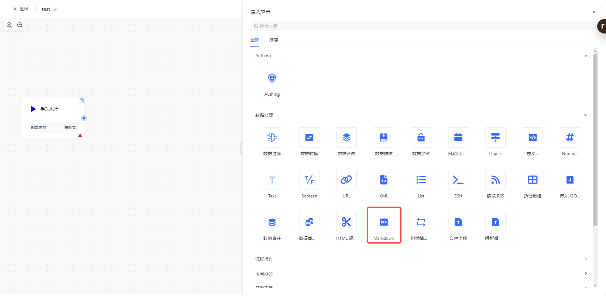
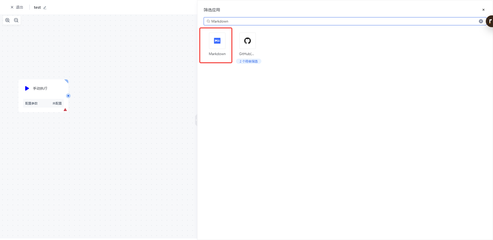
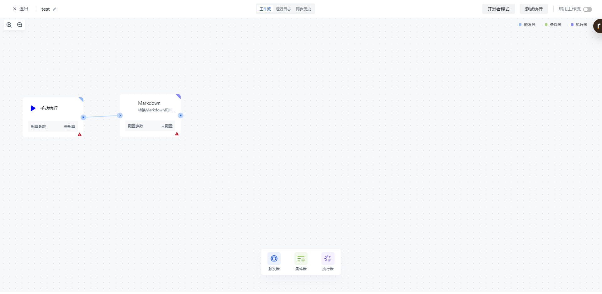
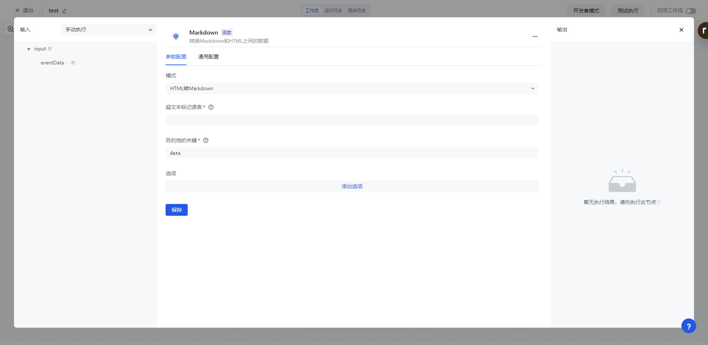
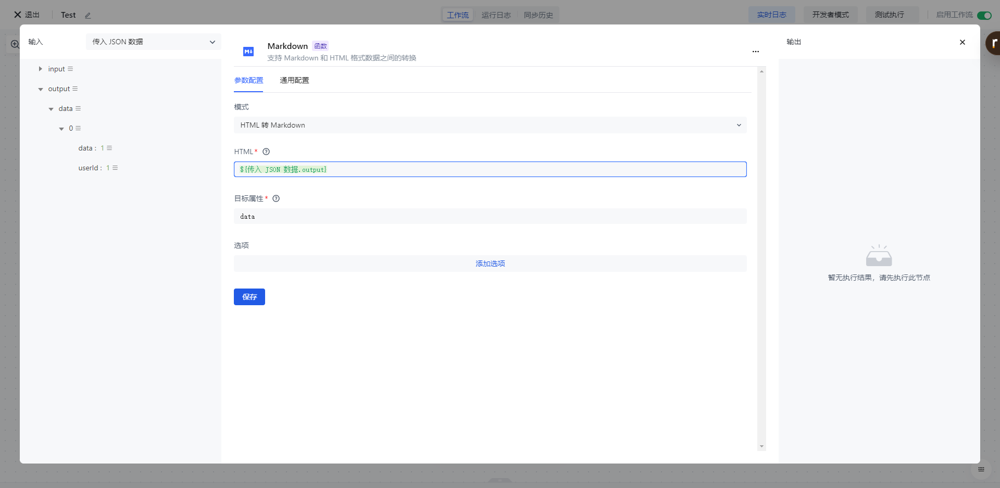
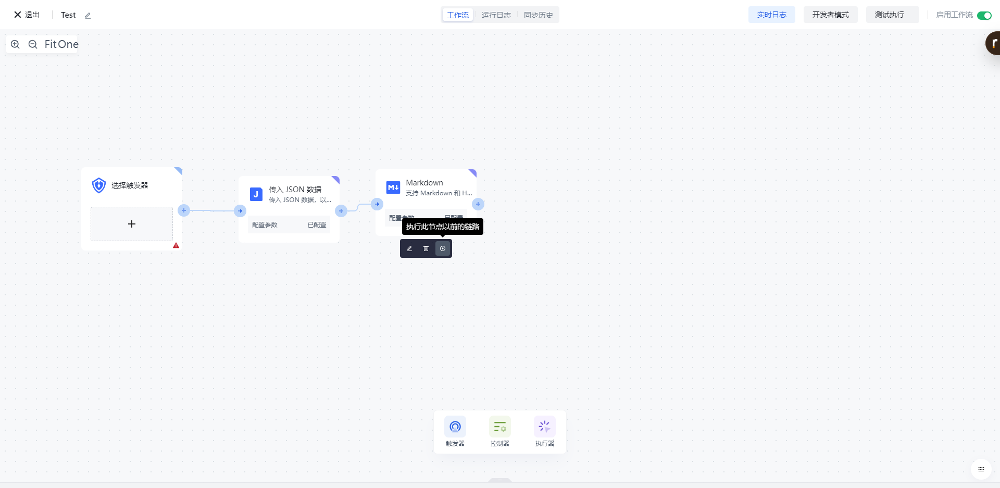
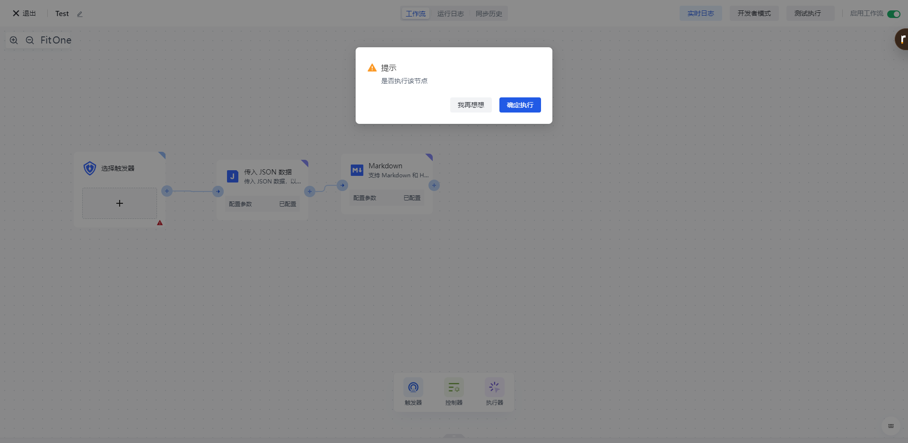
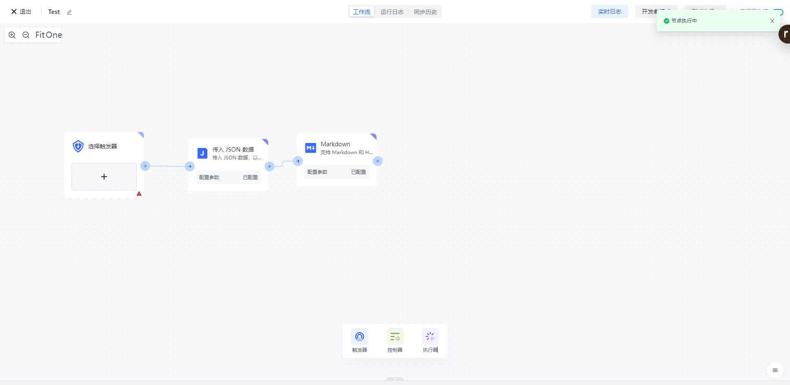

# Markdown

# 节点介绍

「Markdown」节点主要用于对源数组进行按固定大小进行拆分，拆分完成之后将返回多个固定大小的数组数据。

节点主要包括以下配置：

- 数据源，待拆分的原始数据，可自行输入，也可通过数据装配来装配当前节点之前的数据源。
- 每批数目，用户设置源数组按多少数量进行拆分。

# 快速开始

## 添加节点

在添加节点页面，在「数据处理」分类中找到「Markdown」应用节点。

或通过输入「Markdown」关键字进行应用筛选。

点击节点将会自动将该节点添加到工作流中。

## 节点配置

在工作流画布中点击该节点或点击下方的「编辑」按钮，将进入节点的配置页面。

按以下方式配置好节点的各个配置项：

- 「HTML」选择左边的「传入 JSON 数据」中的「output」下的「data」属性进行装配；
- 「模式」支持 HTML 转 Markdown,以及 Markdown 转 HTML。
- 目标属性 默认值 data

## 测试运行

点击节点上的「执行此节点以前的链路」按钮，执行该节点。

再次确认之后，该节点之前的所有流程简单将会被执行。

点击「确认执行」按钮之后，将会看到「节点执行中」的消息提示。

点击「运行日志」栏，依次点击最新的「执行批次」和「Markdown」节点左边的展开按钮，查看节点执行结果。
