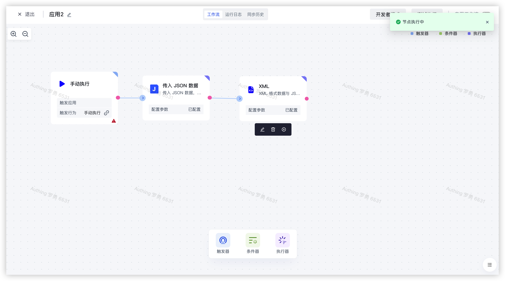

# XML

# 节点介绍

「XML」节点主要用于将 JSON 格式的数据源转换为 XML 格式，或者将 XML 格式的数据源转换为 JSON 格式。

节点主要包括以下配置：

- 数据源，待转换的原始数据，可自行输入，也可通过数据装配来装配当前节点之前的数据源。
- 转换方式，可选择转换的方式，包括：「XML to JSON」和 「JSON to XML」两种方式。
- 属性名称，转换后的数据结果的属性名称，默认为 data。
- 选项，针对不同的「转换方式」提供了多种选项配置。

# 快速开始

## 添加节点

在添加节点页面，在「数据处理」分类中找到「XML」应用节点。

或在搜索框内输入「xml」关键字进行应用筛选。

点击节点将会自动将该节点添加到工作流中。

## 节点配置

在工作流画布中点击该节点或点击下方的「编辑」按钮，将进入节点的配置页面。

按以下方式配置好节点的各个配置项：

- 「数据源」选择左边的「传入 JSON 数据」中的「output」下的「data」属性进行装配。
- 「转换方式」选择 「JSON to XML」，将数据源中的 JSON 格式的数据转换为 XML 格式。

## 测试运行

点击节点上的「执行此节点以前的链路」按钮，执行该节点。

再次确认之后，该节点之前的所有流程简单将会被执行。

点击「确认执行」按钮之后，将会看到「节点执行中」的消息提示。

点击「运行日志」栏，依次点击最新的「执行批次」和「XML」节点左边的展开按钮，查看节点执行结果。

