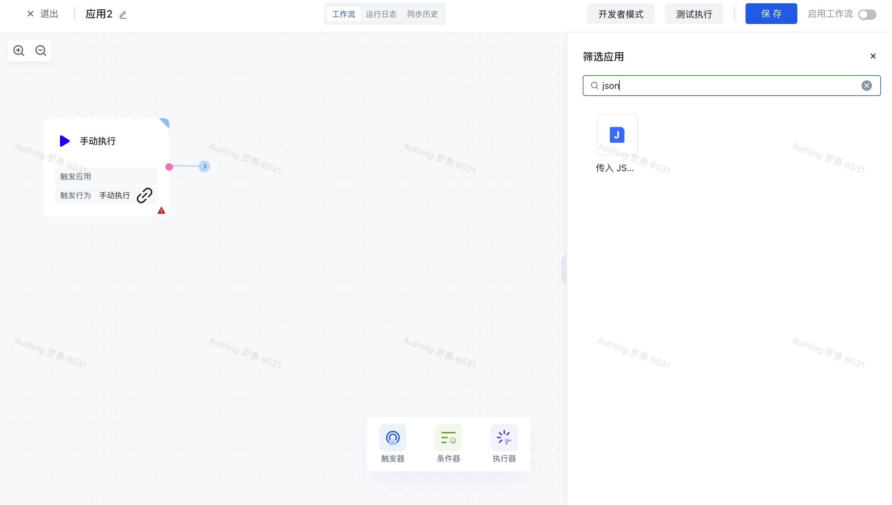
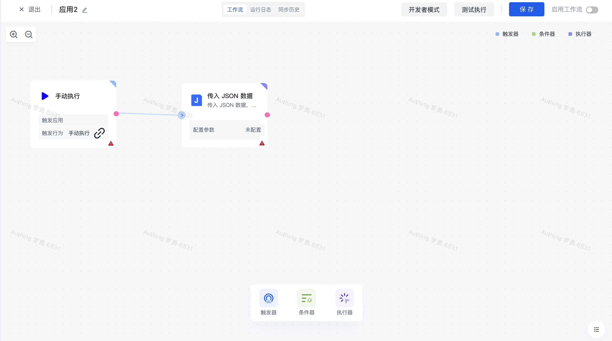
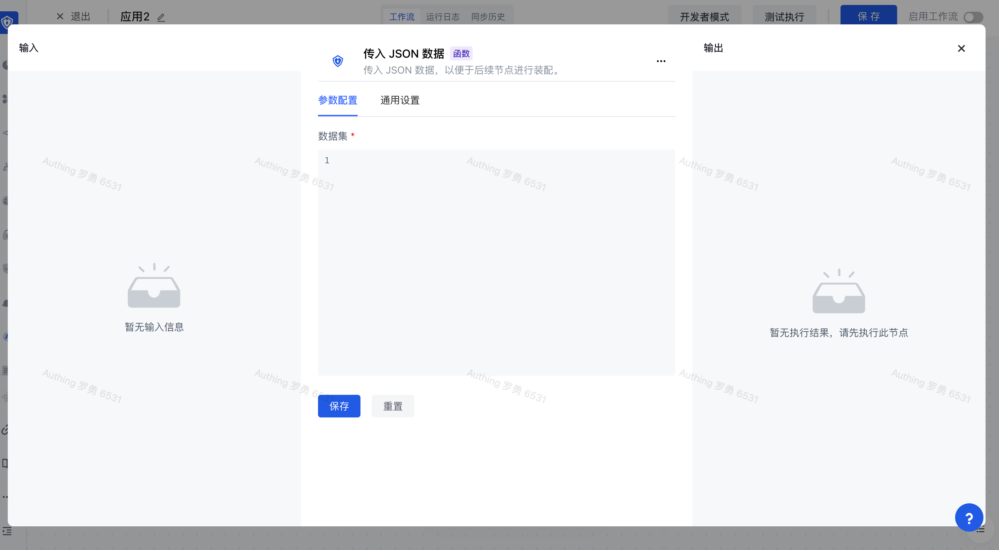
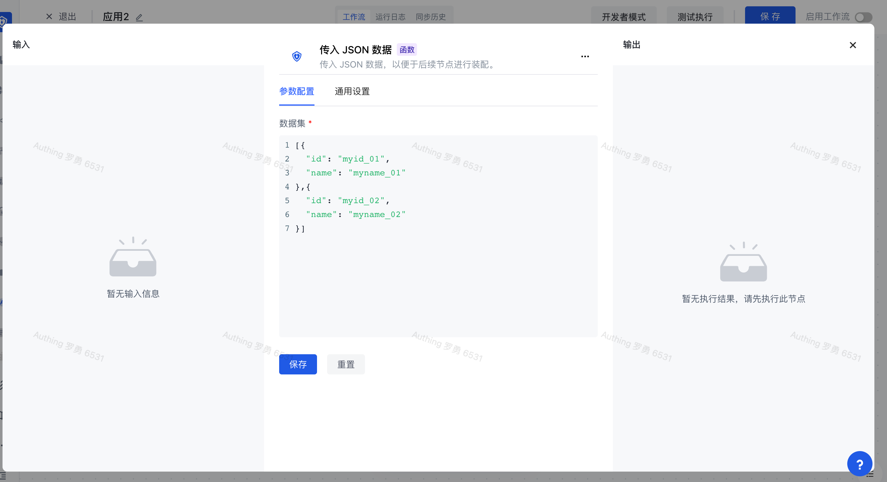
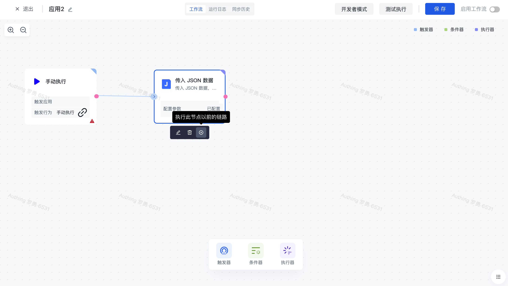
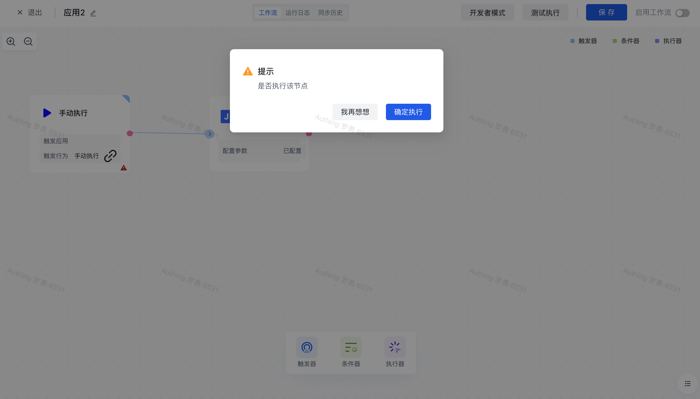
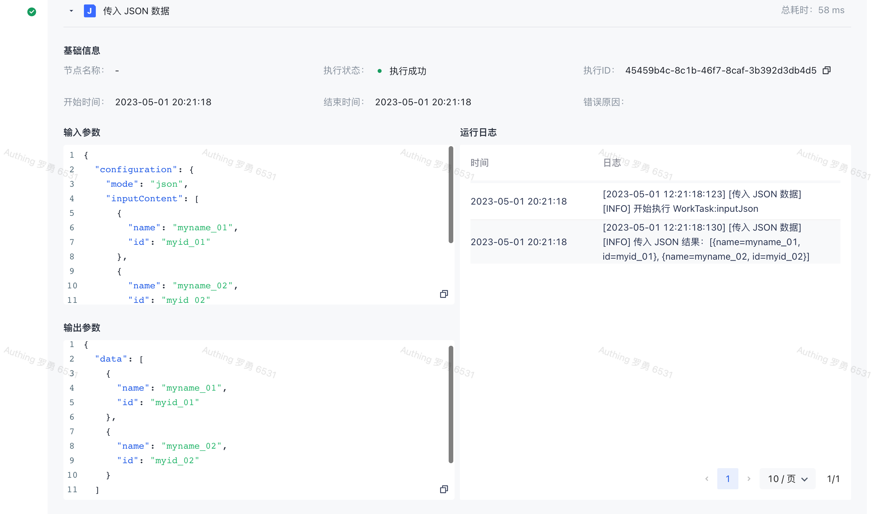

# 传入 JSON 数据

# 节点介绍

「传入 JSON 数据」节点主要用于传入一个自定义的 JSON 格式的数据对象或数据列表到工作流中，以便进行后续操作。

节点主要包含以下配置项

- 数据集，自定义的 JSON 格式的数据对象或数据列表。

# 快速开始

## 添加节点

在添加节点页面，输入「json」关键字进行应用筛选，或在「数据处理」分类中找到「传入 JSON」节点。



找到「传入 JSON」节点，点击节点将会自动将该节点添加到工作流画布中。



## 节点配置

在工作流画布中点击该节点或点击下方的「编辑」按钮，将进入节点的配置页面。



输入以下自定义的 JSON 数据集，点击保存。(注意需要输入正确的 JSON 格式的数据集)

```json
[
  {
    "name": "myname_01",
    "id": "myid_01"
  },
  {
    "name": "myname_02",
    "id": "myid_02"
  }
]
```



## 测试运行

点击节点上的「立即执行」按钮，执行该节点。



再次确认之后，该节点之前的所有流程简单将会被执行。



点击「运行日志」栏，依次点击最新的「执行批次」和「传入 JSON 数据」节点左边的展开按钮，查看节点执行结果。


