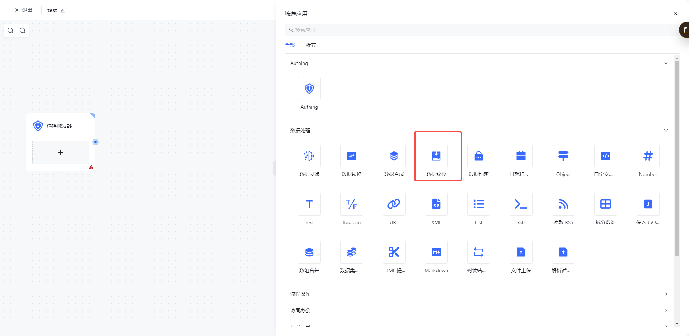
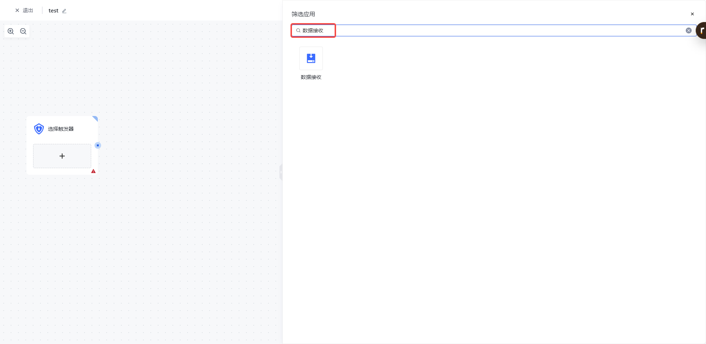
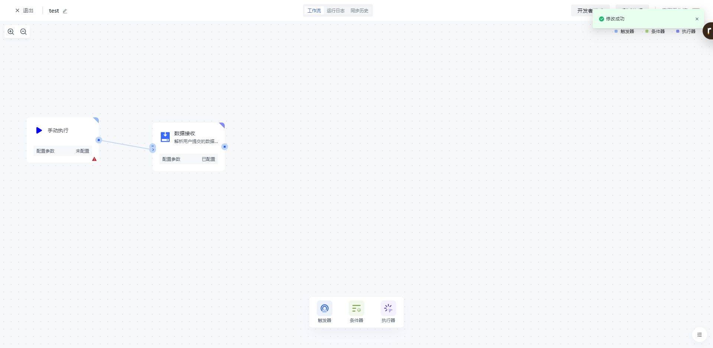
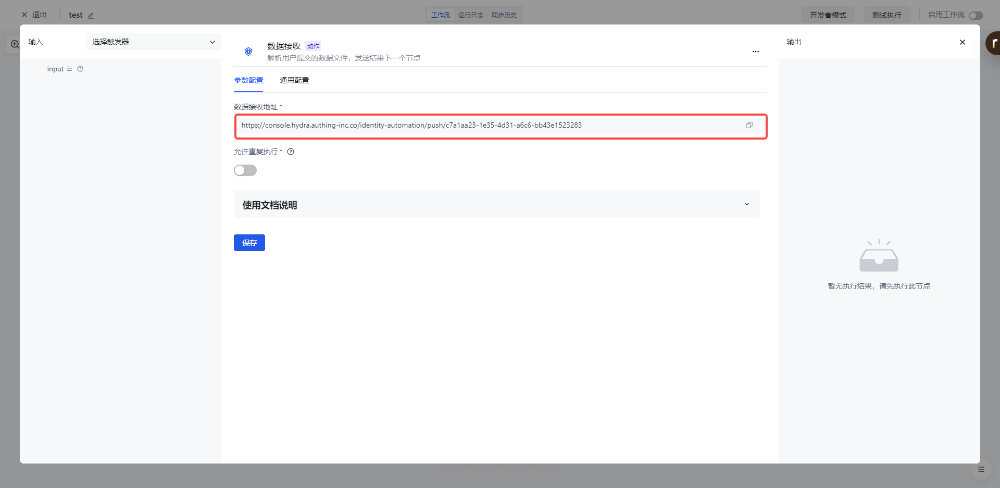
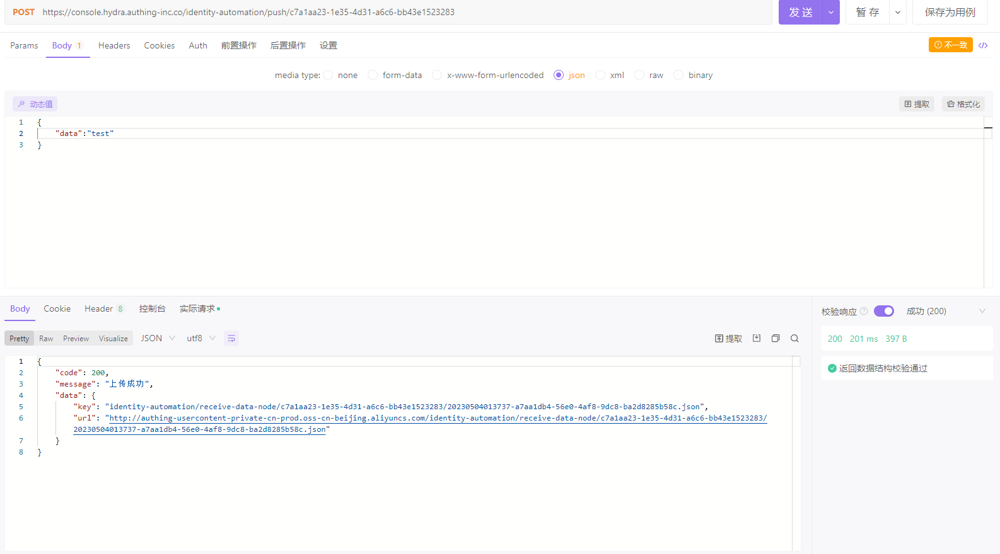
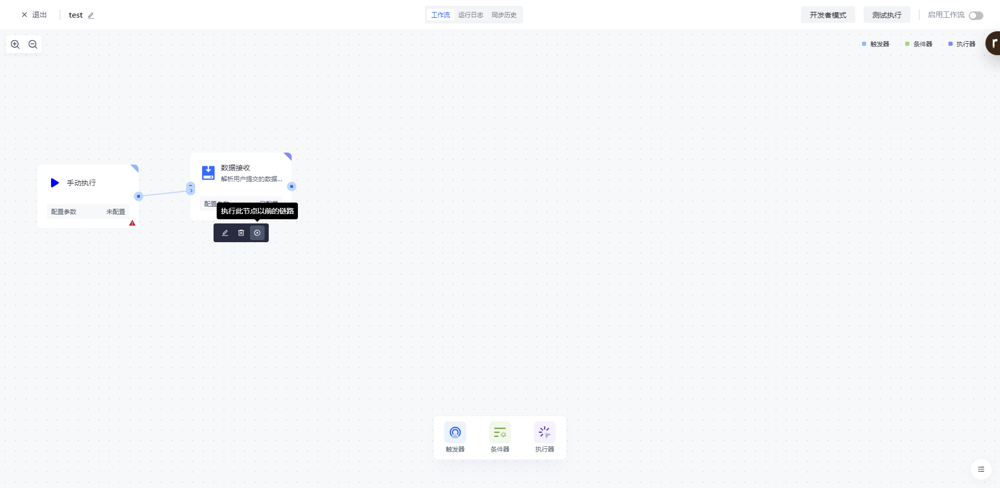
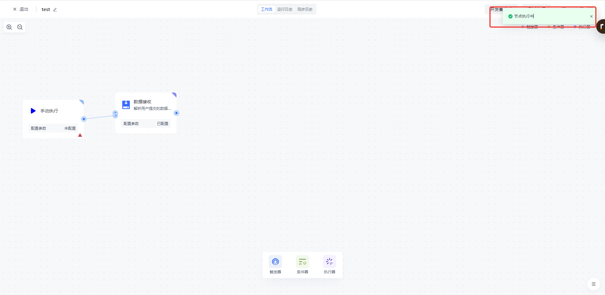
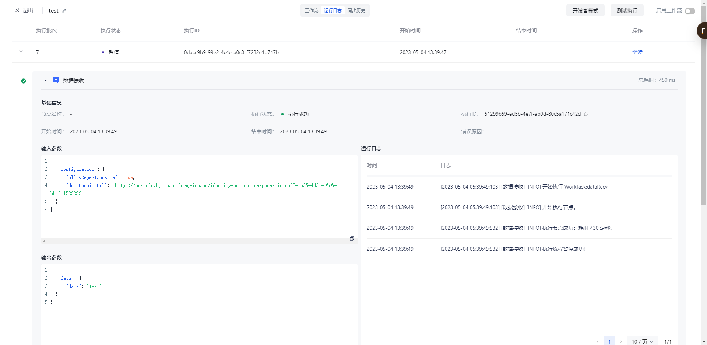

# 数据接收

# 节点介绍

「数据接收」节点主要用于解析用户推送的数据的文件，并将结果推送到下一个节点

- 数据接收地址，用户推送数据文件的地址，当工作流运行到此节点时，会拉取你最近一次的上传数据，作为此节点的输出。
- 是否允许重复执行，默认情况下，同一个上传记录不允许被重复执行，如果 workflow 在执行过程中，最近的一条上传记录已被消费过了，此节点会提示错误并终止流程。。

# 快速开始

## 添加节点

在添加节点页面，在「数据处理」分类中找到「数据接收」应用节点。

或通过输入「数据接收」关键字进行应用筛选。

点击节点将会自动将该节点添加到工作流中。

## 测试运行

复制数据推送地址，通过相关测试工具向该地址推送数据。

点击节点上的「执行此节点以前的链路」按钮，执行该节点。

点击「确认执行」按钮之后，将会看到「节点执行中」的消息提示。

点击「运行日志」栏，依次点击最新的「执行批次」和「数据接收」节点左边的展开按钮，查看节点执行结果。

