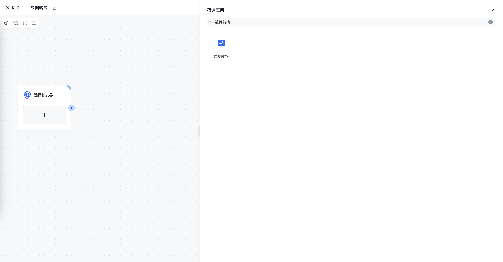
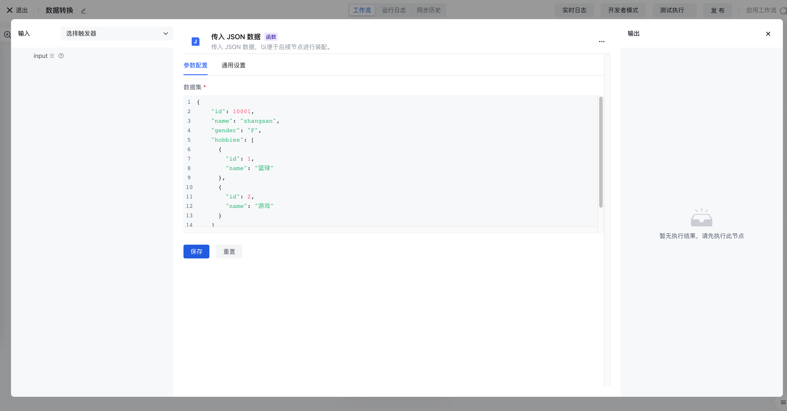
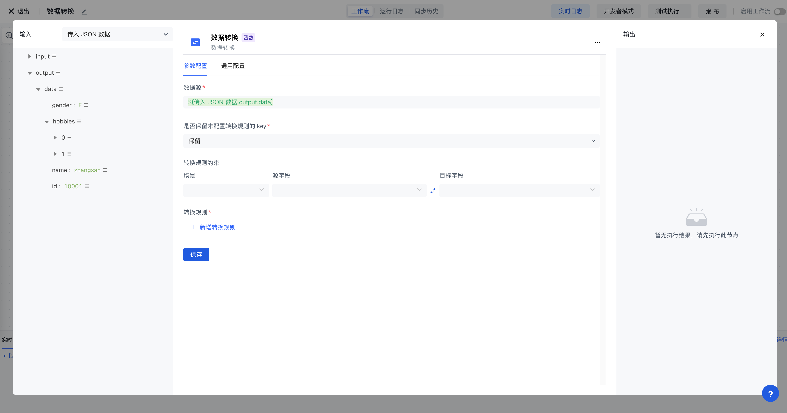
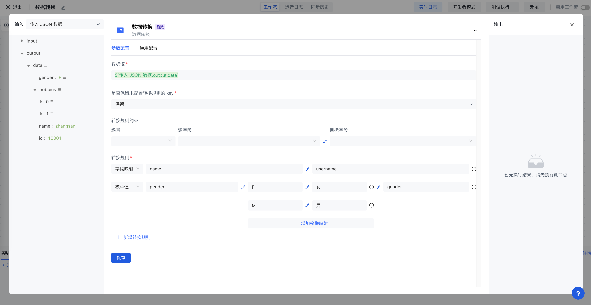
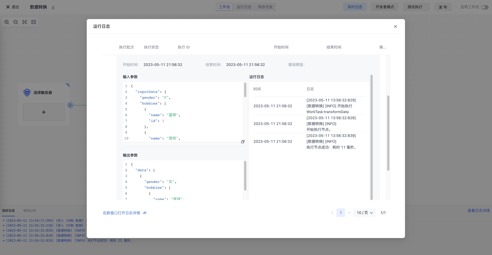

# 数据转换

# 节点介绍

「数据转换」节点可以帮你将数据从一种格式或结构转换为另一种格式或结构。如果你也有这样的需求场景，可以选择使用数据转换节点来完成。

- 你正在准备将数据同步给第三方，你需要将字段映射到三方的字段。
- 你正在准备将不同的多个数据源的数据聚合为统一的格式。
- 你正在准备向数据中添加一些字段来丰富他，比如添加一些标记或时间戳。

数据转换节点包含但不限于以上场景，通常在做数据 ETL 时也可以配合[数据过滤](/workflow/数据处理节点/数据过滤.html)节点来完成。

# 快速开始

## 添加节点

点击画布中的「执行器」，在「筛选应用」卡片上搜索「数据转换」，点击数据转换节点，即可在工作流的画布上添加数据转换节点。



## 配置解释

<strong>数据源</strong>：作为该节点输入的数据，一般为上一个节点的输出内容，也是我们准备处理的数据。

<strong>是否保留未配置的转换</strong><strong>规则</strong><strong>的 key</strong>：如果选择保留，未在下方配置转换规则的 key 也会被保留下来，作为输出参数流转到下一个节点；如果选择去除，则之后保留配置了转换规则的 key，其他 key 会被丢弃。

<strong>转换</strong><strong>规则</strong><strong>约束</strong>：提供了一些常用的同步转换模板，作为辅助选项。

<strong>转换</strong><strong>规则</strong>：配置数据具体的转换规则

<strong>转换</strong><strong>规则</strong><strong>类型：</strong>

- 字段映射：从原始的 key 映射到新的 key 上，可以理解为给 key 换一个新名字。
- 表达式：在字段映射的基础上增加了表达式支持，可以写变量，三元等简单的表达式来转换。
- 固定值：为字段赋予固定的值。
- 删除字段：删除配置的 key。
- 枚举值：原始的枚举值映射到新的枚举值，key 和 value 均可以被映射。

## 应用示例

1. 先添加一个 「传入 JSON 数据」节点，模拟要处理的数据。

```json
{
    "id": 10001,
    "name": "zhangsan",
    "gender": "F",
    "hobbies": [
      {
        "id": 1,
        "name": "篮球"
      },
      {
        "id": 2,
        "name": "游戏"
      }
    ]
  }
```



1. 添加数据转换节点，将 name 映射为 username，将 gender 映射为 从 “M/F” 映射为 “男/女” 。
2. 先装配数据源，为上一个 「传入 JSON 数据」 节点的输出 output。



1. 配置字段映射规则。



1. 点击「立即执行」，等待工作流执行完成之后就可以在运行日志中看到数据转换的结果。



转换后的数据为：

```json
{
  "data": [
    {
      "gender": "女",
      "hobbies": [
        {
          "id": 1,
          "name": "篮球"
        },
        {
          "id": 2,
          "name": "游戏"
        }
      ],
      "name": "zhangsan",
      "id": 10001,
      "username": "zhangsan"
    }
  ]
}
```
