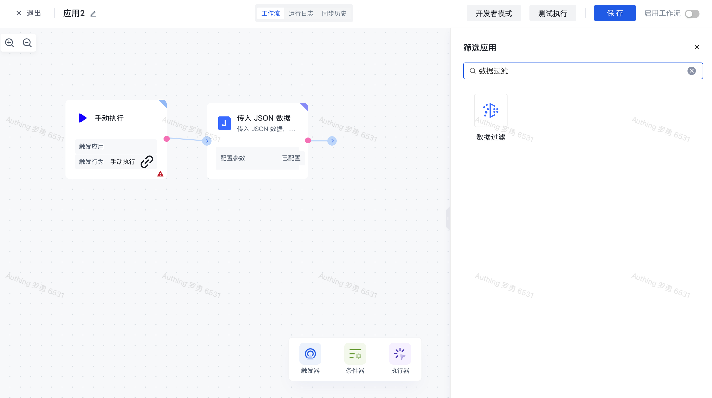
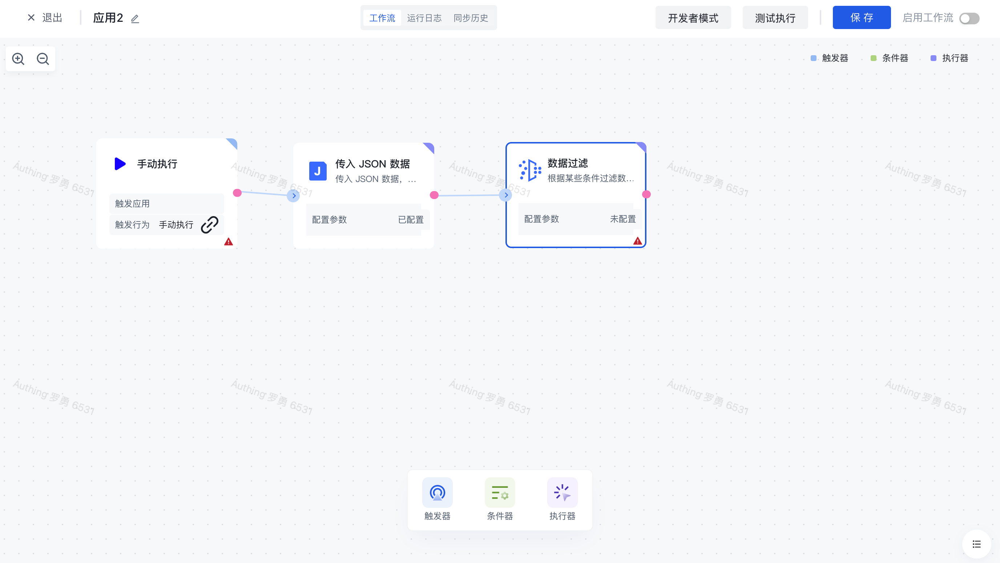
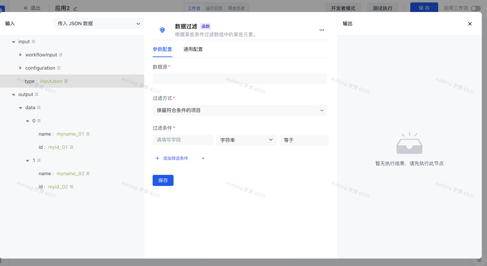
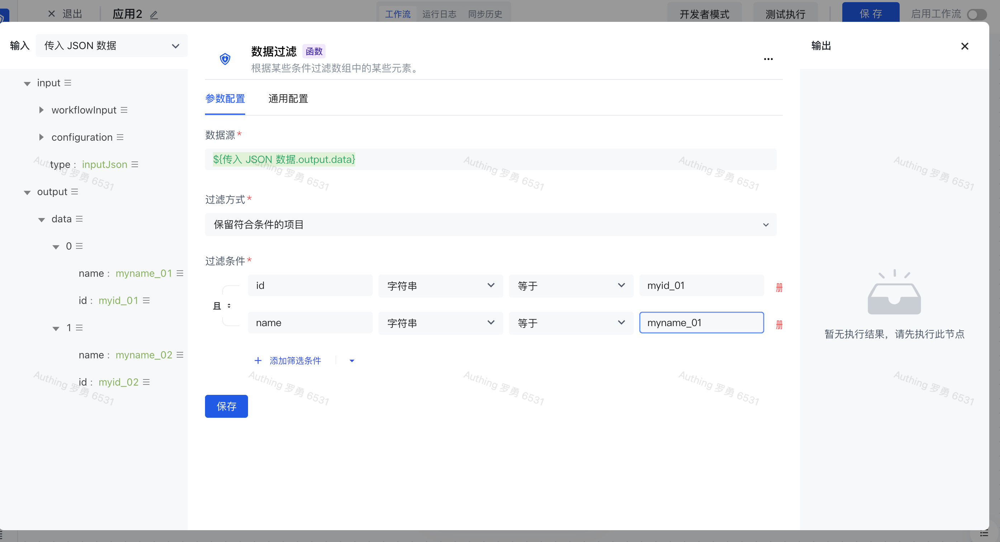
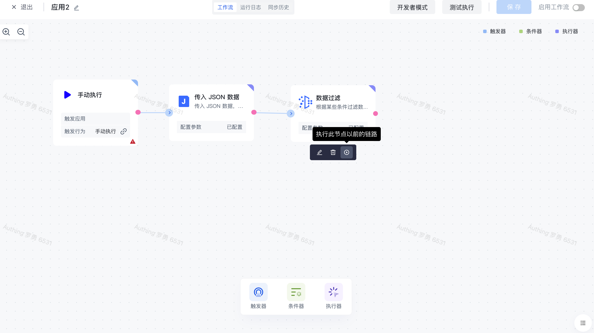
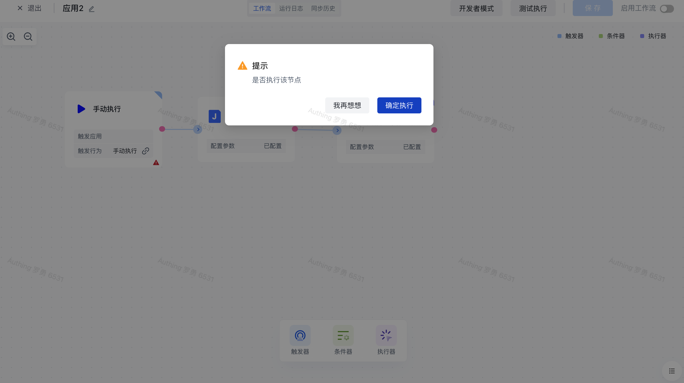
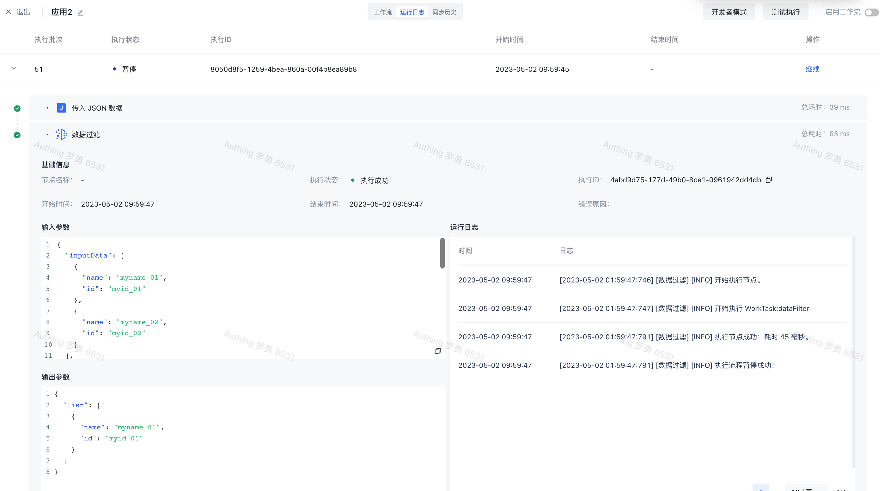

# 数据过滤

# 节点介绍

「数据过滤」节点主要用于根据自定义的过滤条件对数据源中的数据进行过滤。

节点主要包含以下三个配置项：

- 数据源，需要过滤的原始数据源，通常是列表的形式。
- 过滤方式，包括：保留符合条件的项目、保留不符合条件的项目。「保留符合条件的项目」是指满足以下的过滤条件的数据项将被保留到节点输出数据中；「保留不符合条件的项目」是指不满足以下的过滤条件的数据项将被保留到节点输出数据中；
- 过滤条件，一组数据过滤的匹配条件，每条数据过滤条件包含「字段」、「字段类型」、「操作符」以及「字段值」。多过滤条件之间支持且或关系切换。

  - 字段，过滤条件对应的字段名称。
  - 字段类型，过滤条件的字段类型，目前支持：字符串、数字、布尔值、时间、日期、对象、数组以及枚举值。
  - 操作符，每一种字段类型对应的操作符有所不同。
  - 字段值，过滤条件对应的字段值，不同的「字段类型」支持的字段值不同。

# 快速开始

## 添加节点

在添加节点页面，输入「数据过滤」关键字进行应用筛选，或在「数据处理」分类中找到「数据过滤」节点。

点击该节点之后，将会自动将该节点添加到工作流节点中。

## 节点配置

在工作流画布中点击该节点或点击下方的「编辑」按钮，将进入节点的配置页面。

我们按如下配置，配置好数据源、过滤方式以及过滤条件，点击「保存」。

## 测试运行

点击节点下的「执行此节点以前的链路」按钮，开始测试工作流节点链路。

再次确认执行操作

在执行成功之后，点击「运行日志」栏，依次点击最新的「执行批次」和「数据过滤」节点左边的展开按钮，查看节点执行结果。

