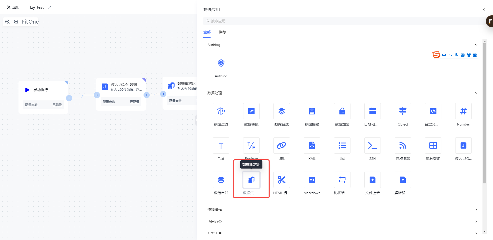
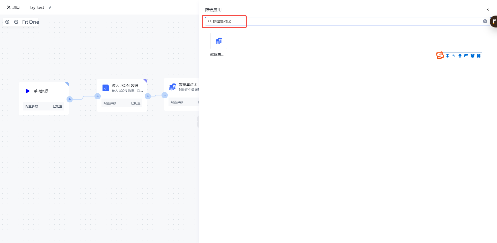
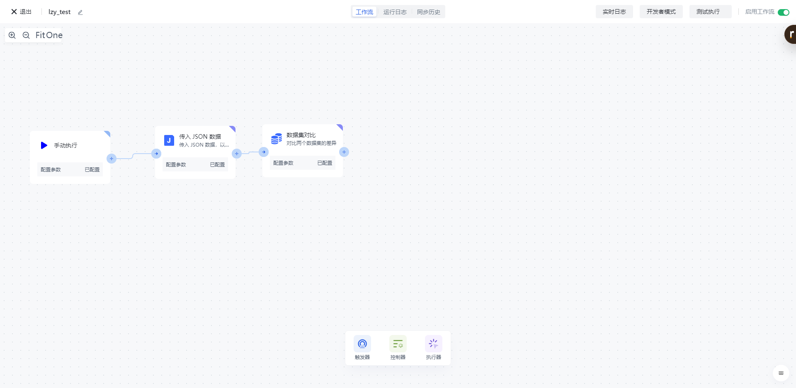
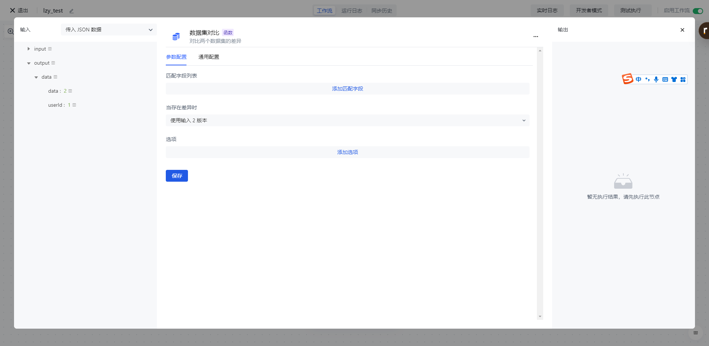
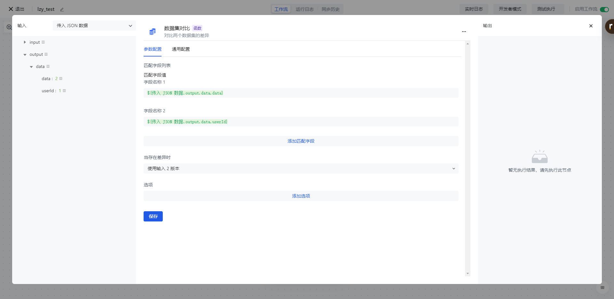
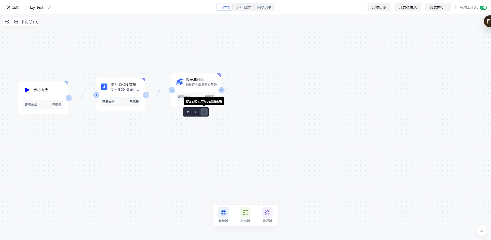
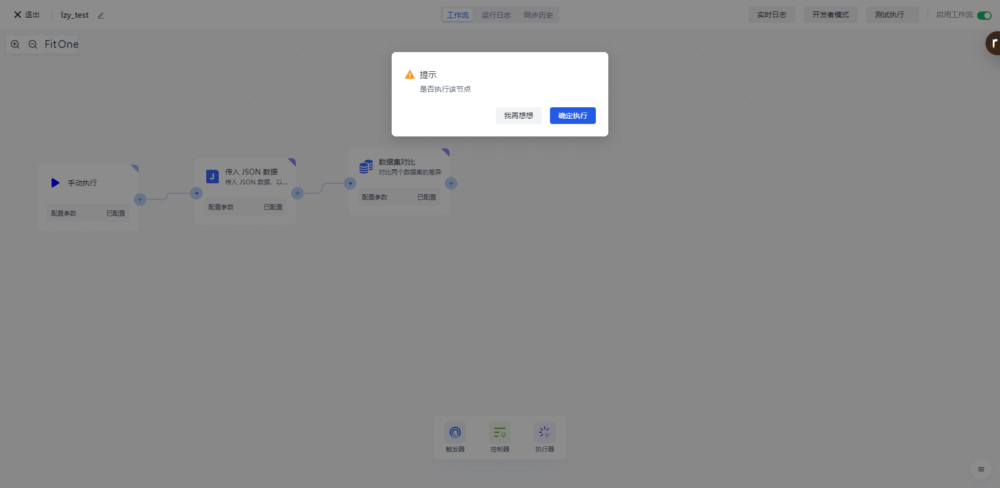
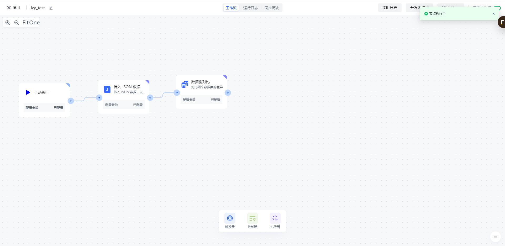
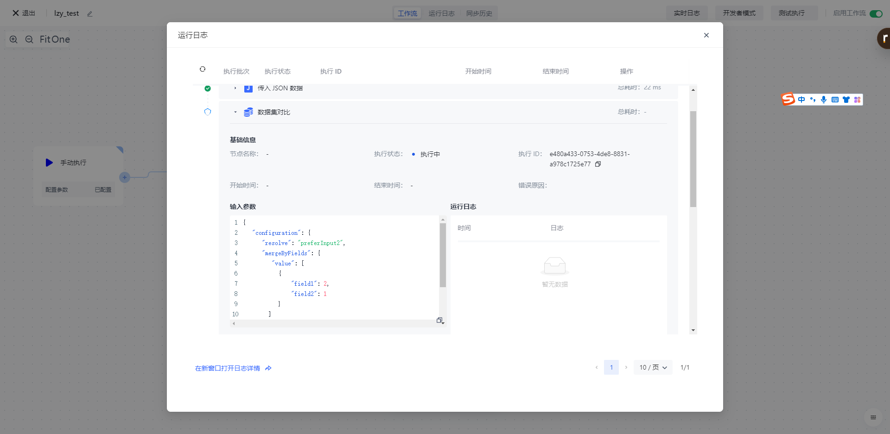

# 数据集对比

# 节点介绍

「数据集对比」节点主要用于对源数组进行按固定大小进行拆分，拆分完成之后将返回多个固定大小的数组数据。

节点主要包括以下配置：

- 匹配字段列表，填入待对比字段 1, 2 。
- 当存在差异时，可以选择使用版本 1，使用版本 2，使用不同版本的混合，包括两个版本。
- 选项：支持禁用点符号，以及支持多次匹配。

# 快速开始

## 添加节点

在添加节点页面，在「数据处理」分类中找到「数据集对比」应用节点。

或通过输入「数据集对比」关键字进行应用筛选。

点击节点将会自动将该节点添加到工作流中。

## 节点配置

在工作流画布中点击该节点或点击下方的「编辑」按钮，将进入节点的配置页面。

按以下方式配置好节点的各个配置项：

- 「匹配字段值」选择左边的「传入 JSON 数据」中的「output」下的「data」属性进行装配；
- 「当存在差异时」选择使用输入 2 版本。

## 测试运行

点击节点上的「执行此节点以前的链路」按钮，执行该节点。

再次确认之后，该节点之前的所有流程简单将会被执行。

点击「确认执行」按钮之后，将会看到「节点执行中」的消息提示。

点击「运行日志」栏，依次点击最新的「执行批次」和「数据集对比」节点左边的展开按钮，查看节点执行结果。

