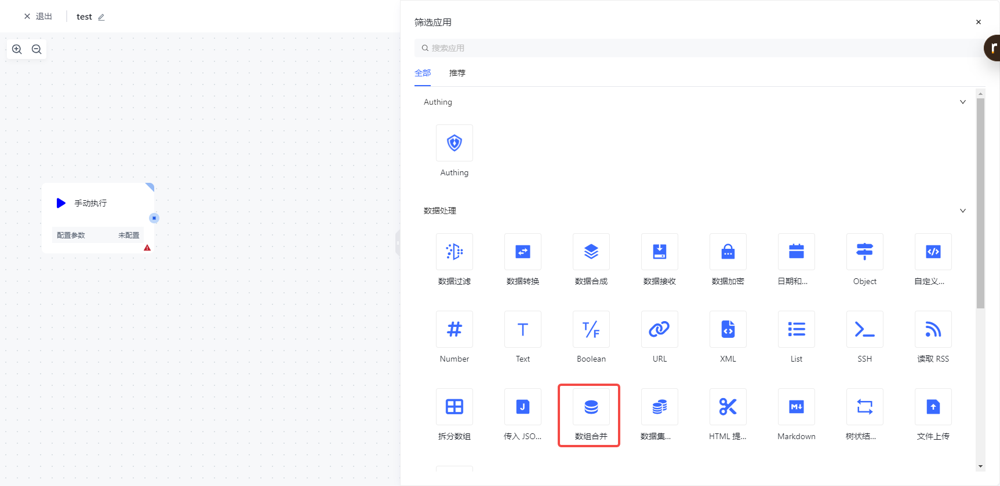
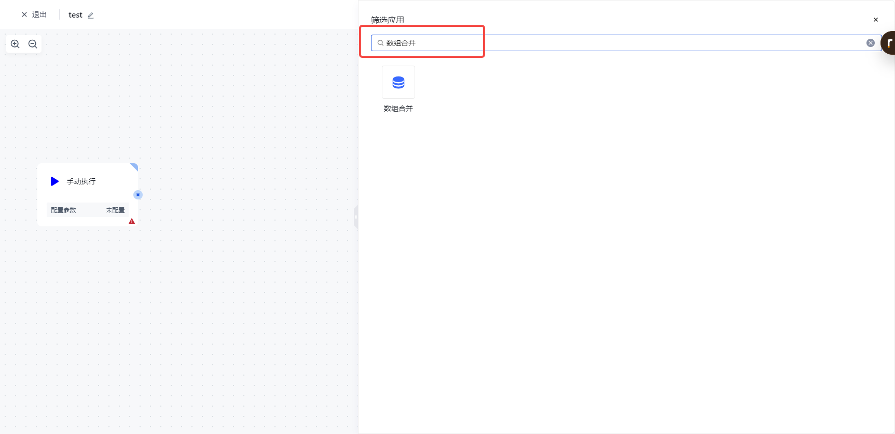
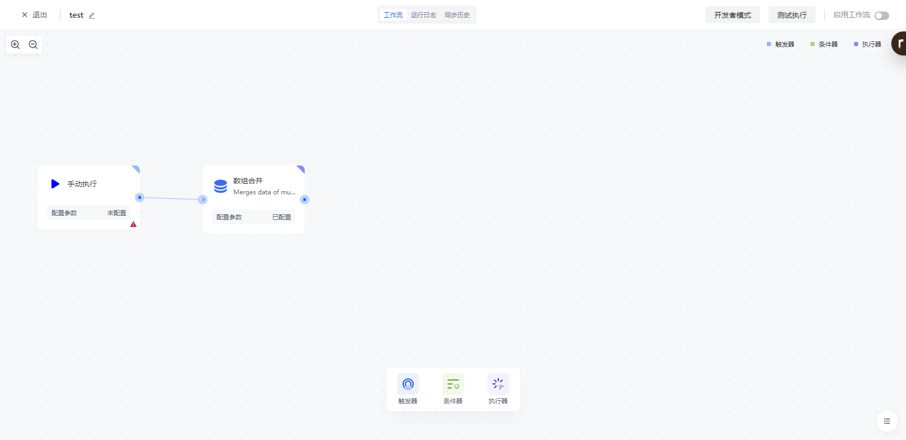
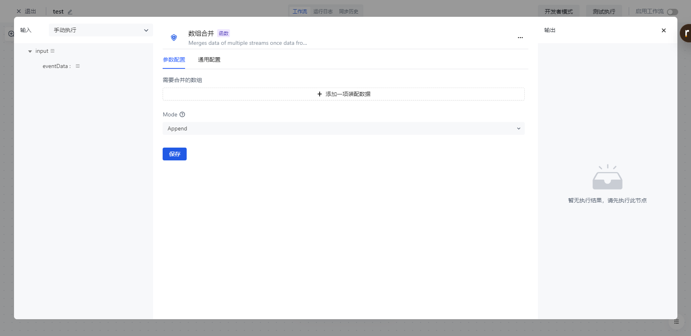
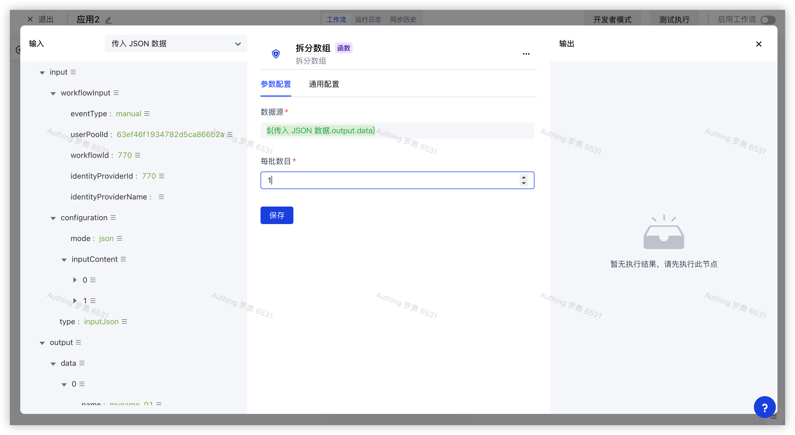
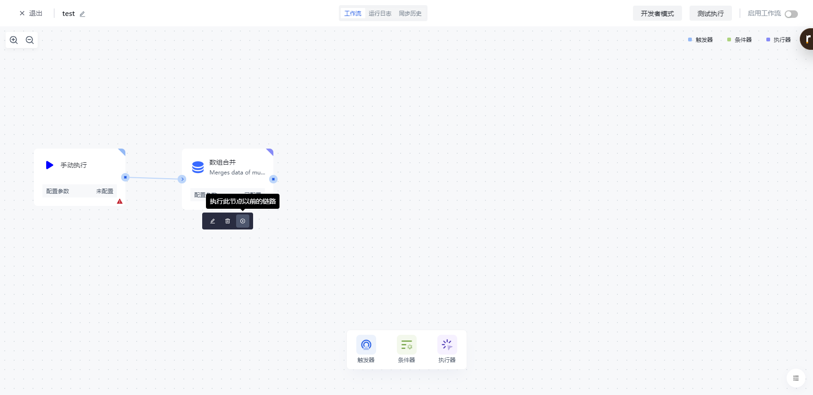
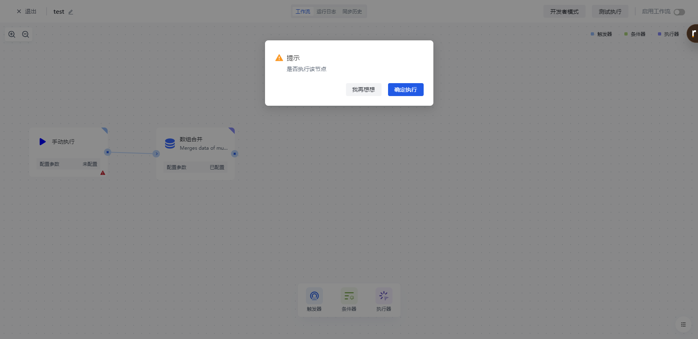
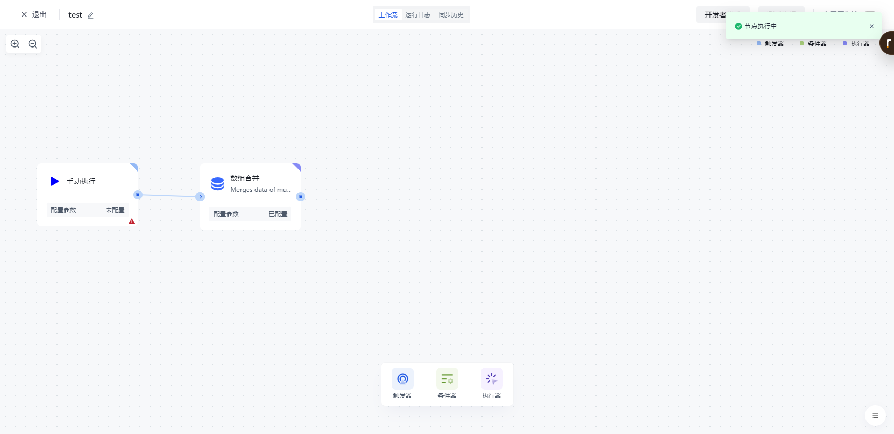
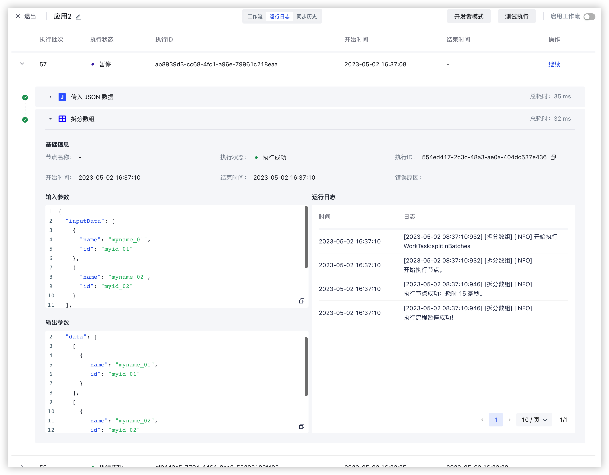

# 数组合并

# 节点介绍

「数组合并」节点主要用于对多数据源数组数据进行合并。

节点主要包括以下配置：

- 需要合并的数组，添加需要进行合并的数组数据。
- 合并方式，现在支持拼接模式。

# 快速开始

## 添加节点

在添加节点页面，在「数据处理」分类中找到「数组合并」应用节点。

或通过输入「数组合并」关键字进行应用筛选。

点击节点将会自动将该节点添加到工作流中。

## 节点配置

在工作流画布中点击该节点或点击下方的「编辑」按钮，将进入节点的配置页面。

按以下方式配置好节点的各个配置项：

- 「数据源」选择左边的「传入 JSON 数据」中的「output」下的「data」属性进行装配；

## 测试运行

点击节点上的「执行此节点以前的链路」按钮，执行该节点。

再次确认之后，该节点之前的所有流程简单将会被执行。

点击「确认执行」按钮之后，将会看到「节点执行中」的消息提示。

点击「运行日志」栏，依次点击最新的「执行批次」和「数组合并」节点左边的展开按钮，查看节点执行结果。

