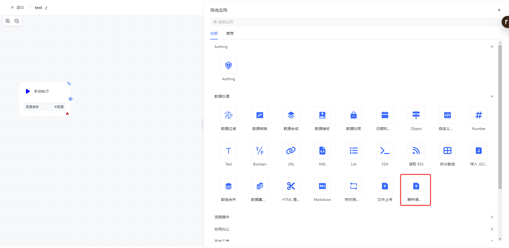
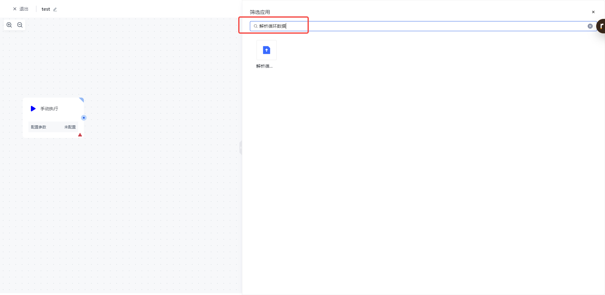
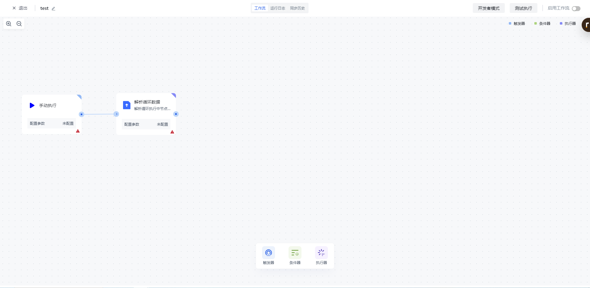
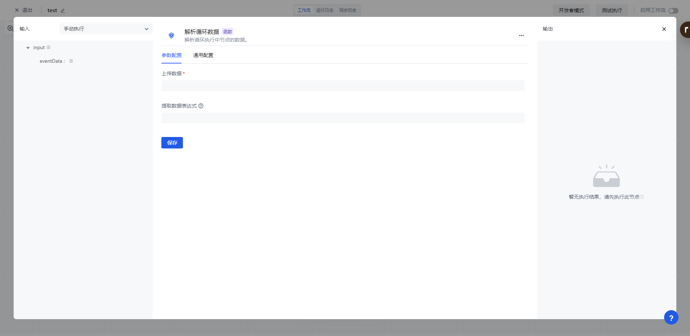
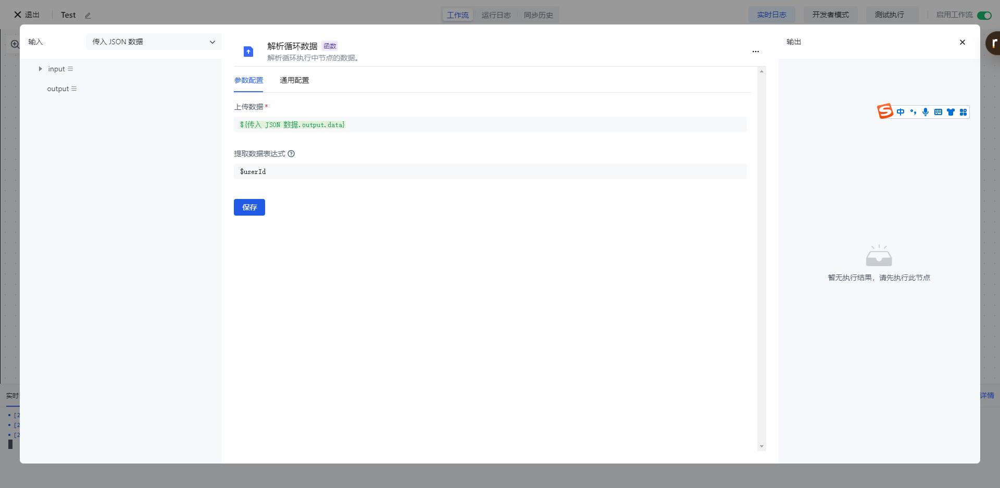
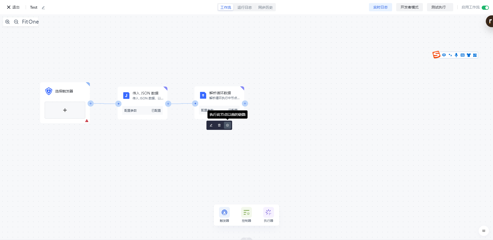
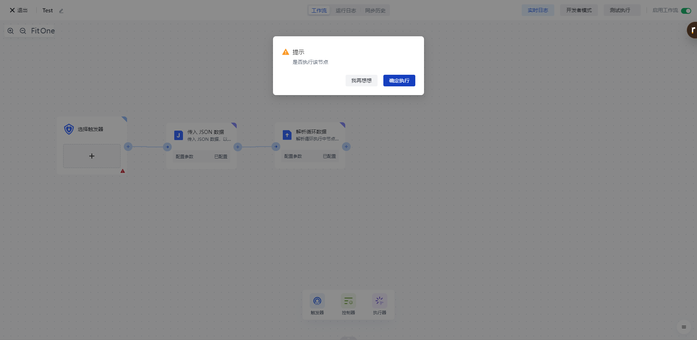
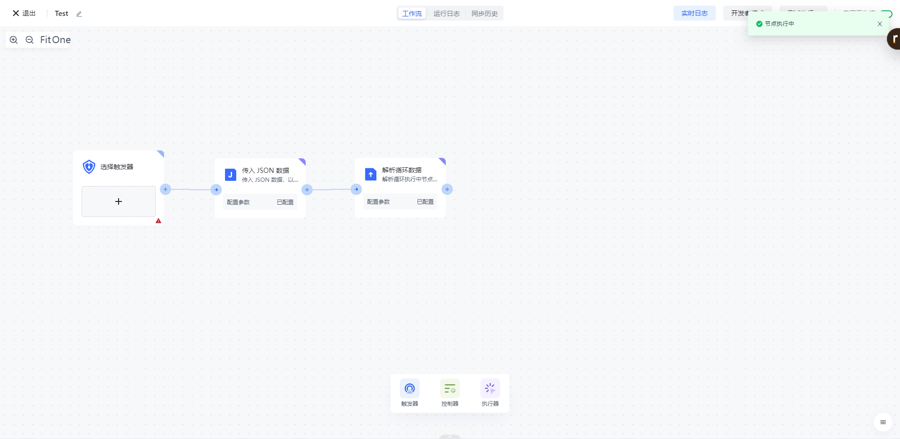

# 解析循环数据

# 节点介绍

「解析循环数据」节点主要用于解析循环数据，根据自定义数据表达式将数据抽出来。

节点主要包括以下配置：

- 上传数据，上传循环数据源。
- 提取数据表达式，自定义数据表达式，用于解析提取循环数据中目标数据。

# 快速开始

## 添加节点

在添加节点页面，在「数据处理」分类中找到「解析循环数据」应用节点。

或通过输入「解析循环数据」关键字进行应用筛选。

点击节点将会自动将该节点添加到工作流中。

## 节点配置

在工作流画布中点击该节点或点击下方的「编辑」按钮，将进入节点的配置页面。

按以下方式配置好节点的各个配置项：

- 「上传数据」选择左边的「传入 JSON 数据」中的「output」下的「data」属性进行装配；
- 「提取数据表达式」填入 $userId，表示提取字段名为 userId 的数据。

## 测试运行

点击节点上的「执行此节点以前的链路」按钮，执行该节点。

再次确认之后，该节点之前的所有流程简单将会被执行。

点击「确认执行」按钮之后，将会看到「节点执行中」的消息提示。

点击「运行日志」栏，依次点击最新的「执行批次」和「解析循环数据」节点左边的展开按钮，查看节点执行结果。

