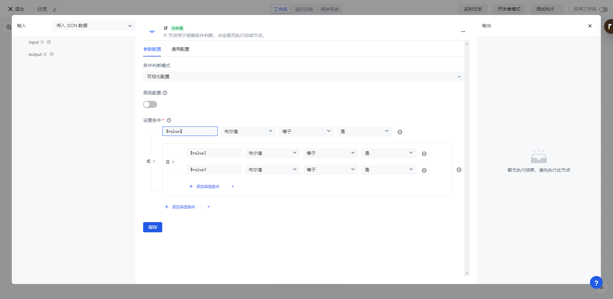
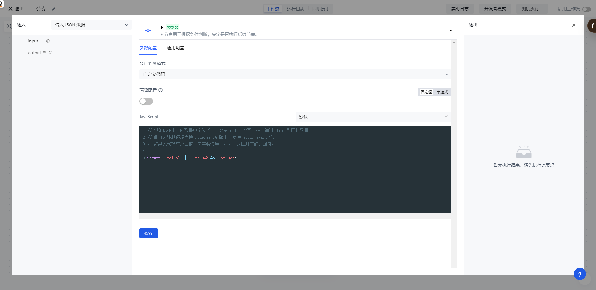

# IF

想象这样的场景：当用户登录我们监听到用户的登录事件之后，我们判断登录的 IP 是否为外网 IP，如果是的话，给当前用户发送一封提醒邮件；当使用模版进行上游同步的场景，如果此次同步的用户对比结果为大批量用户需要删除，我们需要给管理员发送一封告警邮件。要实现这样的动态逻辑判断，都需要用到 IF 节点。

Authing 身份自动化的 IF 节点允许你配置非常灵活的可视化判断规则，当满足特定条件时，执行某一段逻辑；否则执行另一段逻辑（或者忽略）。

# IF 节点支持的判断表达式

Authing 身份自动化的 IF 节点是一种简化过后的 SWITCH 节点，只不过只包含 TRUE 和 False 两个分支。和 SWITCH 节点一样，也支持下面几种非常灵活的判断表达式，你可以根据自己的具体场景选择合适的模式。

## 可视化配置

使用这种模式，可以配置非常灵活的 AND、OR 逻辑，同时支持条件组。先在<strong>设置运行变量</strong>中添加变量，值可以装配之前任意节点的数据；设置的变量可以在<strong>设置条件</strong>的表达式模块中引用（在变量前加一个 $ 符号）。

如下图所示的规则含义为：当 $value1 的值为 true 或者 $value2 和 value3 同时为 true 的时候，满足条件。



## 自定义代码模式

使用这种模式，可以编写任意的逻辑，下图所示的自定义代码和上面的可视化配置等价：

```typescript
return !!value1 || (!!value2 && !!value3);
```


