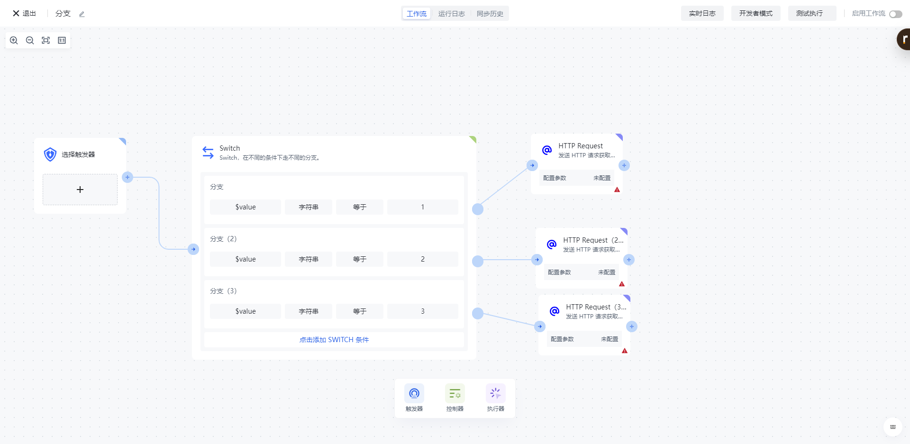
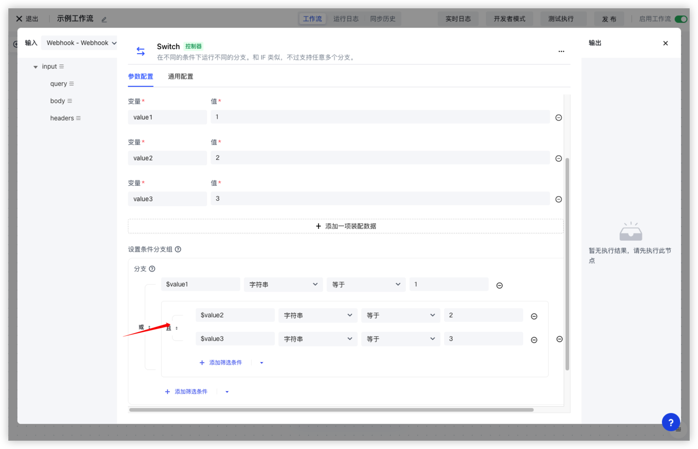

# SWITCH

想象这样的场景：从 Authing 用户目录拉取用户，当用户最近 6 个月未登录时，自动禁用账号；当最近一年未登录时，自动归档账号；否则不做任何操作。或者是当用户的账户级别为普通用户时、为 VIP、为超级 VIP 时，分别发送不同的邮件。要实现这样满足什么条件时走什么分支的场景，都需要用到 SWITCH 节点。

Authing 身份自动化的 SWITCH 节点允许你配置非常灵活的可视化判断规则，当满足条件 A 时，执行分支 A；满足条件 B 时，执行分支 B；否则默认走其他分支。

# SWITCH 节点支持的判断表达式

Authing 身份自动化的 SWITCH 支持下面几种非常灵活的判断表达式，你可以根据自己的具体场景选择合适的模式。

## 可视化配置

使用这种模式，可以配置非常灵活的 AND、OR 逻辑，同时支持条件组。先在<strong>设置运行变量</strong>中添加变量，值可以装配之前任意节点的数据；设置的变量可以在<strong>设置条件</strong>的表达式模块中引用（在变量前加一个 $ 符号）。

在<strong>设置</strong><strong>条件</strong><strong>分支组</strong>处：可以分别设置每个分支的满足条件，每个分组的名称和 SWITCH 分支名称对应。

每个分支的条件可以支持嵌套的筛选条件，如下图所示，表示当 $value1 为 true 或者 $value2 和 $value3 全部为 true 的时候，走「分支」。

##
