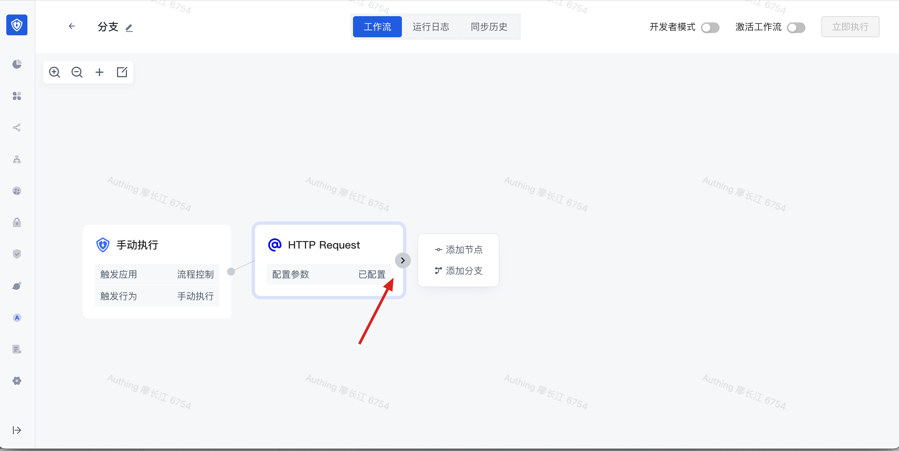

# 分支

想象这样的场景：你需要从第三方接口拉取两批数据，这两批数据之间是完全相互独立的，不存在依赖关系。我们势必希望能够并发去执行，而不是请求完一个之后再去请求下一个。这个时候，分支就派上用场了。

分支运行你创建一个及以上个 workflow 分支，这些分支可以同时执行，从而提供运行效率。

# 创建分支

将鼠标放到任意节点的 > 按钮处，会出现两个按钮：「添加节点」和「添加分支」：



点击<strong>添加分支</strong>按钮，会弹出应用选择框，可以选择需要添加的任意应用：


添加一个节点之后，可以看到后面增加了一个分支流程，通过「添加分支」和「合并分支」分别标记分支的起始和结束。


接着点击添加分支按钮再次添加一个分支：


这样我们就创建了两个并行执行的分支，在 workflow 运行时，这两个分支将会并行执行，当两个分支全部执行完成之后，才会继续往下执行；如果有其他一个分支运行失败，整个 workflow 将会以失败状态终止。


# 示例：并行获取数据之后对数据进行统一处理

接下来，我们编写一个简单的示例：创建一个包含两个分支的 workflow，每个分支单独获取自己的数据，等到两个分支全部执行完成之后，再统一对数据进行聚合处理。

为了演示方便，我们在此使用两个「传入 JSON」节点来 Mock 数据：


两个节点的数据分别为：

- 用户列表，id 字段为用户 ID

```typescript
[
    {
        "id": 1,
        "name": "张三",
        "email": "zhangsan@example.com"
    },
    {
        "id": 2,
        "name": "李四",
        "email": "lisi@example.com"
    }
]
```

- 购物车列表：userId 为所属的用户 ID

```typescript
[
    {
        "userId": 1,
        "orderedItems": [
            {
                "name": "IPhone14"
            },
            {
                "name": "Tesla"
            }
        ]
    },
    {
        "userId": 2,
        "orderedItems": [
            {
                "name": "Macbook Pro"
            }
        ]
    }
]
```

我们需要将这两份数据合并为一个数组，即将第二个 JSON 数据中的 orderedItems 添加到第一个 JSON 数据中对应的用户元素上。

在分支后面添加一个自定义代码节点，分别装配两个 JSON 节点的数据：


在自定义代码块中输入下面的代码：

```typescript
// 假如你在上面的数据中定义了一个变量 data，你可以在此通过 data 引用此数据。
// 此 JS 沙箱环境支持 Node.js 14 版本，支持 async/await 语法。
// 如果此代码有返回值，你需要使用 return 返回对应的返回值。

for (const user of users) {
  const targetOrderItem = orders.find(order => order.userId === user.id);
  if (targetOrderItem) {
    user.orderedItems = targetOrderItem.orderedItems
  }
}
return users;
```

点击执行，我们可以看到最终自定义代码节点的执行结果为：

```typescript
{
  "data": [
    {
      "id": 1,
      "name": "张三",
      "email": "zhangsan@example.com",
      "orderedItems": [
        {
          "name": "IPhone14"
        },
        {
          "name": "Tesla"
        }
      ]
    },
    {
      "id": 2,
      "name": "李四",
      "email": "lisi@example.com",
      "orderedItems": [
        {
          "name": "Macbook Pro"
        }
      ]
    }
  ]
}
```
