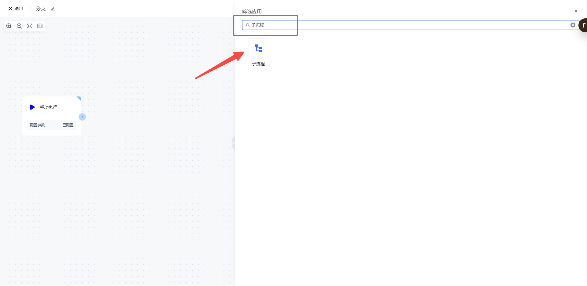
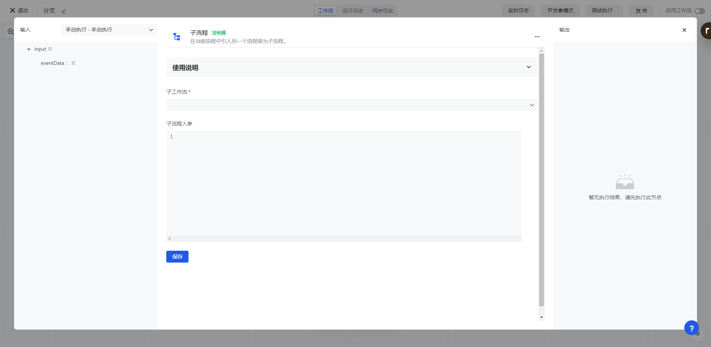
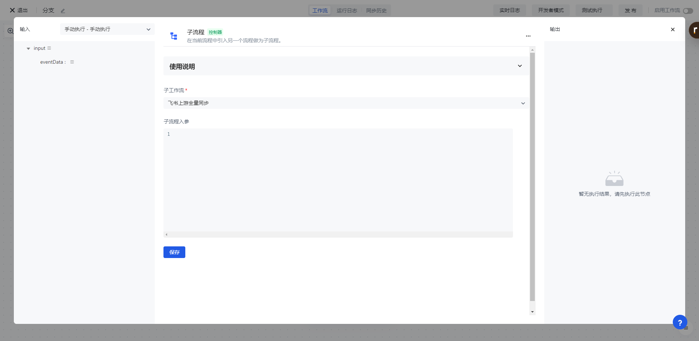

# 子流程

想象这样的场景：你需要编写的 workflow 是一个非常复杂的流程，可能会包含很多个大的步骤，如拉取数据、过滤数据、检测数据、写入数据。就像我们写程序不会把所有逻辑都放在一个大的函数体一样，我们编写 workflow 也不希望把所有节点放到一个大的流程里面。借助<strong>子流程</strong>，你可以把一个大的流程单独拆成很多个小的流程，每个流程可以被独立运行、调试，并且被组合成一个大的流程。

子流程节点可以让你在当前工作流执行过程中触发另外一个工作流，在配置子流程节点时，可以选择当前用户池下的除当前工作流以外的任意一个主流或从流，并且可以配置子流程的启动参数。

# 创建子流程

你可以在「流程操作」分类中找到「子流程」节点，也可以直接在应用搜索框内直接搜索 “子流程” 关键字。

# 配置子流程

配置项：

> 子工作流：选择一个除当前工作流以外的工作流作为子工作流； 启动参数（可选）：输入一个 JSON 格式的数据

在添加完「子流程」节点之后，需要选择一个子工作流，并且可以配置子流程的启动参数（可选）

保存「子流程」配置之后，执行该工作流时，将会自动触发子工作流程，并且将「启动参数」（可选）作为子流程的输入参数。
