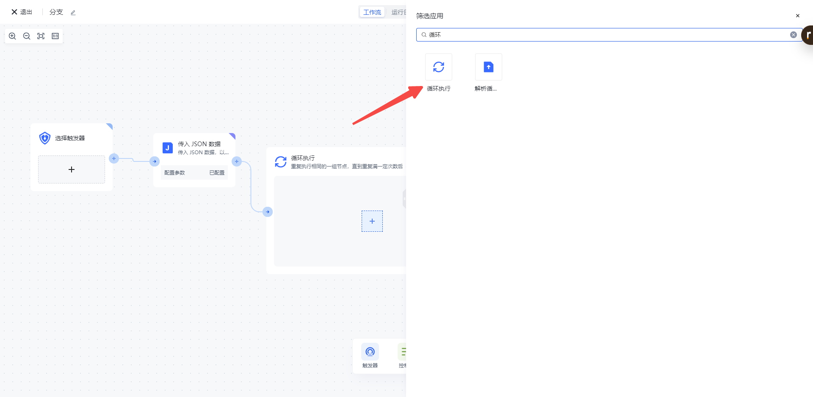
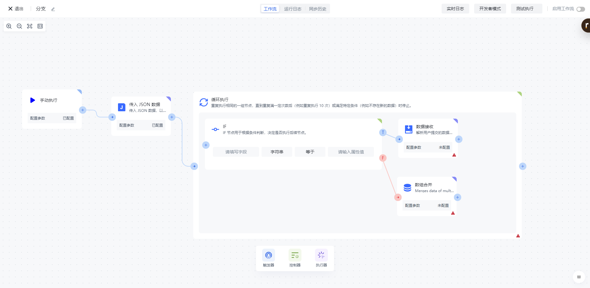
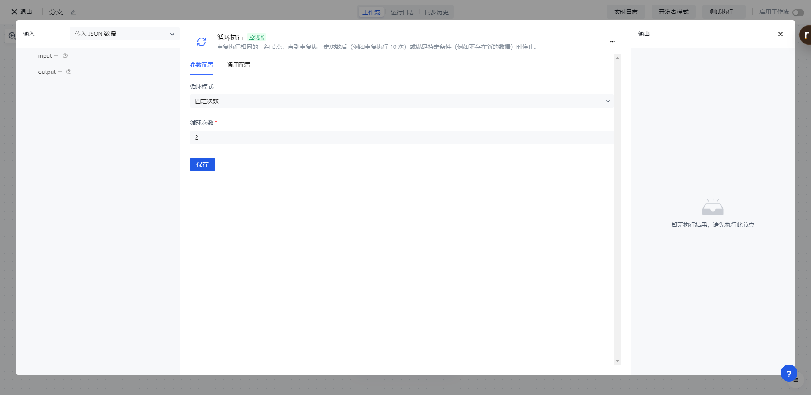
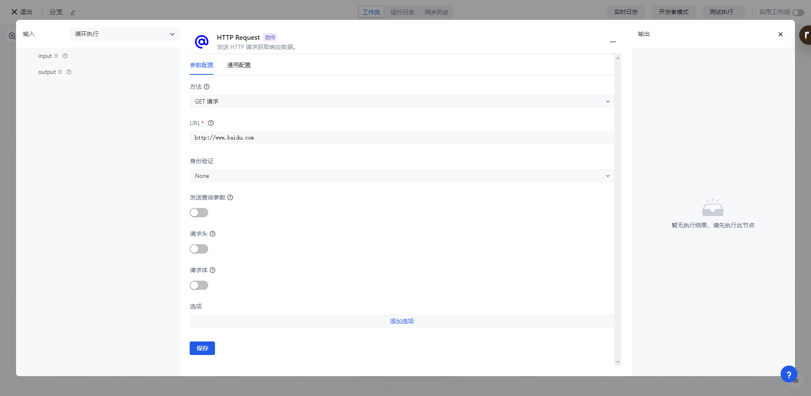
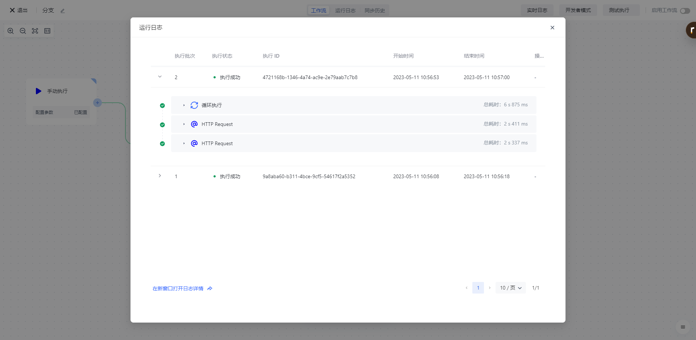
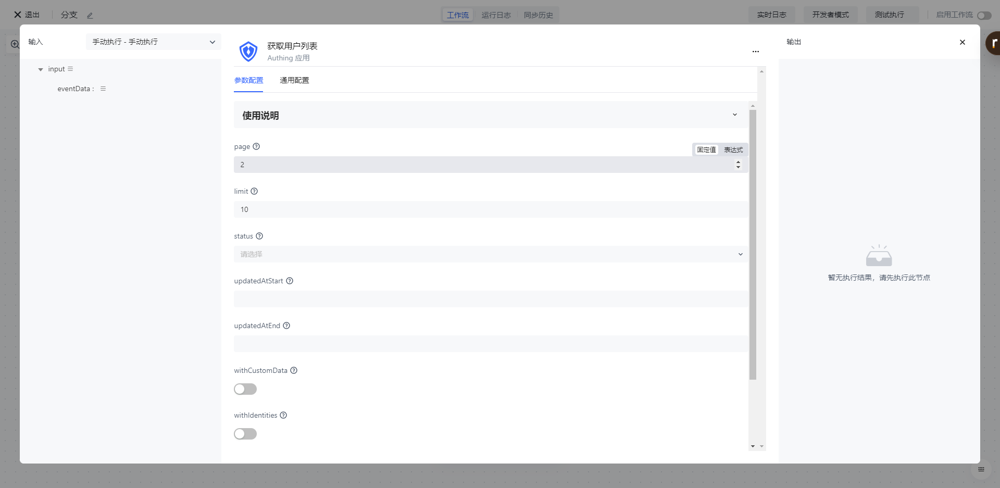
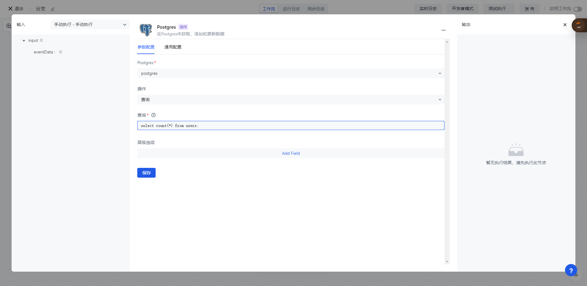
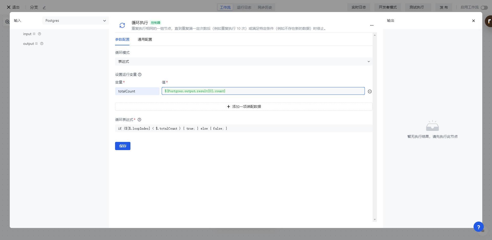
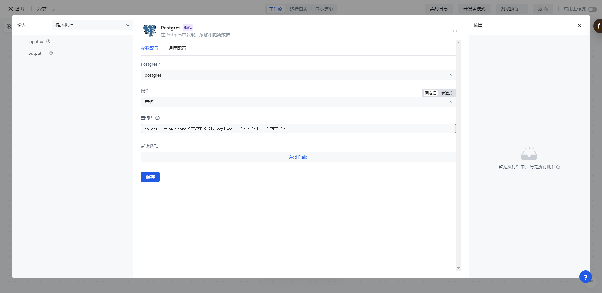
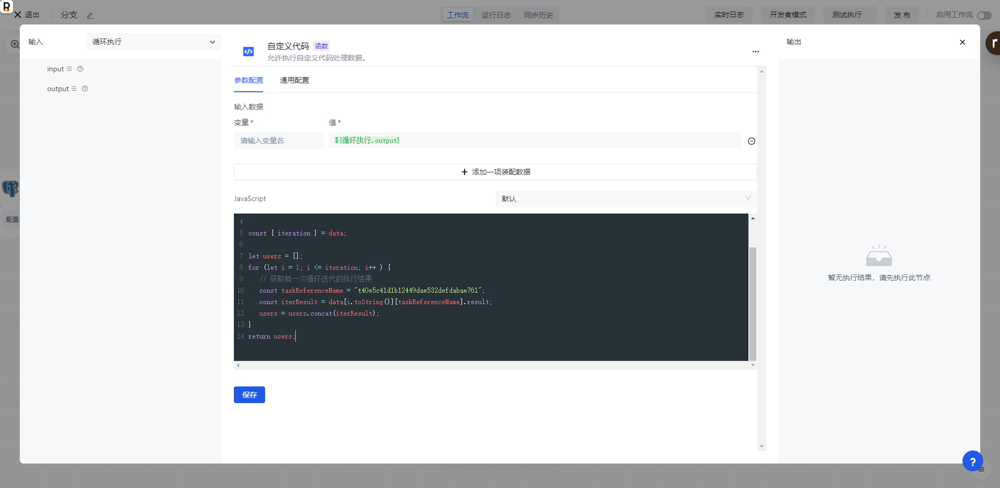

# 循环执行

想象这样的场景：你需要从第三方接口拉取大量数据，一次请求无法全部返回需要分页；或者需要给一批用户分别发送账户密码。在这些场景中，都会用到循环。

循环节点可以让你重复执行某个操作，当满足某些特定条件时停止，在一些场景下非常有用，如：

1. 给一批邮箱发送邮件；
2. 当拉取第三方数据时数据量比较大，需要分页查询时；
3. 分页查询数据库数据时；
4. 针对一批数据单个或者分批处理时；

# 创建循环节点

你可以在 Authing 身份自动化的应用列表中查到<strong>循环执行</strong>节点：



在 Authing 身份自动化平台中，循环节点内部可以嵌套任意的流程，如下所示：



# 支持的几种循环模式

Authing 循环节点支持以下几种循环模式：

1. 固定次数模式：配置固定的执行次数，运行固定执行之后终止循环。适用于预先知道需要循环多少次的场景。



1. 表达式模式：通过编写动态表达式，动态决定循环执行的次数。适用于需要动态计算循环次数的场景，如循环拉取数据库数据、循环分页拉取第三方数据。详情见后文的示例三和示例四。


1. 循环列表模式：动态传入一个数组，根据传入数组的长度决定循环次数，你可以在循环节点中获取当前元素的值。详情见

# 获取循环上下文

在循环节点内部，经常需要获取以下上下文信息：

- 当前循环次数的下标：$[$.loopIndex]，从 1 开始。还可以编写类似下面这种表达式：

  - $[$.loopIndex + 1]：当前循环坐标 + 1
  - $[$.loopIndex * 10]：当前循环坐标 * 10
  - $[($.loopIndex - 1) * 10]：（当前循环坐标 - 1） * 10
- 当前循环元素的值：可以通过 ${getLoopItem.output.result} 获取当前循环元素的值。详情见示例二：循环给用户发送邮件。

# 常见场景示例

## 示例一：执行固定次数

在此示例中，我们在循环执行节点中创建了一个 HTTP Request 节点，并且设置固定循环次数为 2：




点击执行，可以看到一共执行了两次：



## 示例二：循环给用户发送邮件

在此示例中，我们先使用 Authing 应用的「获取用户列表」方法拉取用户列表：



接下来添加一个循环执行节点，设置循环模式为「循环列表」，将列表数据装配为上一个节点的输出结果：


接下来在循环体中添加一个「Authing 邮件服务」节点，在此将收件人设置为 ${getLoopItem.output.result.email}，即当前元素的 email 值：


点击执行：可以看到针对每个用户都发送了一封邮件。

## 示例三：分页拉取数据库数据

在此我们以从「Postgres」数据库分页拉取用户数据为例。当我们在程序中分页拉取数据库数据时，一般分为以下几个步骤：

1. 使用 count 计算总数；
2. 从一个起始坐标开始（offset），指定每批次的拉取数量（limit），每次按照 limit 的量增加 offset，直到 offset 大于总数；
3. 累计所有查询批次的结果，得到最终结果。

使用 Authing 身份自动化的循环节点也是一样的过程：首先我们添加一个 Postgres 节点，编写一个用于查询用户总数的 SQL：

```typescript
select count(*) from users;
```



执行此节点，你可以看到实际的执行结果。接下来我们创建一个「循环执行」节点：选择「循环模式」为「表达式」，并且在运行变量中添加一个运行变量 <strong>totalCount</strong>，值装配为上一个节点的输出结果。在这个示例中，我们查询到一共有 46 条用户：



然后循环表达式设置为：

```typescript
if ($[$.loopIndex] < $.totalCount / 10 ) { true; } else { false; }
```

其中，内置变量 $[$.loopIndex] 表示当前循环执行的次数（<strong>以 1 开始</strong>），你可以在表达式中通过 $.变量名 引用「设置运行变量」中设置的变量。在这个示例中，我们设置了循环执行的条件为：循环迭代的下标（$[$.loopIndex]）小于 $.totalCount / 10，即每页拉取 10 个用户（如果你需要每批拉取 50 个用户，将 $.totalCount / 10 改成 $.totalCount / 50 即可）。

动态设置了总循环次数之后，接下来我们需要为每次查询设置正确的 offset 和 limit。在循环执行节点中添加一个 Postgres 节点，查询 SQL 如下：

```typescript
select * from users OFFSET $[($.loopIndex - 1) * 10]  LIMIT 10;
```

在此，我们给 OFFSET 设置了一个动态参数：`$[($.loopIndex - 1) * 10]`，即（当前迭代坐标 - 1）乘以 10。当 $.loopIndex 为 1 时，OFFSET 值为 0，即第一页；当 $.loopIndex 为 2 时，OFFSET 值为 10，即第二页。LIMIT 的值为 10，这个和我们在上一步设置循环表达式时编写的 $.totalCount / 10 一致。



点击保存之后执行，可以看到循环里面的 Postgres 节点执行了若干次：


循环直接节点的输出为如下格式：


输出结果中的 iteration 表示为总迭代次数，此示例中迭代了 5 次，每次迭代的结果分别在 key 1-5 中。由于一个循环节点可能包含多个节点，所以每次迭代中每个节点的输出使用此节点的 taskReferenceName 作为 key，比如在这个示例中，循环执行节点中的 Postgres 节点的 taskReferenceName 为 t40e5c41d1b12449dae532defdabae761，他的输出在 result 字段中，是一个数组。


清晰了循环执行节点的输出结构之后，接下来我们使用「自定义代码」节点拿到最终的数据。首先在输入数据中组装配「循环执行」节点的输出结果：



代码如下：

1. 第 6 行：获取总的循环执行次数；
2. 第 9 行：使用 for 循环遍历每一次迭代执行的记过，拿到 Postgres 节点的输出（此例中 Postgres 节点的 taskReferenceName 为 t40e5c41d1b12449dae532defdabae761）；
3. 第 13 行：将每次执行的结果添加到最终需要返回的 users 数组中；
4. 第 15 行：返回最终结果

```typescript
// 假如你在上面的数据中定义了一个变量 data，你可以在此通过 data 引用此数据。
// 此 JS 沙箱环境支持 Node.js 14 版本，支持 async/await 语法。
// 如果此代码有返回值，你需要使用 return 返回对应的返回值。

// 循环总执行次数
const { iteration } = data;

let users = [];
for (let i = 1; i <= iteration; i++ ) {
  // 获取每一次循环迭代的执行结果
  const taskReferenceName = "t40e5c41d1b12449dae532defdabae761";
  const iterResult = data[i.toString()][taskReferenceName].result;
  users = users.concat(iterResult);
}
return users;
```

最后点击执行，我们可以看到自定义代码节点的输出结果：


可以看到最终的结果为 46 条用户，这和我们前面拿到的用户总数是一致的。


