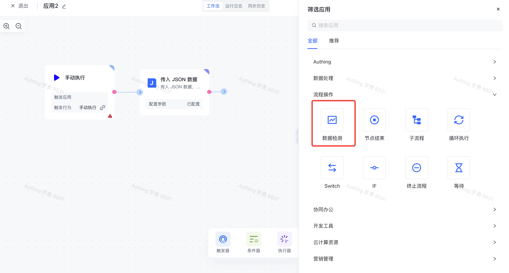
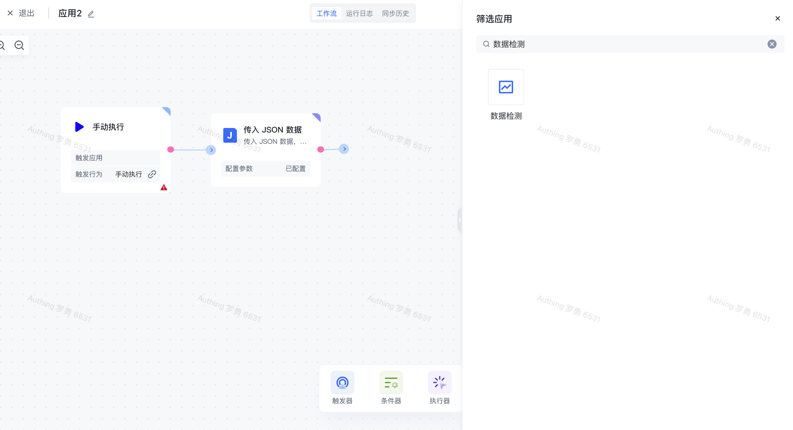
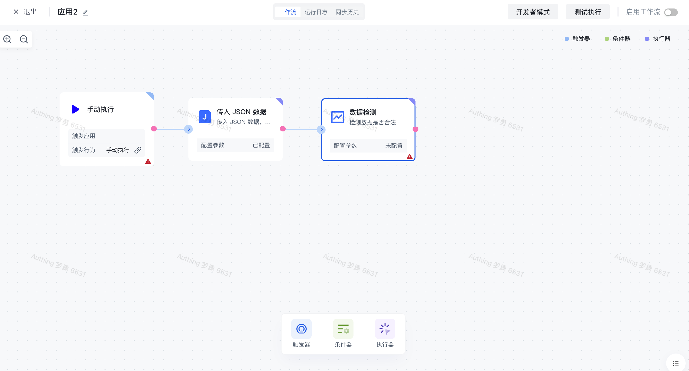
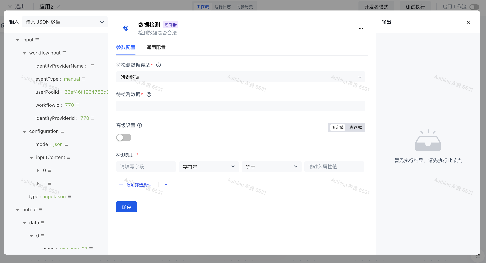
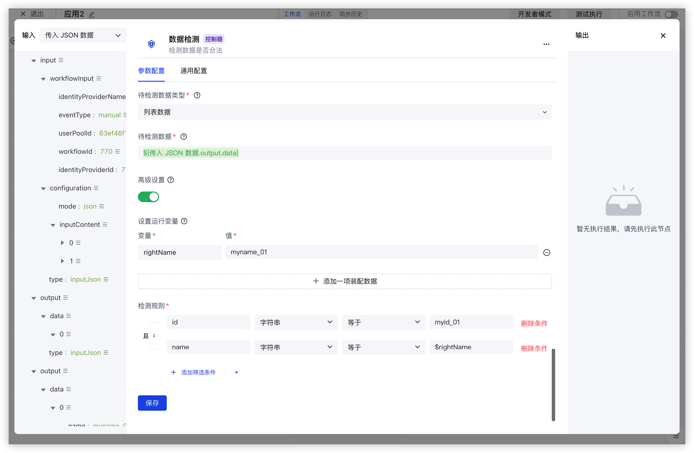
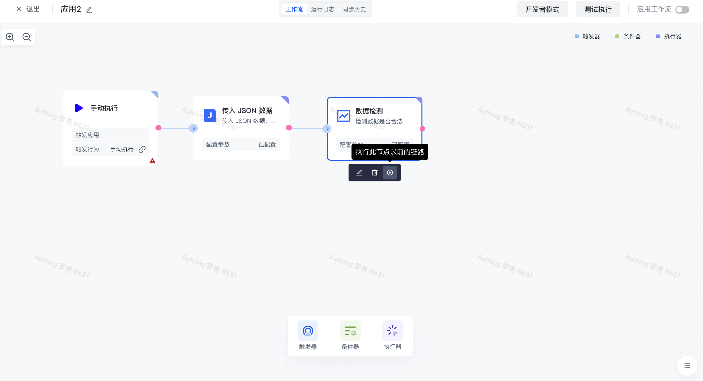
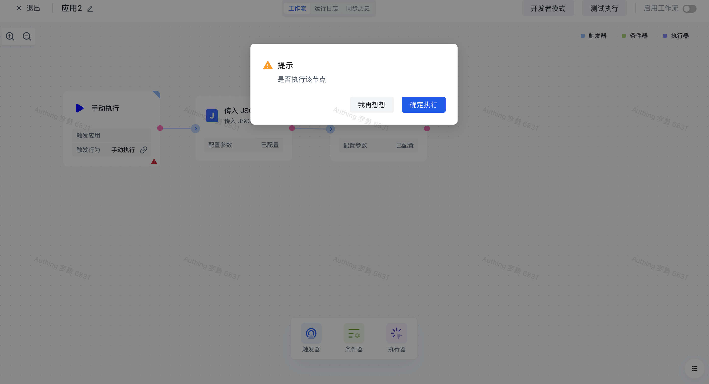
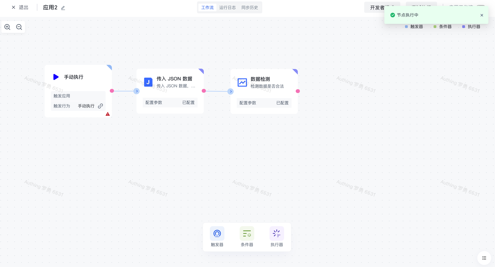
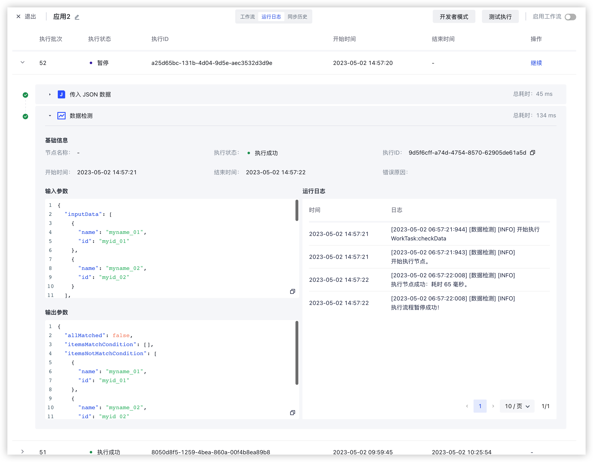

# 数据检测

# 节点介绍

「数据检测」节点主要用于检测数据是否符合某些条件，用于决定工作流流程是否继续往后执行。

节点主要包括以下配置：

- 待检测数据类型，可选数据类型有「列表数据」和「树结构数据」。如果你需要对一个对象或者一个数组中的每个元素的值做检测，请选择「列表数据」模式；如果你需要对一个树结构做检测，如子节点的父亲节点是否存在、节点 ID 是否重复，请选择「树结构」模式。
- 待检测数据，待检测的原始数据，可自行输入，也可通过数据装配来装配当前节点之前的数据源。如果此数据是一个数组，那么会对数组中的每一项进行检测。
- 高级设置，开启「高级设置」之后，可设置或装配多项「运行变量」，每一项「运行变量」包含一个变量名和变量值。在此设置的参数，可以在下面的「检测规则」中引用。比如说你有一个场景：你希望检测用户数据中的部门 ID 对应的部门是否存在，你可以设置了一个 `allDepartmentIds` 参数，那么你可以在「检测规则」中使用 ` $allDepartmentIds` 来进行引用。
- 检测规则，可配置一组数据检测的规则，每项规则都包含「字段」、「字段类型」、「操作符」以及「字段值」。多项检测规则之间支持且或关系切换。

  - 字段，过滤条件对应的字段名称。
  - 字段类型，过滤条件的字段类型，目前支持：字符串、数字、布尔值、时间、日期、对象、数组以及枚举值。
  - 操作符，每一种「字段类型」对应的操作符有所不同。
  - 字段值，检测规则字段对应的字段值，不同的「字段类型」支持的字段值不同。

# 快速开始

## 添加节点

在添加节点页面，输入「数据检测」关键字进行应用筛选。

或在「流程操作」分类中找到「数据检测」应用节点。

点击节点将会自动将该节点添加到工作流中。

## 节点配置

在工作流画布中点击该节点或点击下方的「编辑」按钮，将进入节点的配置页面。

按以下方式配置好节点的各个配置项：

- 「待检测数据类型」选择「列表数据」；
- 「带检测数据」选择左边的「传入 JSON 数据」中的「output」下的「data」属性进行装配；
- 打开「高级设置」，并设置「运行变量」`rightName` 对应的值 `myname_01`；
- 配置两条「检测规则」分别为：`id = "myid_01" ` 且 ` name = $rightName`。

## 测试运行

点击节点上的「执行此节点以前的链路」按钮，执行该节点。

再次确认之后，该节点之前的所有流程简单将会被执行。

点击「确认执行」按钮之后，将会看到「节点执行中」的消息提示。

点击「运行日志」栏，依次点击最新的「执行批次」和「数据检测」节点左边的展开按钮，查看节点执行结果。

