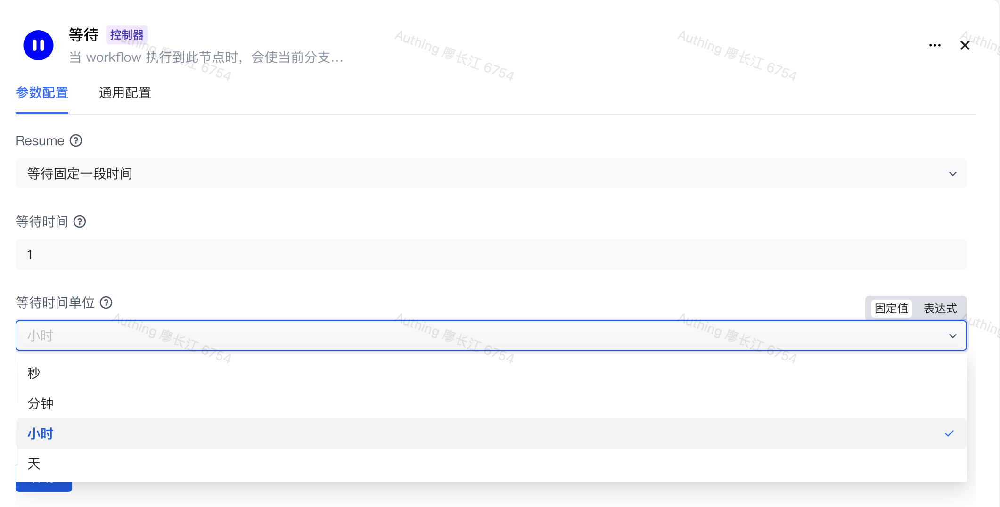

# 等待

想象这样的场景：进行上游同步的时候，如果用户对比的计算结果为大量数据需要删除，你需要针对这种场景将整个流永久得暂停起来，等待管理员手动确认之后再恢复；或者是你执行完一个节点之后，希望等待一定时间再继续往下执行。以上这些场景，你可以使用等待节点来实现。

# 支持的几种等待模式

Authing 身份自动化的等待节点支持以下几种模式，以支持各种不同的使用场景。

## 永久等待

这种模式下，当执行等待节点时，会将此节点永久暂停下来，只有当管理员手动恢复之后，流程才会继续往下执行。

## 等待固定一段时间（敬请期待）

支持秒、分钟、小时、天为单位，当等待时间达到一定时间之后，恢复流程执行。

## 等待到特定时间点（敬请期待）

手动选择一个固定时间点，当时间达到此时间点之后，流程恢复执行。

