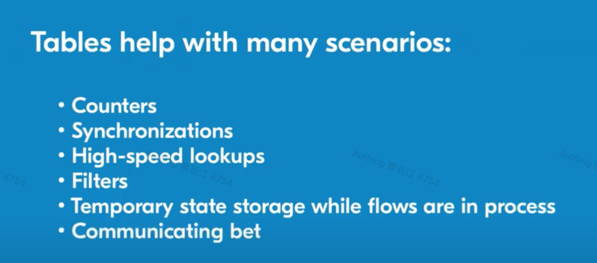
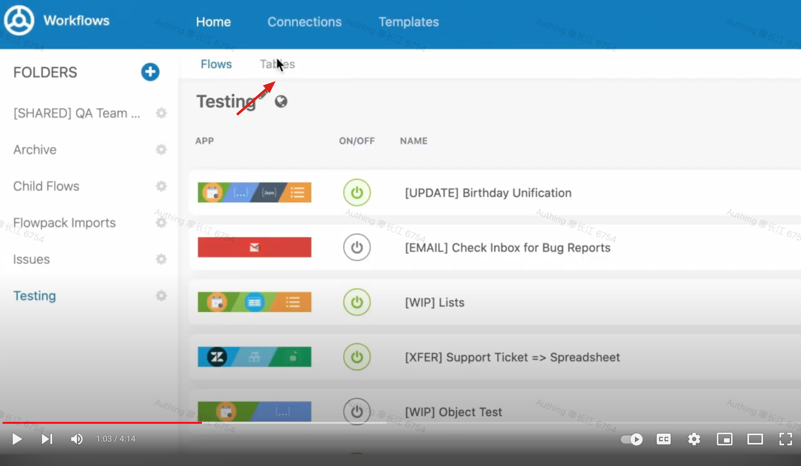
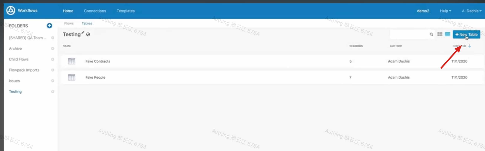
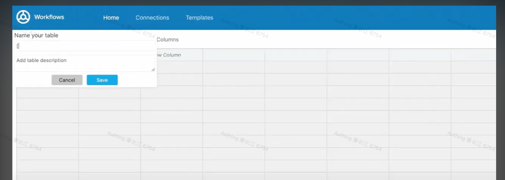
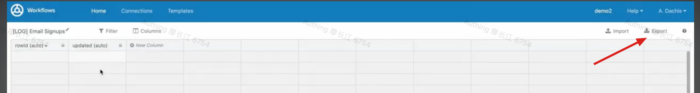
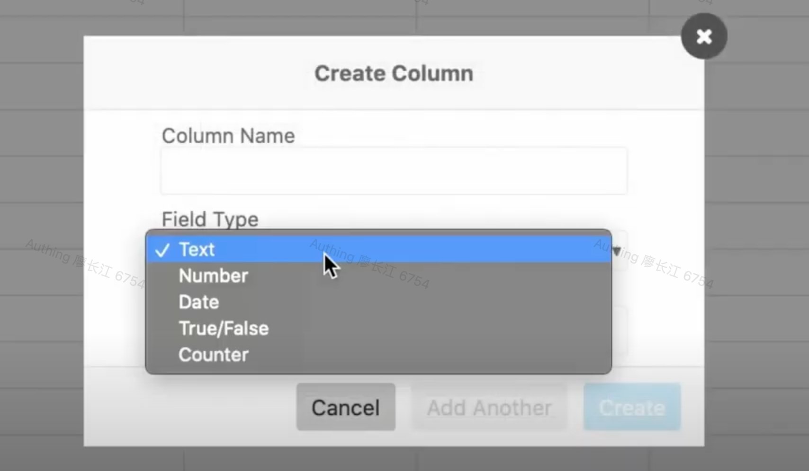
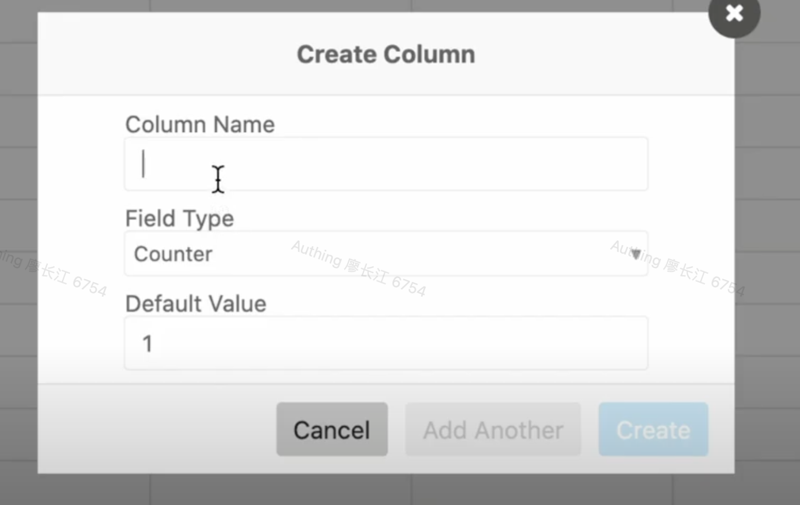
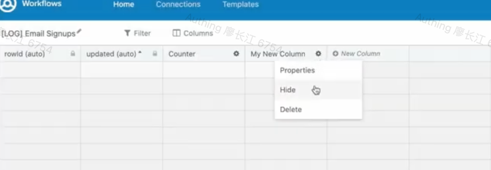
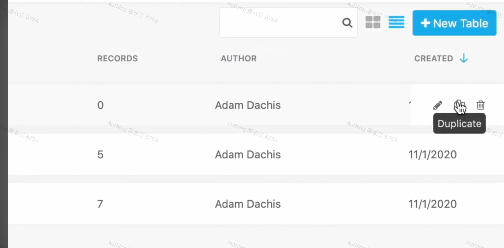
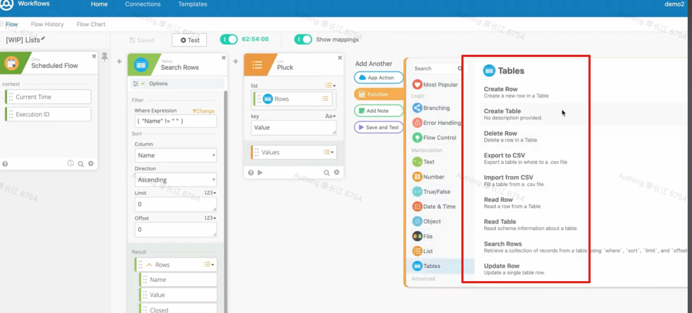

# Tables 组件

# 是什么

[https://www.youtube.com/watch?v=wsF0KimdFFY&ab_channel=Okta](https://www.youtube.com/watch?v=wsF0KimdFFY&ab_channel=Okta)

# 有什么用

1. counter：比如员工工号生成
2. 临时用户组：
3. 用户加入分组的时候，如果判断分组是临时的，会往<strong> Tables 组件里面插入一条记录</strong>，包含用户 ID、分组 ID、过期时间
4. 有一个定时任务，<strong>定时查询此 Table 中是否有记录满足</strong><strong>条件</strong><strong>（当前时间 > 过期时间）</strong>
5. 查到了就把用户从分组里面移除

# 怎么做：基于元数据
