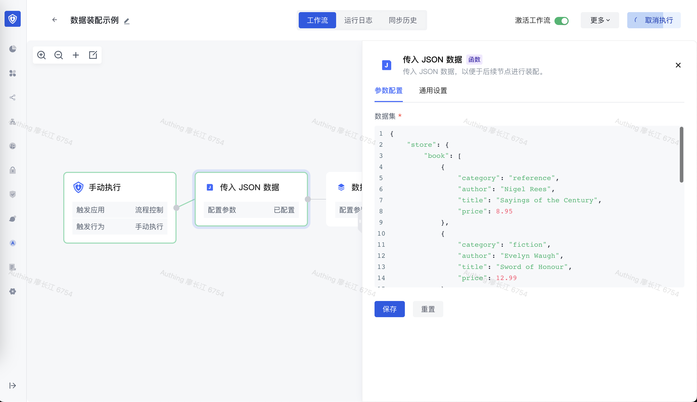
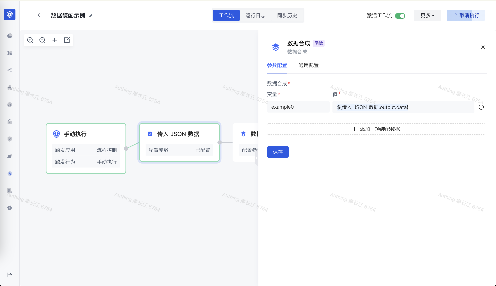
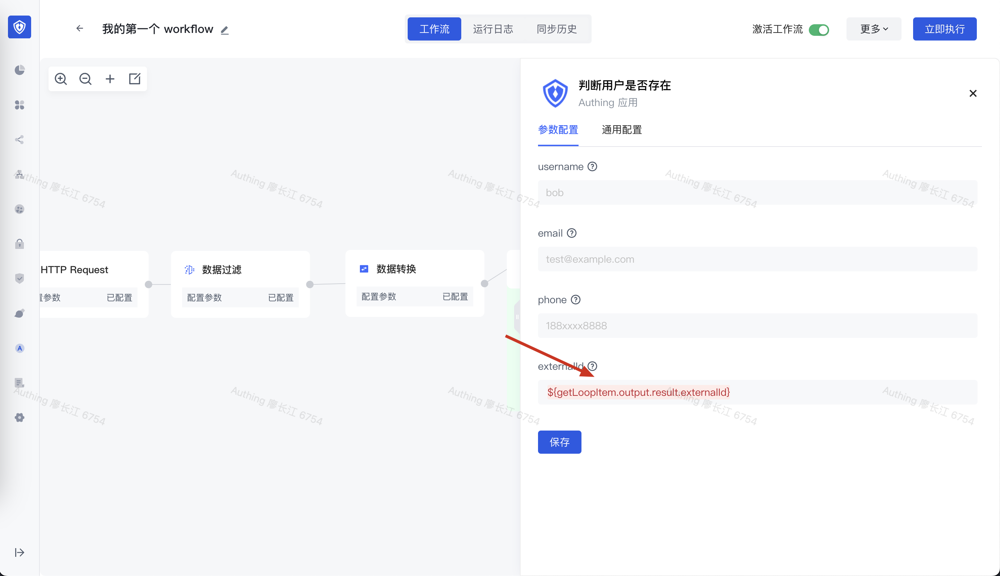
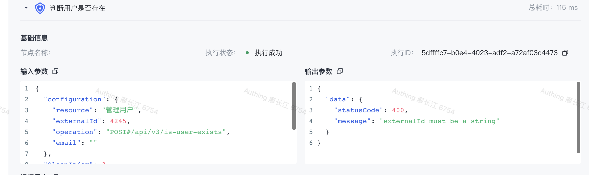

# 为节点动态装配数据

此篇文档介绍数据装配中会使用到的表达式，当要对数据进行一些简单处理时，这些开箱即用的表达式往往非常有用。

> Authing 流程编排引擎使用开源的 [jsonpath](https://github.com/json-path/JsonPath) 作为装配数据的解析引擎，如果你对此 library 非常熟悉，可以直接查询其文档。

# 创建示例 workflow

> 如果你刚刚接触 Authing 的身份自动化，推荐阅读 [编写你的第一个 workflow](https://steamory.feishu.cn/wiki/wikcnIepAj9Rdv3PKtExvj6hZ9b) 。

这里我们使用一份 Mock 数据：

```typescript
{
    "store": {
        "book": [
            {
                "category": "reference",
                "author": "Nigel Rees",
                "title": "Sayings of the Century",
                "price": 8.95
            },
            {
                "category": "fiction",
                "author": "Evelyn Waugh",
                "title": "Sword of Honour",
                "price": 12.99
            },
            {
                "category": "fiction",
                "author": "Herman Melville",
                "title": "Moby Dick",
                "isbn": "0-553-21311-3",
                "price": 8.99
            },
            {
                "category": "fiction",
                "author": "J. R. R. Tolkien",
                "title": "The Lord of the Rings",
                "isbn": "0-395-19395-8",
                "price": 22.99
            }
        ],
        "bicycle": {
            "color": "red",
            "price": 19.95
        }
    },
    "expensive": 10
}
```

在此我们创建一个简单的 workflow：使用 <strong>JSON</strong> 节点拉取数据，再使用<strong>数据合成</strong>节点测试数据装配的使用：



先点击 JSON 节点上的执行按钮，让 workflow 执行到此节点，接下来我们就可以在数据合成节点看到 HTTP 节点的执行结果，并可以对其数据进行装配了。



执行 workflow，你就可以看到数据合成节点的输出，即我们测试的装配结果：比如最简单的场景，就是直接对值的引用。下面会介绍其他更高级的数据装配表达式。

# 常见解析表达式

> 线上用户池地址：线上用户池地址：[https://console.authing.cn/console/63bea7828f47719bfa80df93/workflow/detail?task_id=138&workflowId=138&defaultActiveKey=WORK_fLOW_CANVAS&page=1&group=custom](https://console.authing.cn/console/63bea7828f47719bfa80df93/workflow/detail?task_id=138&workflowId=138&defaultActiveKey=WORK_fLOW_CANVAS&page=1&group=custom)，如果想直接查看请联系 ou_05bf3085ffc4a9cbb4fda96a24ae3770 添加协作管理员。

| 表达式                                                                       | 示例                                                                                                                                                                                                                                                                                                                                            | 含义                                                            |
| ---------------------------------------------------------------------------- | ----------------------------------------------------------------------------------------------------------------------------------------------------------------------------------------------------------------------------------------------------------------------------------------------------------------------------------------------- | --------------------------------------------------------------- |
| ${某个节点.output.xxx}                                                       | ${传入 JSON 数据.output.data}                                                                                                                                                                                                                                                                                                                   | 最常见方式，直接应用值                                          |
| ${某个节点.output.a[*].b}                                                    | ${传入 JSON 数据.output.data[*].author}                                                                                                                                                                                                                                                                                                         | 提取列表 a 的所有元素的 b 字段，转换成数组                      |
| ${某个节点.output.a..b}                                                      | ${传入 JSON 数据.output.data..author}                                                                                                                                                                                                                                                                                                           | 提取 a 对象下所有元素的 b 字段，转换成数组                      |
| ${某个节点.output.a[index]}                                                  | - ${传入 JSON 数据.output.data.store.book[0]} （第一个元素） <br/>- ${传入 JSON 数据.output.data.store.book[1]} （第二个元素）<br/>- ${传入 JSON 数据.output.data.store.book[-1]} （倒数第一个元素）<br/>- ${传入 JSON 数据.output.data.store.book[-2]} （倒数第二个元素）                                                                          | 获取数组某个下标的元素（下标从 0 开始）                         |
| ${某个节点.output.a[index1,index2,index3]}<br/><br/>注意逗号之间不要有空格！ | - ${传入 JSON 数据.output.data.store.book[0,3,5]} （第一、第四和第六个元素）                                                                                                                                                                                                                                                                    | 批量获取数组某些下标的元素（下标从 0 开始）                     |
| ${某个节点.output.a[fromIndex:toIndex]}<br/><br/>注意「:」之间不要有空格！   | - ${传入 JSON 数据.output.data.store.book[0:3]} （从第一个到第三个元素，不包含最后一个下标）<br/>- ${传入 JSON 数据.output.data.store.book[:3]} （从第一个到第三个元素，不包含最后一个下标）<br/>- ${传入 JSON 数据.output.data.store.book[2:]} （从第三个元素到最后一个元素）<br/>- ${传入 JSON 数据.output.data.store.book[-2:]} （最后两个元素） | 获取数组从开始下标到介绍下标的所有元素，不包含 toIndex 下标的值 |
| ${某个节点.output.a[?(@.b.c)]}                                               | - ${传入 JSON 数据.output.data.store.book[?(@.isbn)]}                                                                                                                                                                                                                                                                                           | 过滤数组数据中某个字段（支持嵌套）存在的元素                    |
| ${某个节点.output.a[?(@.b.c<=10)]}                                           | - ${传入 JSON 数据.output.data.store.book[?(@.price<10)]} 所有 price 小于 10 的书<br/>- ${传入 JSON 数据.output.data.store.book[?(@.price<=10)]} 所有 price 小于等于 10 的元素<br/>- ${传入 JSON 数据.output.data.store.book[?(@.price>=10)]} 所有 price 大于等于 10 的元素                                                                      | 根据一定条件过滤数组中的数据                                    |
| ${某个节点.output.a[?(@.b.c<=$['c']['d'])]}                                    | - ${传入 JSON 数据.output.data.store.book[?(@.price<$['expensive'])]} 所有 price 小于                                                                                                                                                                                                                                                             |                                                                 |

# 暂不支持的表达式

| 表达式                       | 含义                             | Feature Request（描述你的使用场景）                                                                                                                      | 预计何时支持 |
| ---------------------------- | -------------------------------- | -------------------------------------------------------------------------------------------------------------------------------------------------------- | ------------ |
| ${xxx.output.xxx.toString()} | 将数字类型数据转换成 string 类型 | 第三方传过来的 externalId 是数字，但是我们这边是字符串：<br/><br/> |              |
| ${xxx.output.xxx.join(',')}  | 将数组中的元素使用分隔符分割     |                                                                                                                                                          |              |
