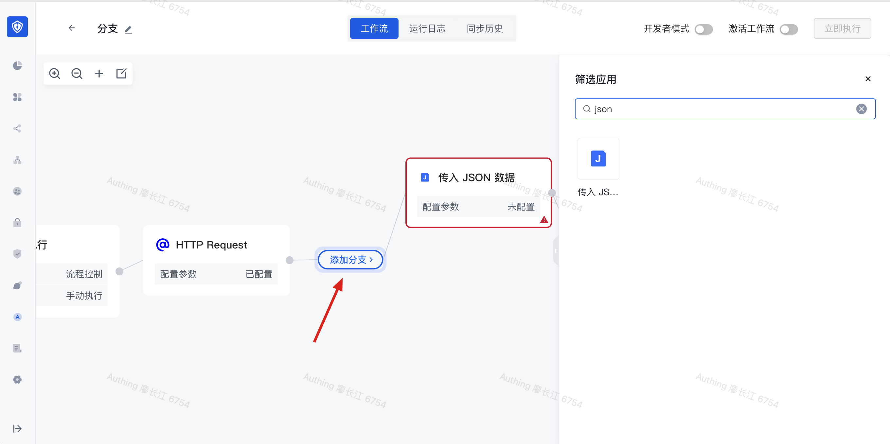
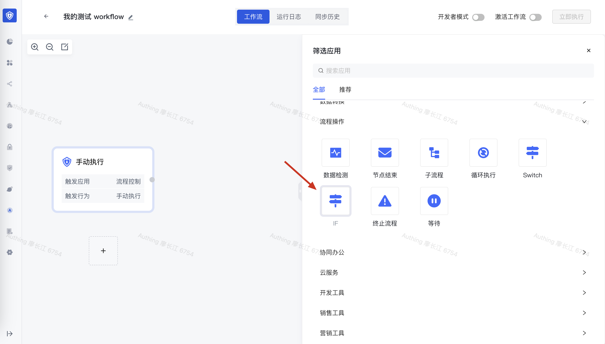
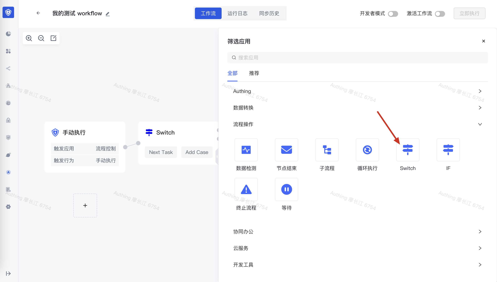
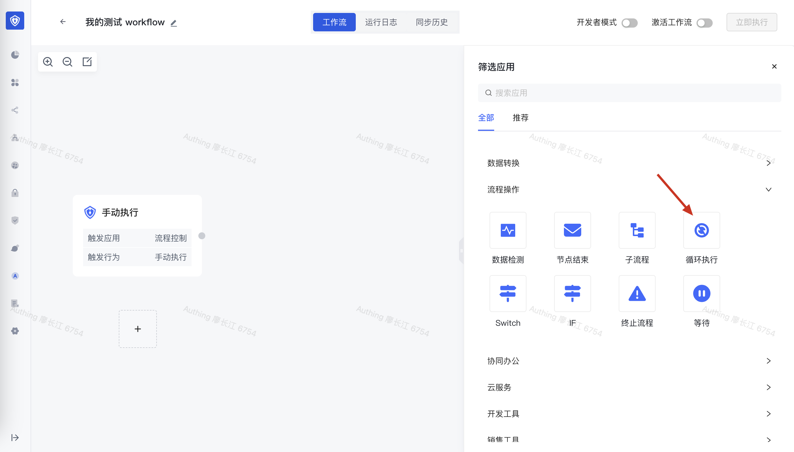
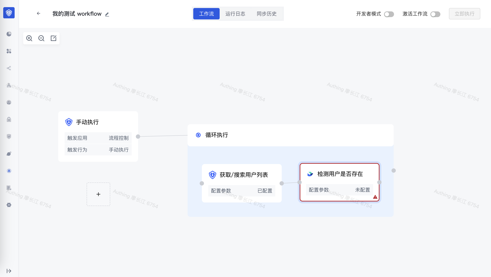
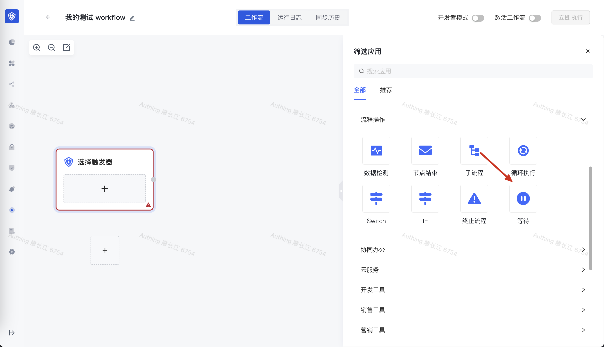
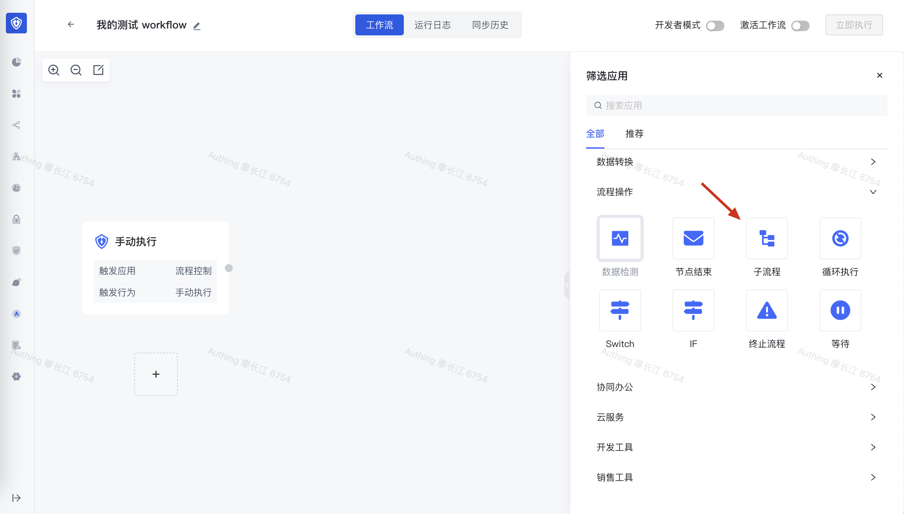
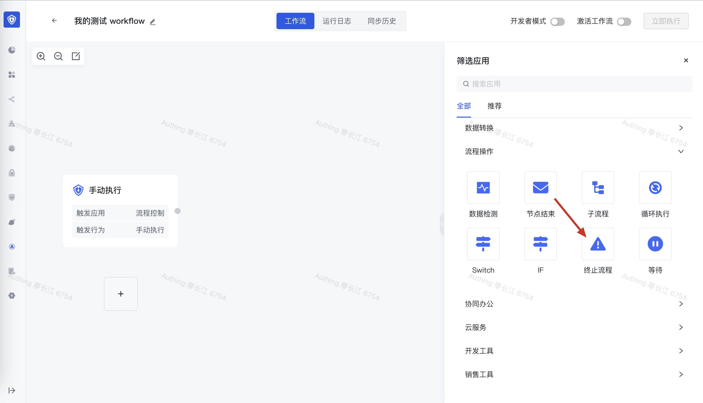

# 添加流程控制节点

下面会介绍循环、IF、SWITCH、函数调用、等待、并发请求等流程控制节点的创建方式，每种流程控制节点的详细使用说明请见「流程控制节点」章节的使用说明。

## 添加分支

分支运行你创建一个及以上个 workflow 分支，这些分支可以同时执行，从而提供运行效率。

将鼠标放到任意节点的 > 按钮处，可以看到「添加分支」按钮：

点击<strong>添加分支</strong>按钮，会弹出应用选择框，可以选择需要添加的任意应用：

添加一个节点之后，可以看到后面增加了一个分支流程，通过「添加分支」和「合并分支」分别标记分支的起始和结束。

接着点击添加分支按钮再次添加一个分支：

这样我们就创建了两个并行执行的分支，在 workflow 运行时，这两个分支将会并行执行，当两个分支全部执行完成之后，才会继续往下执行；如果有其他一个分支运行失败，整个 workflow 将会以失败状态终止。

## 添加 IF 节点

在应用列表的流程操作分类中，可以看到 IF 节点：

## 添加 SWITCH 节点

在应用列表的流程操作分类中，可以看到 SWITCH 节点：

## 添加循环节点

循环节点可以让你重复执行某个操作。

在应用列表的流程操作分类中，可以看到循环节点：

添加完成之后，你可以在循环执行节点内部添加任意流程：

## 添加等待节点

在应用列表的流程操作分类中，可以看到等待节点：

## 添加子流程

在应用列表的流程操作分类中，可以看到子流程节点：

## 添加终止流程节点

在应用列表的流程操作分类中，可以看到终止流程节点：

