# 添加流程控制节点

下面会介绍循环、IF、SWITCH、函数调用、等待、并发请求等流程控制节点的创建方式，每种流程控制节点的详细使用说明请见「流程控制节点」章节的使用说明。

## 添加分支

分支运行你创建一个及以上个 workflow 分支，这些分支可以同时执行，从而提供运行效率。

当我们从一个节点拖出一条连线之后，我们可以继续从此节点拖出任意分支

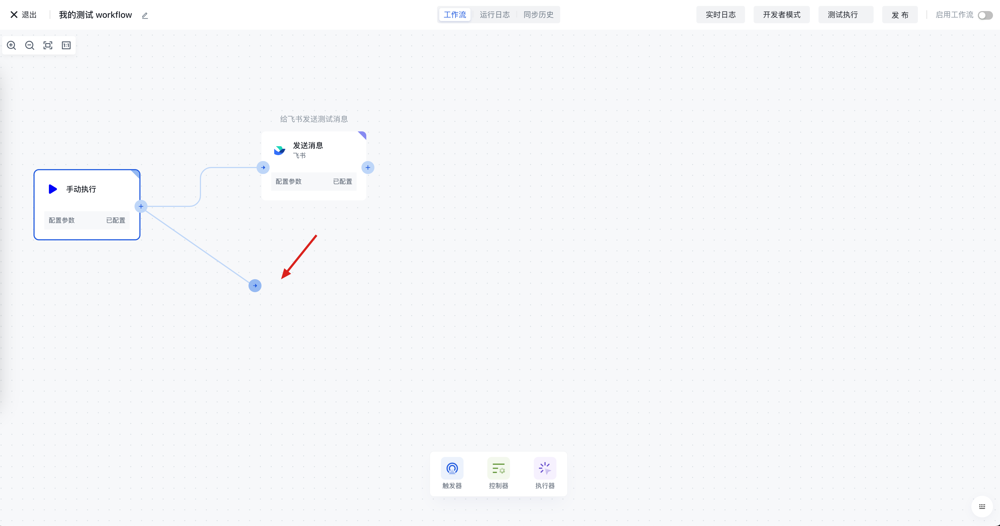

拖出连线之后会弹出应用选择框，可以选择需要添加的任意应用：

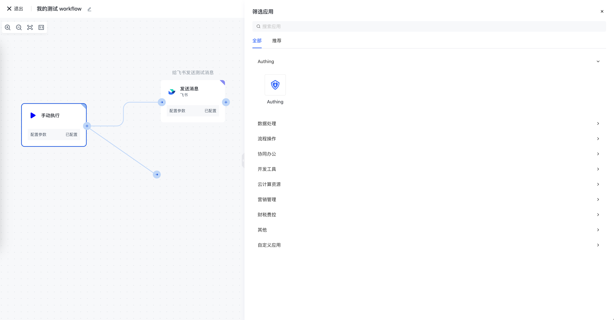

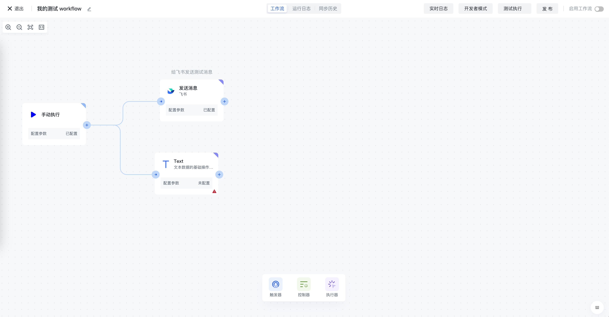

这样我们就创建了两个并行执行的分支，在 workflow 运行时，这两个分支将会并行执行，当两个分支全部执行完成之后，才会继续往下执行；如果有其他一个分支运行失败，整个 workflow 将会以失败状态终止。

后续如何你需要让两个分支合并起来，可以在后续新增一个新的节点，并且将两个分支连到此节点上。

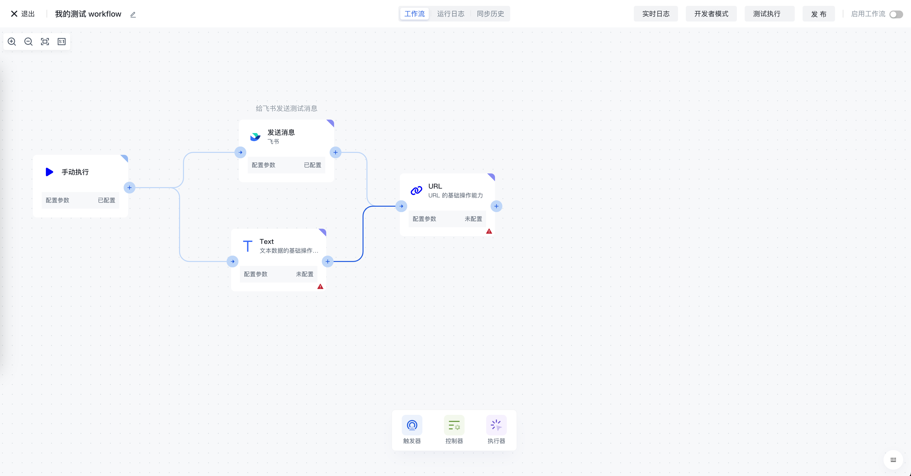

## 添加 IF 节点

你可以在控制器分类中看到 IF 节点：

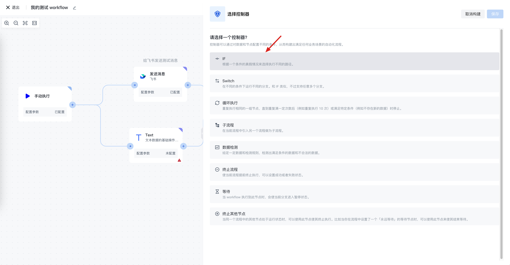

## 添加 SWITCH 节点

你可以在控制器分类中看到 SWITCH 节点：

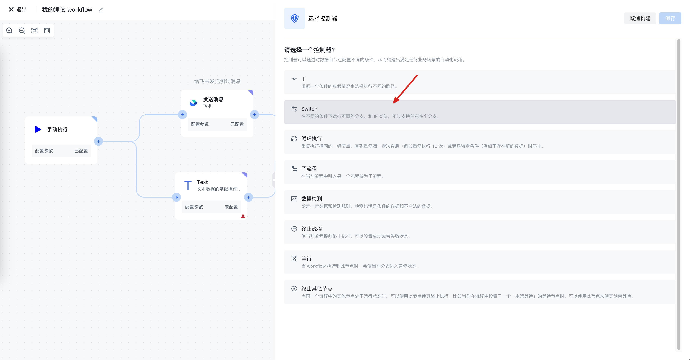

## 添加循环节点

循环节点可以让你重复执行某个操作。

你可以在控制器分类中看到循环节点：

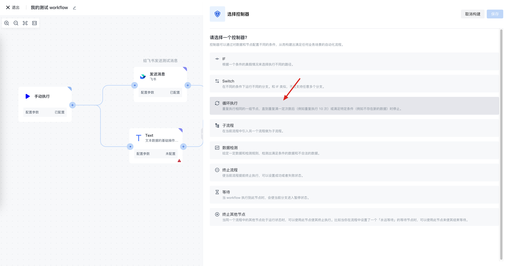

添加完成之后，你可以在循环执行节点内部添加任意流程：

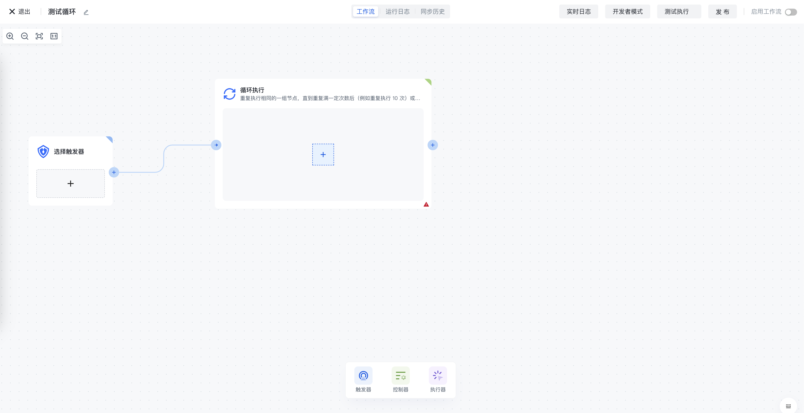

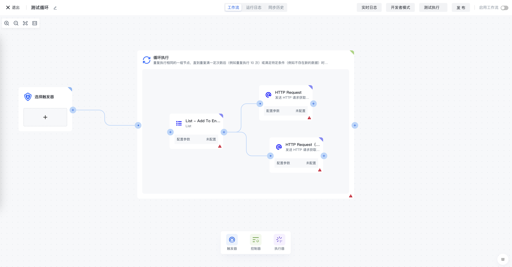

## 添加等待节点

你可以在控制器分类中看到等待节点：

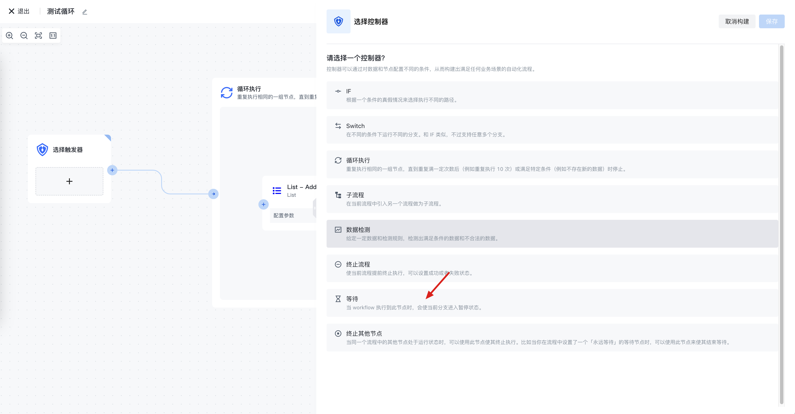

## 添加子流程

你可以在控制器分类中看到子流程节点：

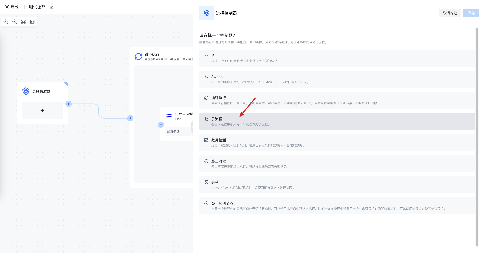

## 添加终止流程节点

你可以在控制器分类中看到终止流程节点：

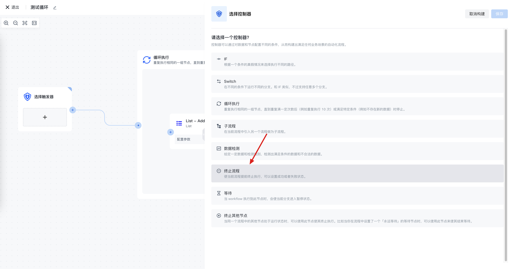
