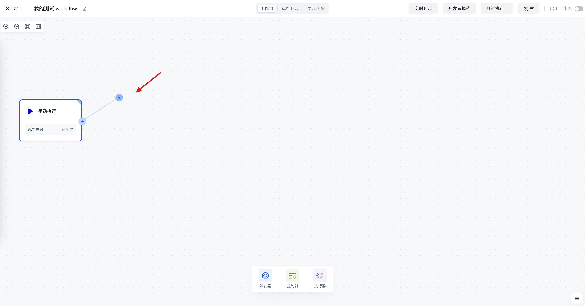
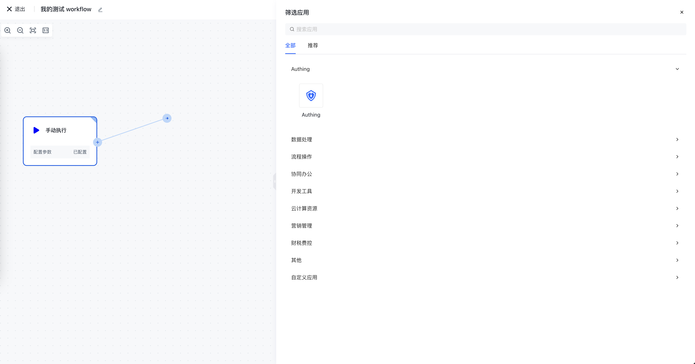
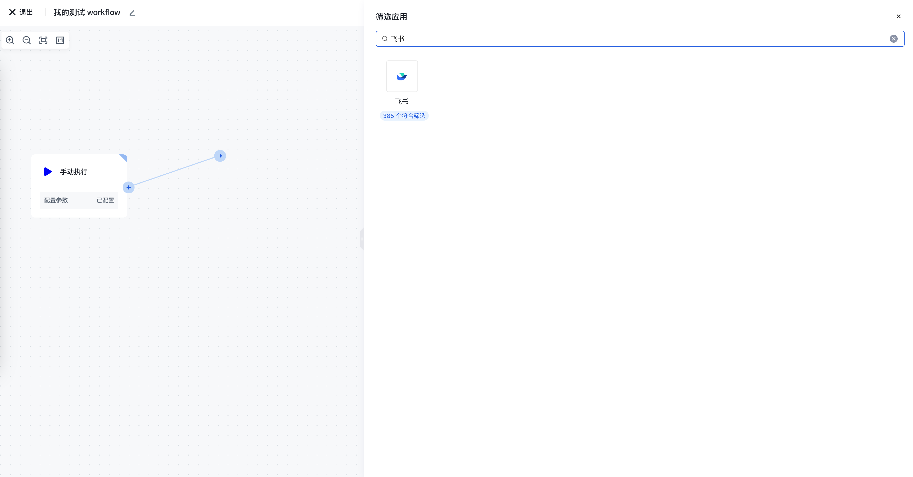
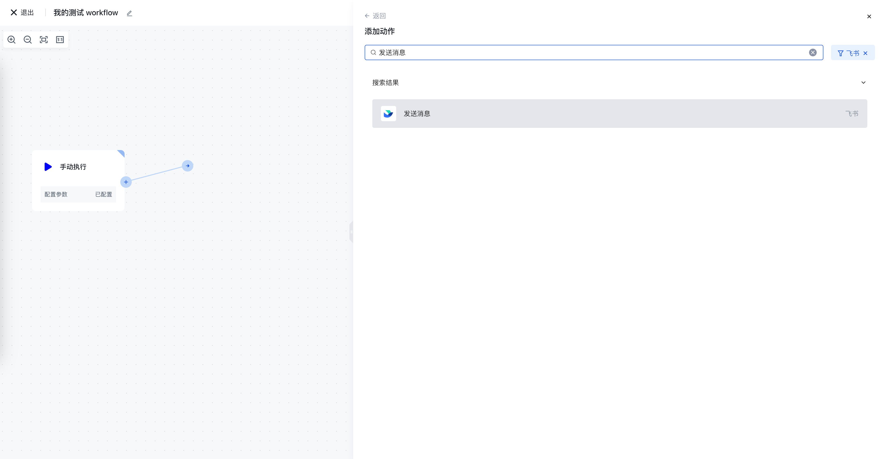
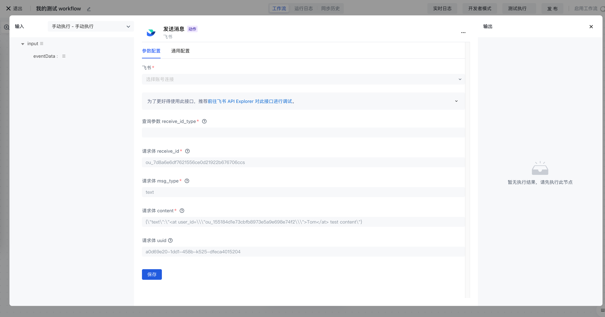
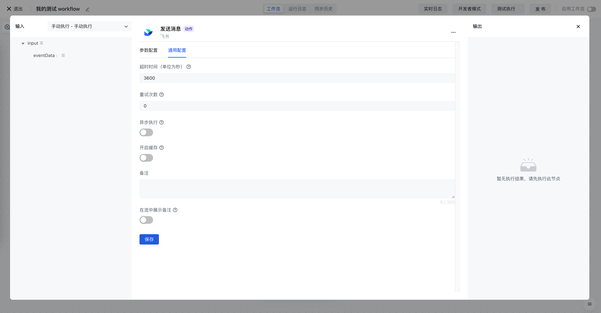
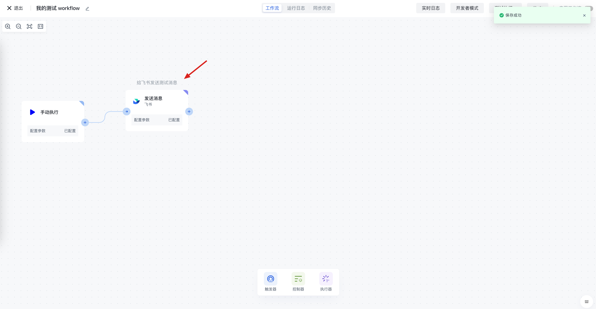

# 添加节点

在任意节点的的右侧，有一个圆点按钮，将鼠标 hover 到此圆点上方，可以拖出一条连线用于添加新的节点：

在弹出的应用选择框中，你可以看到 Authing 集成的所有应用：

你可以在搜索框中搜索你需要的应用：

选择你需要完成的操作，比如飞书的「发送消息」：

接下来你需要填写必要的配置项，如账号、参数等：

很多时候，当前节点的某些参数可能依赖于之前节点的结果，在 Authing 身份子自动化中，这件事情叫做<strong>数据</strong><strong>装配</strong>，详情请见文档：[装配数据](/workflow/编写%20Workflow/为节点动态装配数据.html) 。

# 通用配置项介绍

在每个节点的配置项中，有一个通用配置菜单，你可以配置一些通用参数，如超时时间、重试次数等。

下面是每个通用配置项的说明：

- 超时时间：指定此节点的运行超时时间，默认为 1 小时。
- 重试次数：节点执行异常时，重试次数，默认为 0 次，最大为 5 次。
- 异步执行：开启之后，此节点将会异步执行，不会阻塞其他节点的执行，此节点发生异常也不会导致整个流程失败。适用于发送通知、文件上传等场景。
- 开启缓存：开启之后，在缓存有效时间内，该节点将会直接缓存的值作为输出结果，适用于获取第三方 AccessToken 等在一定时间内有请求次数上限的场景。

  - 缓存时间：缓存有效时间，单位为秒
- 备注：为节点添加备注信息

  - 在工作流中显示备注信息：开启之后你可以在工作流画布上看到此备注信息。

