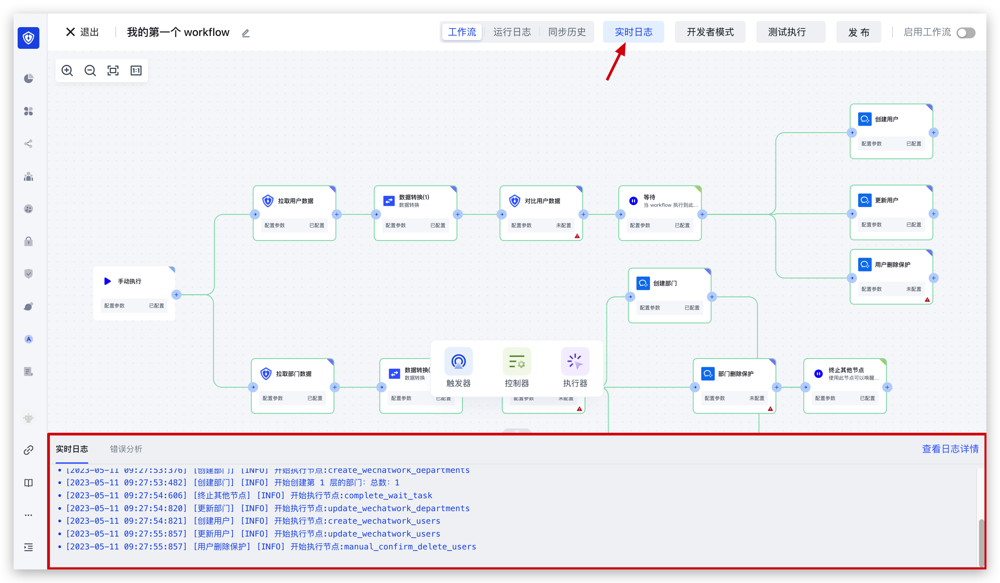
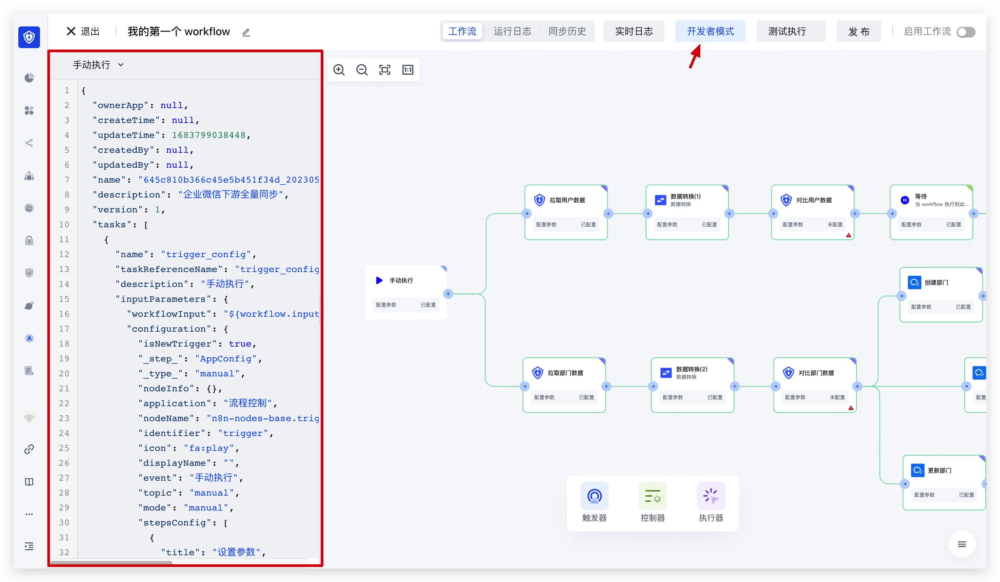
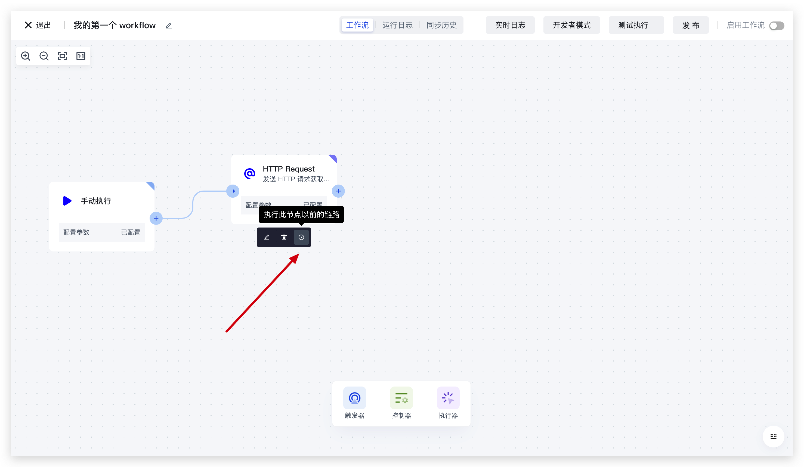

# 调试 Workflow

当你将流程编写完成之后，在正式发布之前，你可能需要对 workflow 进行调试。这个时候，你可以在右上角开启「<strong>实时日志</strong>」和「<strong>开发者模式</strong>」：你可以看到每个节点的执行状态以及输出的日志：

1）实时日志介绍如下：

2）开发者模式介绍如下：

3）你可以点击任意节点上的「执行」按钮单独执行某个节点：

